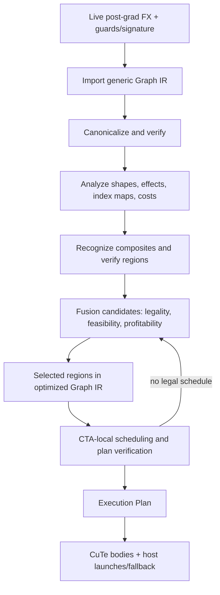

# MegaBake architecture and IR contract

**Status:** current design, 2026-10-05. This is the implementation guide. [ir-analysis.md](ir-analysis.md) supplies the import → analyze → optimize → schedule → lower structure; [north-star.md](north-star.md) records the broader goal.

## Core decision

MegaBake targets **generic tensor computations on NVIDIA GPUs**. SmolLM is the first real graph and benchmark fixture, not an IR dialect or a list of hard-coded operator kinds. GEMM is the main implementation and performance anchor: build a competitive GEMM path and use it to judge fusion. RMSNorm, attention, RoPE and MLP are parameterized patterns that can be recognized in many graphs.

PyTorch's post-grad FX graph is the source of primitive operations, values, metadata and guards. MegaBake owns a smaller **Compute IR** because it adds stable normalized operations, first-class index maps and numerical contracts, effect boundaries, and source mapping needed for fusion. Import only what the compiler can reason about; keep the rest as source-backed opaque regions for fallback. This IR has a purpose beyond wrapping FX nodes in new classes.



Canonicalization runs **before** high-level recognition so different FX spellings reach the same pattern. Analyses are recomputed after a rewrite. Recognition enriches the generic IR; it does not force fusion. A planner may inspect or inline a recognized composite's generic body. The optimized Graph IR and its selected regions remain independent of the downstream Execution Plan. Scheduling can reject a proposed group and return to separate kernels.

## Pass contracts

| Boundary | Output and guarantee |
| --- | --- |
| FX → Graph IR | SSA-like, topologically ordered generic graph with explicit per-input `IndexMap`s. Every supported source node has exact semantics and provenance; every unsupported connected region remains an explicit fallback boundary. Inputs, outputs, aliases, effects and guards are preserved. No GPU schedule is present. Verify the imported graph. |
| Canonicalize → Graph IR | Same graph contract and observable semantics. Normalize views, broadcasts and GEMM forms; fold only provably redundant pure operations. Every rewrite preserves value uses, dtype/cast boundaries, aliases and effects. Verify after each transformation. |
| Analyze → Facts | Producer/users, shapes, strides, validated index maps, reduction domains, alias/effect order, liveness and rough FLOP/byte estimates. No semantic change. Facts are versioned with the graph and invalidated by rewrites. |
| Recognize → Graph IR with composites | Parameterized named regions such as RMSNorm or Attention carry their exact generic body and source FX nodes. Their interface lists every external input and live output; their numerical attributes are complete. Unmatched graph remains generic. Verify graph and region boundaries. |
| Optimize/fuse → selected regions | Candidates pass legality, implementation feasibility, then profitability. The output is an optimized Graph IR with selected `Region`s; it contains no CTA schedule or storage placement. Verify coverage and region boundaries. |
| Schedule → Execution Plan | Every graph op is covered exactly once by a kernel or fallback step. For each kernel, CTA-local ownership, layout, intermediate placement, synchronization, launch arguments and a supported device body are fixed. Failed candidates are split or rejected. Verify the plan. |
| Lower/run → callable | CuTe code and host steps reproduce outputs, mutations/aliases, stream ordering and specialization behavior for guarded inputs. The backend does not invent missing scheduling decisions. |

Keep dumps after import, canonicalization, composite recognition, candidate selection and scheduling, with IDs that link each output back to FX. Graph, region and plan verification are required gates, not deferred debugging aids.

## Compute IR: the generic layer

A first implementable schema is:

```text
Graph:
    inputs, outputs, ordered ops, values, source_fx_map, guard_context

Value:
    id; TensorType(shape, dtype, device, boundary_strides)
    producer; users; optional view/alias relation
    # logical value, not an allocation

Op:
    id; kind; ordered inputs/outputs; typed attributes
    input_index_maps: one IndexMap per tensor input
    source FX nodes; effect summary; numerical contract

Operand:
    ValueId | typed scalar literal

IndexMap:
    output indices/tile + reduction domain -> required input indices/tiles
    explicit axes/relations for supported ops; Unknown for an opaque mapping

Region:
    ordered OpIds; external inputs; every live output; source coverage
    # structural subgraph only: no semantic tag, fusion promise or GPU schedule

Composite:
    Region + verified semantic kind and parameterized attributes
    # retained generic body, e.g. RMSNorm or Attention
```

Keep producer/users as derived maps if storing both would create inconsistent state. Shapes may be concrete initially; a later `DimExpr` must be tied to Dynamo guards. Tensor metadata is about logical/boundary behavior. Registers, shared memory, HBM and CUDA layouts belong to the execution plan. `Region` is a lightweight view over existing graph ops and boundary values; it never duplicates their bodies.

These names have different contracts:

| Object | Meaning | Contains GPU decisions? |
| --- | --- | --- |
| `Composite` | A `Region` proven to implement a named, parameterized computation such as RMSNorm. | No. |
| `FusionCandidate` | A proposal to execute one or more graph ops/regions together. | Proposed implementation family only. |
| Selected `Region` | A fusion proposal accepted by the three decision gates; still part of optimized Graph IR. | No concrete tile or storage schedule. |
| `KernelPlan` | One scheduled GPU launch implementing a selected region. | Yes: ownership, tiling, placement and synchronization. |

A composite can run in several kernels; a kernel can implement part of a composite or multiple compatible composites. The terms are never synonyms.

The initial generic operations are deliberately few:

| Kind | Required semantics | Output-tile dependency |
| --- | --- | --- |
| `Gemm` | Contracted/batch axes, operand orientation, M/N/K, operand and result dtype, accumulation/rounding policy, strides. Normalize `mm`, `bmm` and linear projections here when their semantics match. | An M×N output tile requires the matching A/B tiles across the complete K reduction. |
| `Pointwise` | Exact scalar expression, typed literals, per-input broadcasting maps and cast points. | One output tile needs corresponding input tiles. |
| `Reduce` | Axes, combiner, keepdims, accumulation dtype and result cast. | An output tile needs the specified complete reduction domain. |
| `View` / `Broadcast` | Output-to-input index map, shape/stride and alias or copy behavior. | Dependency follows the map; a required copy remains work. |
| `Cast` | Source/destination dtype and rounding point. | Same logical indices with an observable numeric transition. |
| `OpaqueFX` | Exact source subgraph, inputs, outputs and effects. | Fusion barrier until a lowering or proven pattern exists. |

Each tensor operand has a first-class **`IndexMap`**: given an output index or tile and any reduction indices, it identifies the required input indices or tiles. For example, GEMM output `(m,n)` reads A `(m,k)` and B `(k,n)` over its K domain; a bias broadcast maps `(m,n)` to `(n)`. Import or canonicalization creates the maps; analysis validates and composes them. `Unknown` blocks generic fusion until a specialized implementation proves its mapping. Start with maps for these operation families; a full symbolic algebra system is unnecessary. TVM classifies elementwise, broadcast, reduction and complex ops for fusion, while MLIR Linalg uses indexing and iteration structure to make tiling and producer/consumer fusion precise. [TVM fusion](https://tvm.apache.org/docs/arch/fusion.html), [MLIR Linalg](https://mlir.llvm.org/docs/Dialects/Linalg/)

Verification is explicit after every transformation: the **graph verifier** checks unique definitions, topological uses, shape/dtype/index-map consistency, source coverage, graph outputs, effects and alias relations; the **region verifier** checks connected body coverage, every external input and live output, and no hidden users or effects; the **plan verifier** checks complete graph coverage, chosen body capabilities, CTA ownership, storage lifetimes and synchronization. Reject ambiguous `reshape`, unsupported overloads and unknown side effects with an FX node diagnostic. Do not silently make them pure.

### Canonicalization comes first

Examples of safe, useful canonical forms:

- Normalize `view/reshape/permute + mm` to a `Gemm` with explicit operand indexing, retaining copies and observable view aliases.
- Normalize scalar and tensor broadcasts into pointwise input maps.
- Collapse identity views/casts and adjacent pure pointwise expressions only when their dtype rounding and use boundaries remain equivalent.
- Remove dead pure values and keep all live outputs and effect dependencies.
- Preserve `BF16 Gemm result → FP32 Cast → SiLU → BF16 Cast` as distinct numeric steps. A fused epilogue must reproduce the BF16 rounding before the FP32 activation when required by the captured graph.

Canonicalization is generic. No rule mentions SmolLM layer numbers, head counts or its particular epsilon.

## Parameterized semantic composites

Pattern recognition is an optimization **over Compute IR**, after canonicalization. A composite is a region with a name, attributes and a retained generic body. It can be expanded for another optimization or mapped to a specialized body. It never becomes an opaque magic instruction merely because the pattern matched.

Ordinary fusion rules still work when no composite matches: `Gemm → Pointwise` or `Pointwise → Reduce` can be considered from their generic index maps. A composite adds verified meaning and possible specialized implementations; it is not a prerequisite for all fusion.

| Composite | Generic parameters to prove |
| --- | --- |
| `RMSNorm` | Reduction axes, epsilon location/value, accumulation dtype, exact cast sequence, weight order, output type and live secondary outputs. |
| `RoPE` | Rotated dimension, Q/K layout, position/cos/sin operands and arithmetic/cast order. |
| `Attention` | Q/K/V and output layout, head/group mapping, scale, mask/causal behavior, softmax axis/dtype, probability cast, dropout and KV-state effects. |
| `GatedMLP` | Gate/up/down `Gemm`s, activation expression and branch/multiply dataflow. This is a region annotation; the planner can fuse a subset. |

These are **generic parameterized definitions**, not SmolLM-specific kinds. SmolLM's phase-6 trace is a demanding first match: its RMSNorm computes in FP32, casts to BF16 before multiplying by BF16 weight; its attention uses grouped heads, masking, FP32 softmax and BF16 probabilities. The first matcher proves these exact facts. Other valid variants receive different attributes or remain generic. A matched region must include all internal uses or expose additional live outputs. Named patterns do not change numerical tolerance rules.

For illustration, after canonicalization and recognition one block may read:

```text
%norm = RMSNorm(%x, %weight) {axis=-1, eps=1e-5, compute=f32, ...}
%q    = Gemm(%norm, %Wq)
%k    = Gemm(%norm, %Wk)
%v    = Gemm(%norm, %Wv)
%qr,%kr = RoPE(%q, %k, %positions) {...}
%ctx  = Attention(%qr, %kr, %v, %mask) {heads, scale, dtype_policy, ...}
%h    = Pointwise.add(%x, Gemm(%ctx, %Wo))
%gate = Gemm(%h, %Wgate)
%up   = Gemm(%h, %Wup)
%mix  = Pointwise.mul(Pointwise.silu(%gate), %up)
%out  = Gemm(%mix, %Wdown)
```

This is a readable view of a generic IR. The complete graph also has the second norm and residuals; each composite retains a body that can be printed or inlined. The numbers in the saved SmolLM trace validate matchers but do not become op definitions.

## Fusion: from semantics to a legal GPU plan

A candidate is generated from **tile dataflow and a good implementation anchor**. A `Gemm`, `Reduce` or `Attention` usually determines the tile/CTA schedule; compatible pointwise work may join it. This mirrors XLA:GPU's “hero” emitter idea while keeping MegaBake's implementation small. [OpenXLA GPU emitters](https://openxla.org/xla/emitters)

```text
FusionCandidate:
    region: Region of included OpIds or composite body fragments
    proposed implementation family; expected saved launches/bytes

KernelPlan:                         # selected schedule; trials can be benchmarked earlier
    selected Region, body/template and specialization
    output-tile → CTA/warp ownership
    input-tile mapping and reduction domain
    per-value register/shared/global placement
    barriers; workspace; resource limits; launch grid/arguments

ExecutionPlan:                      # downstream of optimized Graph IR
    ordered KernelLaunch | FallbackCall steps
    graph input/output bindings; lifetimes; guards
```

For a concrete MLP branch, the generic graph has two `Gemm`s fed by the same input, then a cast-aware SiLU and a multiply. A candidate contains those four computations with inputs `{x, Wgate, Wup}` and output `{gated}`. A legal plan could assign the same M×N output tile of both GEMMs to one CTA, round their results as required, compute SiLU and multiply locally, and store `gated` once. The following down-projection remains another `KernelLaunch` because each of its output tiles reduces across the full K dimension of `gated`. If the paired GEMMs exceed the body’s resource budget or lose throughput, scheduling chooses two GEMM launches and a pointwise step instead. The semantic graph and its output contract remain the same in both plans.

Fusion uses three separate gates:

| Gate | Must establish | If it fails |
| --- | --- | --- |
| **1. Legality** | All live outputs and effects are preserved; source semantics and cast points are valid; composed `IndexMap`s permit the proposed tile dependencies. For the initial implementation, every internal producer/consumer edge must be owned by one CTA. | Keep the operations separate or use source-backed fallback. |
| **2. Implementation feasibility** | A composable CuTe body/template exists for the region; shape, dtype and layout are supported; estimated registers/shared memory and CTA-local barriers fit. A host-callable kernel wrapper alone does not satisfy this gate. | Reject the candidate even if it is mathematically fusible. |
| **3. Profitability** | The candidate improves measured or calibrated latency against the best available separate plan, accounting for GEMM throughput, launch savings, traffic and occupancy. | Choose the separate plan. |

Feasibility may build a trial tile configuration and benchmark a tentative kernel to inform profitability. Trial schedules stay outside the optimized Graph IR; only the chosen schedule enters the final `ExecutionPlan`.

The initial scheduler handles **CTA-local fusion only**. It may use normal warp/CTA synchronization inside that CTA, but it does not assume a grid barrier, inter-CTA handoff, or persistent task runtime. A dependency that crosses CTA ownership keeps a kernel boundary. A candidate with multiple users must keep all live outputs. Grouping alone never proves that an intermediate stays off HBM. Later cross-CTA execution requires a separate design and proof.

| Generic candidate | Why it might help | Critical check |
| --- | --- | --- |
| `Gemm` + pointwise epilogue | One store and fewer launches | Correct casts/broadcasts and competitive GEMM throughput. This is an infrastructure slice; CUTLASS already supports such epilogues. |
| Two `Gemm` branches + shared pointwise consumer | Shared input work and local matching output tiles | Same CTA can own both output tiles without excessive registers/shared memory. SmolLM's gate/up pair is one fixture. |
| `Reduce`/`RMSNorm` → `Gemm` | Avoid a norm output write/read | Does each GEMM CTA recompute the row reduction, or can ownership change profitably? |
| Attention's QK/softmax/PV body | Avoid materializing score/probability matrices | Correct mask, reduction and head mapping; specialized tiling and numerical policy. |
| One GEMM after another | Possible larger kernel | Consumer often needs producer tiles from many CTAs; usually keep a launch boundary until another schedule is proved. |

The first cost rule can be simple: compare a strong separate implementation with the fused template for a small set of guarded shape regimes. Record launch time, bytes, GEMM throughput, occupancy and compilation cost. **Optimize end-to-end latency; do not treat fewer launches as the score.** A real persistent multi-stage kernel later needs a task graph, buffer lifetimes and explicit synchronization, as Mirage MPK demonstrates. [Mirage MPK](https://arxiv.org/abs/2512.22219)

## GEMM-first implementation and milestones

GEMM is the highest priority code-generation component. The saved SmolLM MLP has `M=4` projection GEMMs, which may behave differently from larger prefill GEMMs. Establish both shape regimes and compare against Inductor and CUTLASS/cuBLAS on the same GPU before claiming a fusion win. A fused kernel that makes its GEMMs slow is a failed plan even if it removes launches.

| Milestone | Deliverable | Exit condition |
| --- | --- | --- |
| **M0 — source handoff** | Fix cache-hit phase ambiguity in the live post-grad adapter; preserve graph/signature/guards and align CUDA toolkit. | Fresh CUDA run proves the phase and matches reference for its guarded workload. |
| **M1 — generic IR** | Implement `Graph`, `Value`, first-class `IndexMap`, lightweight `Region`, and the initial generic ops; add canonicalization, analyses and graph/region verifiers. A small PyTorch-backed evaluator checks supported rewrites against FX. Use small graphs plus a live SmolLM block. | Dumps show normalized operations, explicit input maps and complete FX coverage; evaluated supported subgraphs match FX outputs and preserve effect boundaries. |
| **M2 — GEMM anchor** | Bring up a competitive standalone CuTe GEMM body for at least the observed small-M shape and one larger prefill shape; keep library/Inductor baselines. | Correct BF16 results and measured throughput/latency, with a clear supported shape/layout contract. |
| **M3 — semantic recognition** | Parameterized RMSNorm and Attention matchers plus RoPE and GatedMLP region annotations over generic IR. Canonicalize before matching and retain bodies. | One real block has exact named regions and source mapping; each match reproduces its generic body at stated tolerances. |
| **M4 — fusion planner** | Form `Gemm` epilogue and gate/up branch candidates; apply legality → implementation feasibility → profitability; schedule only CTA-local regions into CuTe plans and verify each plan. | A measurable legal win on stated shapes, or a measured rejection with the failing gate recorded and the next candidate selected. |
| **M5 — full inference path** | Add strong attention and norm bodies or verified fallbacks, graph partitioning, ordered host execution and output reconstruction. | SmolLM no-cache inference matches reference and reports whole-step latency versus Inductor. |
| **M6 — larger schedules** | Try norm→projection and attention-adjacent candidates only where CTA-local ownership is proved; otherwise retain launch boundaries. Add a measured choice rule. Capture prefill/decode with KV state as separate workloads. | Retain only fusions with correct, reproducible end-to-end gains. |
| **M7 — persistence if justified** | Add cross-CTA dependency and SM/CTA task-graph support with an in-kernel scheduler only if measured scheduling/launch overhead warrants it. | Multi-stage execution is correct with explicit visibility and synchronization and improves its target workload. |

**Immediate work: M0 then M1.** M1 is the strong reusable IR contract. M2 protects the central GEMM performance question. SmolLM drives concrete cases and validation; new models should reuse the same generic operations and parameterized composites.

## Current repository facts and references

- `src/megabake/__init__.py` has no compiler implementation. The existing CUDA trace records 3,323 calls across 30 targets for batch 1, sequence 4, BF16, no KV cache on H200 MIG. A saved text file called `megabake_ir.txt` is an inspection artifact, not a current executable IR path.
- The capture script currently returns `graph.forward` and uses private Inductor APIs. Its cache-hit path can label a graph post-grad without running those passes. Saved metadata shows PyTorch CUDA 13.0 and local `nvcc` 12.8.
- [MLC book](https://book.mlc.ai/chapter_graph_optimization/index.html) motivates graph optimization followed by mapping to executable tensor programs. [TVM Relax fusion](https://tvm.apache.org/docs/arch/fusion.html) separates op grouping from actual kernel merging. [MLIR Linalg](https://mlir.llvm.org/docs/Dialects/Linalg/) and [OpenXLA GPU emitters](https://openxla.org/xla/emitters) inform structured indexing and anchor-led codegen. [CUTLASS CuTe DSL](https://docs.nvidia.com/cutlass/latest/media/docs/pythonDSL/overview.html) is the kernel backend; its [Operator API](https://docs.nvidia.com/cutlass/latest/media/docs/operators/overview.html) already covers common GEMM epilogues.
- The public `torch.compile` backend contract receives Dynamo FX. A pinned Inductor post-grad adapter is a separate integration layer. [PyTorch custom backends](https://docs.pytorch.org/docs/main/user_guide/torch_compiler/torch.compiler_custom_backends.html)
