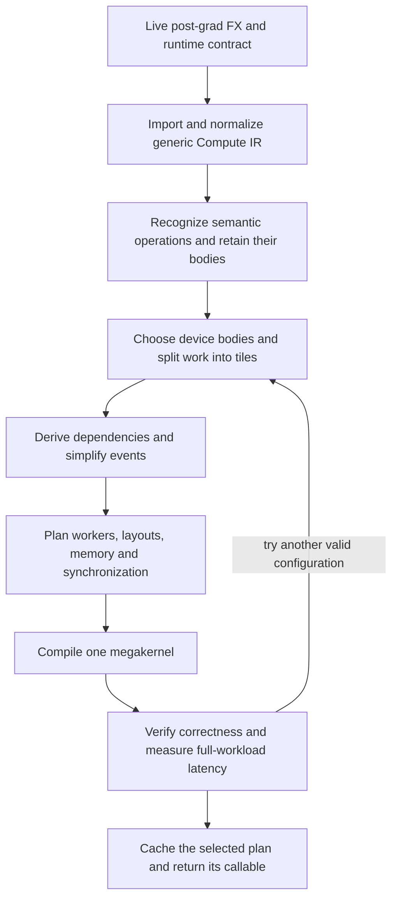
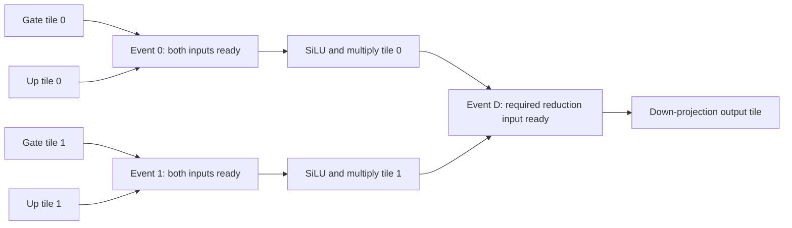

# MegaBake architecture

**Status: proposed design, revised 2026-10-05.** The compiler described here is still to be built. [IMPLEMENTATION_PLAN.md](IMPLEMENTATION_PLAN.md) gives the work order and acceptance checks. [north-star.md](north-star.md) contains the earlier project reasoning; this document defines the current implementation contract.

## 1. The goal and the rule that never changes

**MegaBake compiles an entire supported PyTorch inference workload into one optimized CUDA megakernel.** Its optimization objective is the lowest measured end-to-end latency subject to correctness and that one-kernel requirement.

For a full-model request, the workload is the complete captured model invocation: its tensor computations, requested outputs and state updates. The compiler cannot silently reduce that request to one block or a convenient subgraph. SmolLM is our first model fixture. Its dimensions and layer numbers are specialization data, not definitions of compiler operations.

A successful compiled invocation must satisfy all of these conditions:

1. Every required source computation and observable effect is covered.
2. Outputs, aliases, mutations, numerical behavior and stream ordering satisfy the declared contract.
3. Exactly one GPU workload kernel executes. Required reset, conversion, copy-back and state-update work cannot be hidden in helper kernels.
4. Every dependency has a valid visibility protocol and a forward-progress argument: work that is needed can actually run.
5. The callable uses current runtime inputs and parameters under valid specialization guards.

Separate kernels, eager execution, CUDA Graphs and library launchers are useful reference implementations and performance baselines. They cannot replace the emitted megakernel. If an operation or execution scheme is unsupported, compilation reports the source location and reason. If a correct megakernel is slow, we improve its bodies or schedule and report the performance gap.

Compilation, autotuning and genuinely reusable setup are reported separately from execution. Allocating an uninitialized workspace can be host setup; resetting readiness counters required for each invocation is workload work. A recurring GPU operation cannot be moved into a wrapper and omitted from the launch count.

The initial development target is single-GPU BF16 inference, concrete guarded shapes, and the available H200 MIG / SM90 configuration. Full-model persistent execution is required. Small GEMM and MLP fixtures are steps toward it. Prefill and stateful decode become separate supported regimes; a short no-cache forward does not establish decode support.

## 2. Understand the design through three questions

| Question | Representation | Example |
| --- | --- | --- |
| **What must be computed?** | Compute IR, with optional semantic composites | GEMM, a cast, RMSNorm or attention with exact attributes |
| **Which pieces of work depend on which?** | Tile task graph and readiness events | A multiply tile waits for its gate and up tiles |
| **How will one GPU kernel execute it?** | Kernel plan and composable CuTe device bodies | Worker assignment, layouts, workspace, barriers and one launch |

An **IR** is a compiler's structured description of a program. A **tile** is a portion of a tensor. A **CTA** is a CUDA thread block. A **worker** is a persistent CTA that executes a sequence of tasks. An **SM** is a GPU processor on which CTAs run. A task is a piece of device work; a task boundary does not launch another kernel.



Verification happens at each boundary. An unsupported source operation blocks compilation. Failed correctness or progress checks reject a candidate. Performance selection chooses among correct one-kernel candidates.

Mirage's multi-level graphs connect tensor computations to thread-block and thread execution, including explicit input, output and loop mappings. MegaBake adopts that separation while keeping a single enclosing launch. Our generic index maps and CuTe layouts provide the mappings needed by actual supported bodies; a new universal graph language at every level is unnecessary. [Mirage graph representation](https://mirage-project.readthedocs.io/en/latest/mugraph.html)

MPK adds the directly relevant execution idea: represent small device tasks and their readiness events, then execute them inside a persistent kernel. Its compiler simplifies events and task metadata; its runtime supports static and dynamic dispatch and cross-task pipelining. The sections below specify MegaBake's adaptation and build order. [MPK compiler and runtime](https://arxiv.org/html/2512.22219v2)

## 3. Obtain a trustworthy source graph

PyTorch remains responsible for the model interface. MegaBake receives a live post-grad FX graph through a small, version-pinned adapter before Inductor lowering and scheduling. A text dump is an inspection artifact, not compiler input.

The handoff consists of more than a graph:

| Owner | Responsibility |
| --- | --- |
| Dynamo | Capture, specialization guards and the supported Python-facing call contract |
| AOT/PyTorch wrappers | Lifted arguments, output adaptation and supported alias/mutation handling |
| MegaBake frontend adapter | Consistent graph phase, matching example inputs, metadata and source provenance |
| MegaBake compiled callable | Runtime bindings, one kernel and the graph's required outputs/effects |

Reuse the pinned PyTorch wrappers. Do not guess runtime argument order from an export's placeholder count or replace the wrapped callable with a bare `GraphModule.forward`. Example tensors describe compilation; their addresses or contents do not become permanent runtime bindings. [PyTorch custom backend contract](https://docs.pytorch.org/docs/main/user_guide/torch_compiler/torch.compiler_custom_backends.html)

The current capture path needs a repair: an executable-cache hit must not bypass the passes and handoff while the artifact is still labeled post-grad. The adapter must enforce a consistent phase, preserve/refresh tensor metadata after rewrites, and check its PyTorch version before importing private APIs. Normal reuse of an already compiled callable under valid guards remains allowed.

Start with inference under `torch.no_grad()`, `fullgraph=True`, and concrete guarded shapes. Unsupported training or graph breaks fail explicitly. A reference FX executor may validate the frontend before CUDA lowering exists, but is labeled reference-only.

Wrapper preservation does not automatically establish the one-launch rule. AOT copy-back or materialization work must later be included in the megakernel or the affected workload rejected. Audit the complete callable, not only its generated kernel.

## 4. Compute IR: preserve what the program means

Use small data structures and only introduce fields required by supported operations:

```text
Graph       = inputs, outputs, ordered operations, values, source IDs, guard context
Value       = logical shape/dtype/device, boundary strides, producer, alias relation
Op          = kind, operands, outputs, typed attributes, index maps, effects, numerics
Operand     = value reference or typed scalar literal
IndexMap    = output coordinates + reduction coordinates -> input coordinates
Region      = references to operations, external inputs, all live outputs
Composite   = a Region with a verified semantic name and attributes
```

Users can be derived from operations. A region references its existing body rather than copying it. Concrete shapes are sufficient initially. Any later symbolic dimension must be tied to an actual guard. Physical workspace offsets, shared-memory layouts and worker assignments belong to the kernel plan.

### The small generic operation set

| Operation | What it must specify | Data needed for an output tile |
| --- | --- | --- |
| `Gemm` | Batch/contracted axes, orientation, strides, operand/result dtypes and accumulation policy | Matching input tiles across the full contracted dimension |
| `Pointwise` | Scalar expression, typed constants, broadcast maps and cast points | Corresponding input elements |
| `Reduce` | Axes, combiner, keepdims, accumulation dtype and result cast | The complete stated reduction domain |
| `View` / `Broadcast` | Coordinate map, boundary strides and alias/copy behavior | The mapped source elements |
| `Cast` | Source/destination types and rounding point | The same logical elements |
| `OpaqueFX` | Source-backed unsupported region with its boundaries and effects | Unknown until a verified lowering is supplied |

For GEMM, output `(m,n)` reads `A[m,k]` and `B[k,n]` over `k`. A bias broadcast reads `bias[n]`. These are index maps. Composing them tells the planner which source tiles a consumer needs. Start with concrete mappings for the supported operation families rather than a general symbolic solver. [MLIR structured indexing](https://mlir.llvm.org/docs/Dialects/Linalg/)

Normalize equivalent FX forms before semantic matching: transpose/view plus `mm` can become a GEMM with explicit operand maps; broadcasts become explicit maps; redundant pure views may disappear when their alias behavior is preserved. A reshape that needs a copy remains work. Unknown effects or mappings cannot be assumed pure.

Retain numerical boundaries. For example:

```text
GEMM accumulation -> BF16 result -> FP32 SiLU -> BF16 output
```

A fused body can keep these values on-chip, but it must still perform the required BF16 rounding before widening to FP32. Eliminating an HBM store does not authorize eliminating a cast.

The graph verifier checks definitions/uses, shapes, dtypes, maps, source coverage, outputs and effects. The region verifier checks every external input and live output, including values used outside a match. Refresh derived facts after rewrites. Tuple-valued primitives and their selected outputs must be imported explicitly when the captured workload contains them.

## 5. Semantic operations: reusable definitions of common LLM work

A semantic operation gives a useful name to a proved computation. It does not prescribe a tile size or force the whole operation into one device task. Generic fusion also remains available when no named pattern matches.

Maintain a small definition table. Each entry has:

- A generic reference body or a way to expand to existing generic operations.
- Typed parameters and a verifier for the exact supported variant.
- A matcher for normalized source regions, retaining all source IDs and live outputs.
- Candidate device-body families with their capability checks.

Start with ordinary functions and a table. Add definitions as real fixtures need them. MPK's implementation similarly exposes named operations and registers their mapped task implementations; this is useful precedent for a concrete implementation catalog. [MPK operation definitions](https://github.com/mirage-project/mirage/blob/mpk/python/mirage/mpk/persistent_kernel.py)

| Definition | Parameters that determine its meaning |
| --- | --- |
| `RMSNorm` | Axes, epsilon value/location, accumulation dtype, weight order and exact casts |
| `RoPE` | Rotation convention/dimension, positions, cos/sin inputs, layout and arithmetic order |
| `Attention` | Q/K/V layouts, head/group mapping, scale, masks, softmax axis/dtype, probability casts, dropout and state effects |
| `GatedMLP` | Gate/up/down projections, activation expression, multiply and all rounding boundaries |

For example, this is a complete conceptual transformer block, with each name retaining its precise underlying computation:

```text
n1       = RMSNorm(x, norm1_weight)
q, k, v  = Gemm(n1, Wq), Gemm(n1, Wk), Gemm(n1, Wv)
qr, kr   = RoPE(q, k, positions, cos, sin)
context  = Attention(qr, kr, v, mask)
h        = Add(x, Gemm(context, Wo))
n2       = RMSNorm(h, norm2_weight)
gate, up = Gemm(n2, Wgate), Gemm(n2, Wup)
mix      = Multiply(SiLU(gate), up)
out      = Add(h, Gemm(mix, Wdown))
```

Shapes, masks and casts are omitted here only for readability; they remain explicit in the actual IR. A Q/K/V combined implementation or an RMSNorm-plus-linear implementation is a planner candidate over these computations. Matching a name never hides secondary outputs, aliases or numerical requirements.

### Algebraic changes require a separate decision

Mirage demonstrates moving RMSNorm division after a matrix multiplication to improve data reuse. That motivates a candidate optimization, but the source graph's intermediate rounding can prevent its use in MegaBake. [RMSNorm/linear example](https://mirage-project.readthedocs.io/en/latest/tutorials/rms-norm-linear.html)

The default policy preserves explicit casts and source semantics with declared numerical tolerances for the supported backend. Any relaxed reassociation or approximate arithmetic requires an explicit numerical policy and end-to-end validation; it cannot be enabled by silently widening tolerances after a failure. Algebraic equivalence alone does not prove floating-point equivalence. Mirage's own verifier supplements algebraic checks with floating-point tests. [Mirage numerical verification, §5.2](https://www.usenix.org/system/files/osdi25-wu-mengdi.pdf)

## 6. Tasks and events: describe exactly what can run

The planner selects a body family, output tiling and reduction strategy, then creates **task instances**. A task instance binds a reusable body to particular tensor tiles. Initially one worker CTA executes a task; an SM is the hardware execution location, not a permanently named tensor owner.

```text
DeviceTaskPlan:
    task ID, source region/coverage, body variant and tile parameters
    input/output regions and bindings, full reduction requirements
    participant/layout/resource requirements, memory accesses and effects
    prerequisite events, completion events, completion/release conditions

EventPlan:
    event ID, distinct producer task IDs, consumer task IDs
    expected completion count, invocation-local state, visibility protocol

TaskGraph:
    tasks, events, source/effect coverage, intermediate uses
```

A task is ready when all its prerequisite events are ready. An event becomes ready after all its producer tasks have published their completed work. Each producer contributes once to each event. External inputs are already available under the invocation's stream dependencies; they need no fictitious producer task.

### A running MLP example

Suppose gate and up each produce two output tiles. Choose separate tasks first so dependencies are visible:



`Event 0` counts two producers. The first multiply tile can run without waiting for gate/up tile 1. In this example the down-projection tile reduces over both mix tiles, so it waits for both. A split reduction would need explicit partial-result and combining tasks with a verified numerical policy.

Alternatively, one body may calculate gate tile 0, up tile 0 and their multiply locally. Its internal edges then use local ordering/barriers rather than device events. The compiler chooses this only if fragment layouts and resources fit. Both arrangements implement the same complete MLP inside one enclosing kernel.

### Derive dependencies from actual accesses

For each task, use the index maps to compute required input regions and produced output regions. Connect a consumer to every producer whose writes supply its reads. Include write/write and read/write ordering required by aliases or state effects. Reduction inputs must be complete; matching only an output shape is insufficient.

Start with exact pairwise overlap checks for small concrete fixtures. Their quadratic cost is acceptable initially; add interval/tile indexing when graph-construction measurements require it. Resolve views to their underlying storage regions. A conservative dependency is safe when proved sufficient, but its lost parallelism must be visible in the plan.

### Simplify events without losing dependencies

Use explicit producer/consumer sets as the first understandable representation:

1. Merge events with identical consumer sets by taking the union of their producer sets.
2. Merge events with identical producer sets by taking the union of their consumer sets.
3. Deduplicate sets and rebuild counts and task/event links after each transformation.
4. Check that required dependency reachability is preserved and the result remains acyclic.

These rules follow MPK's event fusion. Merge only equivalent readiness conditions; grouping merely adjacent tasks can introduce unnecessary waits. [MPK event fusion, §4.1](https://arxiv.org/html/2512.22219v2#S4.SS1)

Keep multiple event IDs per task initially. Use flat arrays and offset/count pairs for device metadata. If descriptor traffic becomes expensive, consider normalized single-prerequisite/single-completion descriptors and contiguous successor ranges. MPK's runtime headers illustrate compact task/event records. Such compression is an optimization: auxiliary relay tasks, unique completion counts and preserved dependencies need verification. Arbitrary successor sets cannot be encoded as one range unless their ordering actually makes them contiguous. [MPK descriptor definitions](https://github.com/mirage-project/mirage/blob/mpk/include/mirage/persistent_kernel/runtime_header.h)

## 7. Device bodies: fast computation that can compose

A **device body** is callable inside the megakernel. It must not invoke a host launcher. GEMM is the first performance anchor; norm and attention bodies follow. Reuse compatible CuTe implementations where their device-side work is accessible.

Every body declares a capability contract:

| Contract item | Why the planner needs it |
| --- | --- |
| Supported shapes, dtypes, strides and tails | Reject unsupported bindings before code generation |
| Participating threads/warps and collective scope | Keep MMA, barriers and other collectives valid |
| Logical tile maps and fragment layouts | Determine ownership and conversion requirements |
| Shared-memory size/alignment, barriers and async resources | Compose bodies without overlapping live storage or barrier state |
| Numerical policy and side effects | Preserve the source computation and state behavior |
| Completion and release conditions | Know when outputs are visible and scratch storage is reusable |

Begin with a run-to-completion body interface. Every task finishes its asynchronous work before publishing completion. In a local composition, a GEMM may pass its register fragment directly to a compatible epilogue. Otherwise plan an explicit conversion or shared-memory exchange. Even matching logical shapes can have incompatible thread ownership.

Choose local fusion, layouts and memory placement together. Mirage's transpiler provides concrete examples of epilogue reuse, layout constraints, swizzling and the tradeoff between barrier count and live shared memory. MegaBake starts with supported CuTe layout variants and measured enumeration; a global ILP solver is not an initial dependency. [Mirage CUDA transpiler](https://mirage-project.readthedocs.io/en/latest/cuda-transpiler.html)

## 8. The persistent runtime inside the one kernel

### First runtime: fixed workers and static task lists

Use a finite worker set, explicit task/event arrays and one compiler-assigned task list per worker. Every list respects a common topological order. No separate scheduler CTA is required for this first schedule.

The conceptual kernel does the following:

```text
initialize this invocation's counters and required workspace state
establish initialization visibility for every worker
for each worker, following its assigned task list:
    wait until the task's prerequisite events are ready
    execute the body with the required participating threads
    finish required asynchronous operations and publish outputs
    notify each completion event exactly once
finish the workload after every required task and output is complete
```

This is an execution description, not valid CUDA synchronization code by itself. The implementation must supply the following three proofs.

**Initialization and residency.** The first cross-CTA prototype should use a supported cooperative launch with a grid within the compiled kernel's co-residency limit. Initialize state inside the kernel and use its legal grid synchronization before reading it. Query actual device support and resources, including MIG. If the selected CuTe launch route cannot provide this, implement a supported launch adapter or prove an alternative before accepting that schedule. Occupancy arithmetic alone does not make an ordinary-grid global spin barrier legal. [CUDA cooperative-launch requirements](https://docs.nvidia.com/cuda/cuda-runtime-api/cuda_runtime_api/group__CUDART__EXECUTION.html)

**Publication and observation.** Producer writes, including required asynchronous completion, precede device-scope publication. A consumer observes readiness with the matching acquire semantics before reading data. A many-producer counter protocol must carry visibility from every producer, not just the final writer; use a proved atomic/fence sequence with the necessary memory and proxy scopes. Collective producer completion must include all participating threads. A relaxed atomic increment or a volatile flag alone is insufficient. [CUDA memory model](https://docs.nvidia.com/cuda/cuda-programming-guide/05-appendices/cuda-cpp-memory-model.html)

For the first ordinary global-memory handoff, validate this concrete protocol: finish producer writes, synchronize its participating CTA threads, then have one elected thread perform a device-scope acquire-release counter increment. Each consumer's elected thread polls the counter with acquire loads until the expected count is reached, then synchronizes its CTA before consumption. The read-modify-write chain must carry all producer publications to the consumer. Use counters large enough for the verified producer count and reset them during the in-kernel initialization phase. Bodies using TMA or other asynchronous/proxy accesses require their additional completion/fence rules before this publication step.

**Forward progress.** For the static schedule, include both data dependencies and per-worker task order in the wait graph. All edges must respect a global topological order. With resident workers, finite bodies and no additional resource-acquisition cycle, an unfinished task with minimal order can complete; repeating this argument establishes progress. Recheck the argument when adding queues, pipelining or shared resource allocation. Workers with no remaining tasks must still participate in any required collective completion phase.

Start with invocation-private workspace and a single active invocation per workspace. Same-stream reuse is valid after the preceding invocation's completion. Concurrent invocations require independent state or explicit synchronization. Never depend on freshly allocated memory being zero. Counter initialization, reuse and eventual generation wrap must be defined if generation-based protocols are later introduced.

The MPK source inspected during this design has a separate preparation launch and an optional split worker/scheduler launch path. MegaBake borrows the task scheduling ideas while integrating required per-invocation initialization and scheduler work into its single kernel. [MPK launch implementation](https://github.com/mirage-project/mirage/blob/mpk/include/mirage/persistent_kernel/persistent_kernel.cuh#L1851)

### Later runtime: measured hybrid dispatch

Retain static assignment for predictable work. When measured duration variation leaves workers idle, add ready-task dispatch for the affected work. Ready dynamic tasks should take priority over an unready static head; polling must not prevent useful producers from running. MPK's hybrid AOT/JIT task dispatch is the reference for this tradeoff. Here AOT/JIT describe device-task dispatch timing, not frontend compilation. [MPK hybrid dispatch, §5.2](https://arxiv.org/html/2512.22219v2#S5.SS2)

The dynamic design must define unique task claiming, queue publication, capacity/backpressure, fairness, progress and termination with work still in flight. A task appears exactly once, and an empty queue alone cannot mean the workload is done. Reserve scheduler warps or CTAs only when measurements justify their lost compute capacity; tune the allocation for actual available resources.

## 9. Memory placement and complete-kernel resources

One megakernel may still use global workspace. The aim is to reduce total latency while keeping placement legal:

| Placement | Appropriate use | Required check |
| --- | --- | --- |
| Registers | Compatible operations inside a body/local composition | Fragment ownership and whole-kernel register pressure |
| CTA shared memory | Cooperating threads in the same resident worker | Layout, barriers, live storage and alignment |
| Global workspace | Data exchanged across workers or retained beyond local storage | Publication, lifetime and traffic cost |
| Recompute pure work | Cheap computation whose stored result would cost more | Numerical equivalence, effects and measured total cost |

Shared-memory data does not follow a task that runs on another CTA. Cross-task local reuse requires a verified same-worker assignment and a storage contract. Cross-CTA communication initially uses global workspace.

Allocate distinct intermediate slices first. Reuse storage only when all readers, including asynchronous reads, have completed before the next writer begins. Task-list position on one worker does not prove that a reader on another worker has finished. Use dependency-based happens-before proofs or explicit release events. Never overwrite returned outputs or live aliases.

Memory layout includes padding and swizzling where required by the body. Tail handling must keep collective instructions valid and prevent out-of-bounds reads, including MMA loads. Fewer barriers can lengthen lifetimes and reduce occupancy; evaluate the combined effect.

Compile the **complete megakernel** before final feasibility/performance selection. Record registers per thread, static/dynamic shared memory, spills, launch limits and achievable residency, including runtime overhead. Sequential tasks can reuse scratch storage, but compilation can still impose a high register requirement across all task types. Per-body estimates do not prove the resources of the combined kernel. [CUTLASS GEMM resource considerations](https://docs.nvidia.com/cutlass/latest/media/docs/cpp/efficient_gemm.html)

### Later: cross-task prefetching

After a correct full-model path exists, consider separating a body into preload and compute phases. Preload only inputs whose producers have published them. Independent weights may become available earlier than activations. Overlap needs distinct live storage, valid async/barrier state and enough resources for both phases.

Begin with a bounded double buffer on one worker. Consider paged shared-memory management only when mixed body footprints make it worthwhile. MPK uses page acquisition/release to support cross-task pipelining; this is an advanced optimization rather than a prerequisite for the first runtime. [MPK pipelining, §5.3](https://arxiv.org/html/2512.22219v2#S5.SS3)

Prefetch must be optional when space is unavailable. It cannot hold resources needed by the current task to finish or read an unpublished activation. Buffer release waits for async operations as well as logical consumers.

## 10. Select and cache the fastest valid plan we have measured

Keep the initial search small: a few device-body variants, tile sizes, pipeline depths, worker counts and compatible layout/placement choices. Candidate regions are temporary planner data, not another mandatory IR hierarchy. Recognition does not permanently fix task boundaries.

For each candidate:

1. Check source coverage, semantics and numerical policy.
2. Build its tasks/events and reject invalid dependency, ownership or lifetime plans.
3. Compile the complete kernel and reject unsupported resource/residency configurations.
4. Verify outputs, effects, repeated execution and the one-launch contract.
5. Benchmark the entire declared workload and keep the fastest valid candidate.

Use inexpensive FLOP/byte/resource estimates to prune; use end-to-end measurements to select. Record the search budget, candidate rejection reasons and performance gaps. A globally optimal kernel is not promised by a bounded search. Exhausting the search without a valid candidate reports unsupported compilation.

Cache keys include source/graph and body identity, numerical policy, guarded shapes/strides/dtypes, semantic constants, GPU architecture and resource configuration, compiler/toolchain versions, and relevant scheduling assumptions. Ordinary runtime parameter values remain runtime data. Folded or prepacked values require an explicit validity/invalidation contract. Rebind runtime addresses on each call; cached pointers to example inputs are invalid.

The final plan is small enough to inspect:

```text
KernelPlan:
    exact declared workload and source coverage
    task/event graph, body specializations and local compositions
    worker schedule, tile/fragment layouts and intermediate placements
    visibility, initialization, lifetime, progress and termination protocols
    one launch configuration, bindings and specialization requirements
    compiled resource report and chosen-candidate measurements

ExecutionPlan:
    one KernelPlan plus the frontend's input/output/runtime bindings
```

These are contracts; separate Python classes are only needed if they simplify the actual implementation.

## 11. Verification and performance evidence

Keep source-linked dumps after import, normalization, recognition and planning. A failed check should identify the FX region, task, event or body capability involved.

| Check | What passing establishes |
| --- | --- |
| Frontend | Stable graph phase and correct runtime bindings/guards |
| Graph/region | Preserved computation, numerics, effects and all live boundaries |
| Task/event | Complete dependencies, valid reductions, unique completion and acyclic ordering |
| Kernel plan | Compatible bodies, legal storage, visibility, progress and launch resources |
| Executable | Full output/state correctness, repeated-call behavior and exactly one workload kernel |
| Measurement | Reproducible latency against equivalent effective baselines |

Stress delayed producers, fan-in/fan-out, uneven tails, changed inputs, repeated workspace use, applicable masks and multi-step state updates. Include deliberately invalid plans so the verifiers themselves are exercised. Compare intermediate values in diagnostic runs to locate failures, then validate the complete workload.

Initial GEMM measurements cover the observed `M=4, K=576, N=1536` projection and a larger case such as `M=256`, with actual transposed-weight layouts. Compare library/eager, CUDA Graph and suitable Inductor configurations on the same target. Record whether autotuning actually activated on the available MIG resources. Add a strong attention baseline for block/model comparisons.

Separate compile/first-call cost from warmed GPU and synchronized host-call latency. Keep raw samples, numerical errors, workspace sizes, compiler resource reports and launch traces. Record model revision, seeds, output scope, dtype, guards, GPU/MIG resources and exact toolchain revisions. Performance traces and instrumented task timelines are separate from uninstrumented timing runs.

## 12. Build order and current state

| Stage | Result to build | New design emphasis |
| --- | --- | --- |
| M0 | Reliable live frontend | Consistent post-grad phase and wrapped runtime contract |
| M1 | Baselines and working CuTe toolchain | Small/large projection regimes on the actual GPU |
| M2 | GEMM plus epilogue through the compiler | Generic maps, composable body contract and one launch |
| M3 | Cross-CTA handoff and gate/up composition | Early visibility/progress proof and local-layout compatibility |
| M4 | Persistent complete-MLP execution | Task/event construction, event fusion, static scheduling, memory and bounded tuning |
| M5 | Complete transformer block | Parameterized semantic definitions and norm/RoPE/attention bodies |
| M6 | Complete SmolLM invocation | Model-wide coverage, runtime effects, resource/code size and one-launch audit |
| M7 | Stateful workloads and further optimization | KV state, measured hybrid dispatch, metadata compression and cross-task prefetching |

M0–M6 are the path to the first complete model megakernel. M7 extends its supported regimes and reduces measured bottlenecks. Every added regime retains the same one-kernel contract. Distributed execution is a future scope decision; MPK's multi-GPU communication machinery is not a dependency of the initial single-GPU compiler.

Currently the repository has a capture/reference script, its CLI wrapper, an empty `src/megabake/__init__.py`, and saved trace artifacts. The saved SmolLM trace is a useful workload inventory, not an implemented compiler. Neither this architecture nor its implementation plan marks the proposed stages complete.
