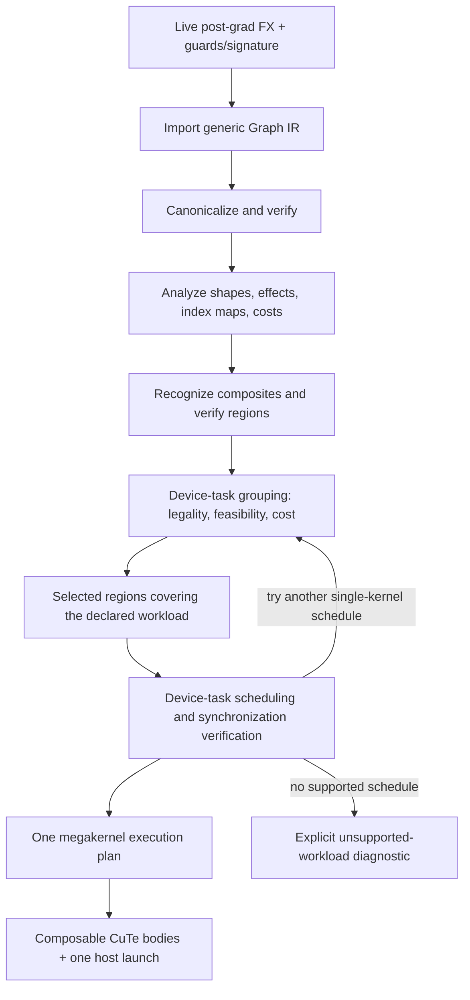

# MegaBake architecture and IR contract

**Status:** proposed implementation approach, 2026-10-05. This document describes the intended contracts and build order; it does not imply that the compiler stages exist. The north star is fixed: compile the declared inference workload into one CUDA megakernel. [north-star.md](north-star.md) records the project vision; this implementation plan must serve that goal.

## Core decision

MegaBake is a **megakernel compiler for generic tensor computations on NVIDIA GPUs**. A successful compilation executes the entire declared workload in one GPU kernel launch. For the full-model target, that workload is the captured model inference graph. SmolLM is the first real graph and benchmark fixture, not an IR dialect or a list of hard-coded operator kinds. GEMM is the main implementation and performance anchor. RMSNorm, attention, RoPE and MLP are parameterized patterns that can be recognized in many graphs.

**Megakernel execution is a requirement, not a profitability option.** Separate kernels, eager FX execution and library calls are development references and performance baselines only. They do not constitute a successful MegaBake compilation. The compiler must not silently partition a requested workload into separate launches, insert host fallbacks, or shrink its scope to satisfy this requirement. An unsupported operation or an unproven synchronization scheme means that workload is not yet supported.

Small graphs such as GEMM plus an epilogue are development milestones toward the full-model megakernel. Persistent device-side execution, task scheduling and cross-CTA synchronization are required parts of the full-model roadmap. Starting with CTA-local work changes the build order, not the destination. Correctness remains mandatory; a slow megakernel is a performance problem to solve, not permission to substitute a multi-kernel execution path.

PyTorch's post-grad FX graph is the source of primitive operations, values and tensor metadata. Its surrounding frontend/runtime owns specialization checks and argument/output bindings; a bare `GraphModule` is not the complete runtime contract. MegaBake owns a smaller **Compute IR** because it adds stable normalized operations, first-class index maps and numerical contracts, effect boundaries, and source mapping needed for fusion. Import only what the compiler can reason about; retain the rest as source-backed opaque regions for diagnostics and future lowering. An unresolved opaque region blocks megakernel compilation of the declared workload. This IR has a purpose beyond wrapping FX nodes in new classes.



Canonicalization runs **before** high-level recognition so different FX spellings reach the same pattern. Analyses are recomputed after a rewrite. Recognition enriches the generic IR; it does not fix device-task boundaries. A planner may inspect or inline a recognized composite's generic body. The optimized Graph IR and its selected regions remain independent of the downstream Execution Plan. Scheduling may split a group into multiple device tasks inside the same enclosing megakernel, or reject the workload if no supported single-kernel schedule exists.

## Pass contracts

| Boundary | Output and guarantee |
| --- | --- |
| FX → Graph IR | SSA-like, topologically ordered generic graph with explicit per-input `IndexMap`s. Every supported source node has exact semantics and provenance; unsupported regions retain source coverage and block executable megakernel emission until lowered. Inputs, outputs, aliases, effects and guards are preserved. No GPU schedule is present. Verify the imported graph. |
| Canonicalize → Graph IR | Same graph contract and observable semantics. Normalize views, broadcasts and GEMM forms; fold only provably redundant pure operations. Every rewrite preserves value uses, dtype/cast boundaries, aliases and effects. Verify after each transformation. |
| Analyze → Facts | Producer/users, shapes, strides, validated index maps, reduction domains, alias/effect order, liveness and rough FLOP/byte estimates. No semantic change. Facts are versioned with the graph and invalidated by rewrites. |
| Recognize → Graph IR with composites | Parameterized named regions such as RMSNorm or Attention carry their exact generic body and source FX nodes. Their interface lists every external input and live output; their numerical attributes are complete. Unmatched graph remains generic. Verify graph and region boundaries. |
| Optimize/fuse → selected regions | Candidate task groupings pass legality and implementation feasibility, then are ranked by cost within the single-megakernel constraint. The output is an optimized Graph IR with selected `Region`s; it contains no concrete CTA schedule or storage placement. Verify complete workload coverage and region boundaries. |
| Schedule → Execution Plan | One enclosing megakernel covers the entire declared workload. Device tasks, CTA ownership, layouts, intermediate placement, dependency visibility, synchronization, progress and launch arguments are fixed. Rejected task groupings may be rescheduled inside that kernel; no host fallback or additional workload kernel launch is allowed. Verify the plan. |
| Lower/run → callable | The runtime checks specialization, binds buffers and launches one CuTe/CUDA megakernel reproducing outputs, mutations/aliases, state updates and stream ordering. The backend does not invent missing scheduling decisions. Separate initialization or library compute launches cannot be hidden outside the declared workload. |

Keep dumps after import, canonicalization, composite recognition, candidate selection and scheduling, with IDs that link each output back to FX. Graph, region and plan verification are required gates, not deferred debugging aids.

## Compute IR: the generic layer

The target schema below should be introduced incrementally. The first GEMM-plus-epilogue experiment needs only the values, ops, input maps, region boundaries and numerical contracts used by that kernel. General reductions, composite matchers and broad graph analyses should follow working kernels rather than block the first experiment.

```text
Graph:
    inputs, outputs, ordered ops, values, source_fx_map, guard_context

Value:
    id; TensorType(shape, dtype, device, boundary_strides)
    producer; users; optional view/alias relation
    # logical value, not an allocation

Op:
    id; kind; ordered inputs/outputs; typed attributes
    input_index_maps: one IndexMap per tensor input
    source FX nodes; effect summary; numerical contract

Operand:
    ValueId | typed scalar literal

IndexMap:
    output indices/tile + reduction domain -> required input indices/tiles
    explicit axes/relations for supported ops; Unknown for an opaque mapping

Region:
    ordered OpIds; external inputs; every live output; source coverage
    # structural subgraph only: no semantic tag, fusion promise or GPU schedule

Composite:
    Region + verified semantic kind and parameterized attributes
    # retained generic body, e.g. RMSNorm or Attention
```

Keep producer/users as derived maps if storing both would create inconsistent state. Shapes may be concrete initially; a later `DimExpr` must be tied to Dynamo guards. Tensor metadata is about logical/boundary behavior. Registers, shared memory, HBM and CUDA layouts belong to the execution plan. `Region` is a lightweight view over existing graph ops and boundary values; it never duplicates their bodies.

These names have different contracts:

| Object | Meaning | Contains GPU decisions? |
| --- | --- | --- |
| `Composite` | A `Region` proven to implement a named, parameterized computation such as RMSNorm. | No. |
| `FusionCandidate` | A proposal to group graph ops/regions into device-side work within the enclosing megakernel. | Proposed implementation family only. |
| Selected `Region` | A selected device-task grouping; still part of optimized Graph IR. | No concrete tile or storage schedule. |
| `KernelPlan` | The single GPU launch implementing the entire declared workload, including its device-task graph. | Yes: ownership, tiling, placement and synchronization. |

A composite can span several device tasks, and one task can implement parts of multiple composites. Every task executes inside the same enclosing megakernel. A task or region boundary is not a host kernel-launch boundary.

The initial generic operations are deliberately few:

| Kind | Required semantics | Output-tile dependency |
| --- | --- | --- |
| `Gemm` | Contracted/batch axes, operand orientation, M/N/K, operand and result dtype, accumulation/rounding policy, strides. Normalize `mm`, `bmm` and linear projections here when their semantics match. | An M×N output tile requires the matching A/B tiles across the complete K reduction. |
| `Pointwise` | Exact scalar expression, typed literals, per-input broadcasting maps and cast points. | One output tile needs corresponding input tiles. |
| `Reduce` | Axes, combiner, keepdims, accumulation dtype and result cast. | An output tile needs the specified complete reduction domain. |
| `View` / `Broadcast` | Output-to-input index map, shape/stride and alias or copy behavior. | Dependency follows the map; a required copy remains work. |
| `Cast` | Source/destination dtype and rounding point. | Same logical indices with an observable numeric transition. |
| `OpaqueFX` | Exact source subgraph, inputs, outputs and effects. | Blocks successful workload compilation until a device lowering or proven pattern exists. |

Each tensor operand has a first-class **`IndexMap`**: given an output index or tile and any reduction indices, it identifies the required input indices or tiles. For example, GEMM output `(m,n)` reads A `(m,k)` and B `(k,n)` over its K domain; a bias broadcast maps `(m,n)` to `(n)`. Import or canonicalization creates the maps; analysis validates and composes them. `Unknown` blocks generic fusion until a specialized implementation proves its mapping. Start with maps for these operation families; a full symbolic algebra system is unnecessary. TVM classifies elementwise, broadcast, reduction and complex ops for fusion, while MLIR Linalg uses indexing and iteration structure to make tiling and producer/consumer fusion precise. [TVM fusion](https://tvm.apache.org/docs/arch/fusion.html), [MLIR Linalg](https://mlir.llvm.org/docs/Dialects/Linalg/)

Verification is explicit after every transformation: the **graph verifier** checks unique definitions, topological uses, shape/dtype/index-map consistency, source coverage, graph outputs, effects and alias relations; the **region verifier** checks connected body coverage, every external input and live output, and no hidden users or effects; the **plan verifier** checks complete graph coverage, chosen body capabilities, CTA ownership, storage lifetimes and synchronization. Reject ambiguous `reshape`, unsupported overloads and unknown side effects with an FX node diagnostic. Do not silently make them pure.

### Canonicalization comes first

Examples of safe, useful canonical forms:

- Normalize `view/reshape/permute + mm` to a `Gemm` with explicit operand indexing, retaining copies and observable view aliases.
- Normalize scalar and tensor broadcasts into pointwise input maps.
- Collapse identity views/casts and adjacent pure pointwise expressions only when their dtype rounding and use boundaries remain equivalent.
- Remove dead pure values and keep all live outputs and effect dependencies.
- Preserve `BF16 Gemm result → FP32 Cast → SiLU → BF16 Cast` as distinct numeric steps. A fused epilogue must reproduce the BF16 rounding before the FP32 activation when required by the captured graph.

Canonicalization is generic. No rule mentions SmolLM layer numbers, head counts or its particular epsilon.

## Parameterized semantic composites

Pattern recognition is an optimization **over Compute IR**, after canonicalization. A composite is a region with a name, attributes and a retained generic body. It can be expanded for another optimization or mapped to a specialized body. It never becomes an opaque magic instruction merely because the pattern matched.

Ordinary fusion rules still work when no composite matches: `Gemm → Pointwise` or `Pointwise → Reduce` can be considered from their generic index maps. A composite adds verified meaning and possible specialized implementations; it is not a prerequisite for all fusion.

| Composite | Generic parameters to prove |
| --- | --- |
| `RMSNorm` | Reduction axes, epsilon location/value, accumulation dtype, exact cast sequence, weight order, output type and live secondary outputs. |
| `RoPE` | Rotated dimension, Q/K layout, position/cos/sin operands and arithmetic/cast order. |
| `Attention` | Q/K/V and output layout, head/group mapping, scale, mask/causal behavior, softmax axis/dtype, probability cast, dropout and KV-state effects. |
| `GatedMLP` | Gate/up/down `Gemm`s, activation expression and branch/multiply dataflow. This is a region annotation; the planner can fuse a subset. |

These are **generic parameterized definitions**, not SmolLM-specific kinds. SmolLM's phase-6 trace is a demanding first match: its RMSNorm computes in FP32, casts to BF16 before multiplying by BF16 weight; its attention uses grouped heads, masking, FP32 softmax and BF16 probabilities. The first matcher proves these exact facts. Other valid variants receive different attributes or remain generic. A matched region must include all internal uses or expose additional live outputs. Named patterns do not change numerical tolerance rules.

For illustration, after canonicalization and recognition one block may read:

```text
%norm = RMSNorm(%x, %weight) {axis=-1, eps=1e-5, compute=f32, ...}
%q    = Gemm(%norm, %Wq)
%k    = Gemm(%norm, %Wk)
%v    = Gemm(%norm, %Wv)
%qr,%kr = RoPE(%q, %k, %positions) {...}
%ctx  = Attention(%qr, %kr, %v, %mask) {heads, scale, dtype_policy, ...}
%h    = Pointwise.add(%x, Gemm(%ctx, %Wo))
%gate = Gemm(%h, %Wgate)
%up   = Gemm(%h, %Wup)
%mix  = Pointwise.mul(Pointwise.silu(%gate), %up)
%out  = Gemm(%mix, %Wdown)
```

This is a readable view of a generic IR. The complete graph also has the second norm and residuals; each composite retains a body that can be printed or inlined. The numbers in the saved SmolLM trace validate matchers but do not become op definitions.

## Composition: from semantics to one megakernel

A candidate is generated from **tile dataflow and a good implementation anchor**. A `Gemm`, `Reduce` or `Attention` usually determines a device task's tile/CTA schedule; compatible pointwise work may join it. This mirrors XLA:GPU's “hero” emitter idea at the task level. All selected tasks must compose inside one enclosing kernel. [OpenXLA GPU emitters](https://openxla.org/xla/emitters)

```text
FusionCandidate:
    region: included OpIds or composite body fragments
    proposed device-body family; expected resource and traffic costs

DeviceTaskPlan:
    region, composable body/template and specialization
    body capability contract; participating threads and fragment layouts
    output/input-tile maps; CTA/warp ownership; reduction domains
    required producer tiles; completion and buffer-release conditions
    register/shared/global placement; local barriers; resource limits

KernelPlan:
    complete declared workload; all DeviceTaskPlans
    device-task dependencies and readiness/completion protocol
    cross-CTA storage, visibility, synchronization and progress rules
    persistent worker assignment; workspace; one launch grid/argument list
    compiled resource usage; measured latency for the selected specialization

ExecutionPlan:
    one KernelPlan
    graph input/output bindings; lifetimes; guards
```

For an MLP, gate/up GEMMs and their pointwise consumer may share output-tile ownership inside one CTA. The down-projection needs the complete corresponding reduction domain, which can depend on tiles produced by other CTAs. Supporting the complete MLP therefore requires a verified device-side dependency schedule inside the same megakernel. The plan may materialize an intermediate in global workspace and signal its availability; one kernel does not imply that every intermediate remains on-chip.

If the paired GEMMs exceed the local resource budget, try different tiles, sequential device-body execution or separate device tasks within the enclosing kernel. If the scheduler cannot prove correctness and progress, the complete MLP is unsupported at that stage. The compiler must not silently substitute separate GEMM launches. A gate/up-only graph may be an explicitly chosen development fixture, but does not satisfy a request to compile the complete MLP.

Composition uses three decisions:

| Decision | Must establish | On failure |
| --- | --- | --- |
| **1. Legality** | Complete workload coverage, all live outputs/effects, exact cast boundaries, valid index maps, producer/consumer ownership and dependency visibility. | Try another single-kernel schedule or report the workload unsupported. |
| **2. Implementation feasibility** | Composable CuTe bodies exist; shape/dtype/layout and resource budgets fit; synchronization and scheduling have a progress argument. Host-callable wrappers alone are insufficient. | Change device bodies, tiles or task assignments; otherwise report the workload unsupported. |
| **3. Performance selection** | Rank correct, feasible megakernel schedules using measured or calibrated latency, including GEMM throughput, memory traffic, occupancy and scheduling overhead. | Revise the megakernel schedule and report the performance gap. A faster multi-kernel baseline does not become the emitted execution plan. |

Trial schedules may be compiled and benchmarked before selection. Only the chosen single-kernel schedule enters the final `ExecutionPlan`.

### Device-body compatibility and tile dependencies

Each composable CuTe body must declare its supported shapes, dtypes and layouts; required CTA/warp participation; input/output fragment layouts; shared-memory size and alignment; barrier requirements; and completion conditions, including outstanding asynchronous work. Start with the contracts required by actual bodies. The planner must account for any layout conversion or synchronization needed to connect them; a matching logical tensor shape alone does not establish efficient composition.

Dependencies are between **producer and consumer tiles**. Derive the required producer tiles from input index maps and reduction domains. A consumer becomes ready when all data it requires is complete and visible at the appropriate memory scope; it need not wait for unrelated tiles of the producer operation. Specify publication, observation and buffer-release conditions explicitly. Keep an intermediate alive until its last consumer completes, and verify the readiness protocol across repeated invocations. This granularity enables cross-operation pipelining while retaining the existing progress requirements.

### Whole-kernel resources and intermediate placement

Per-body estimates filter candidates, but feasibility and performance must also be checked on the **complete compiled megakernel**. Record registers, shared memory, spills and occupancy constraints for the actual launch configuration. Include scheduler and synchronization resources. A body that performs well alone may need a different tile size, pipeline depth or worker assignment when composed with other bodies. Feed compiled resource usage and measured latency back into schedule selection. [CUTLASS GEMM design](https://docs.nvidia.com/cutlass/latest/media/docs/cpp/efficient_gemm.html)

Choose intermediate placement together with ownership and scheduling. Consider retaining a tile in registers/shared memory, publishing it through global workspace, or recomputing pure work when the numerical contract permits. Compare transfer and layout-conversion costs, additional computation, live storage and resulting occupancy. Reuse buffers only when consumer completion proves their lifetimes do not overlap; asynchronous tasks require dependency-aware lifetime analysis. All choices execute within the same megakernel.

### Bounded, measured schedule search

Begin with a small set of supported body variants, tile sizes, pipeline depths and worker assignments, including their compatible placement choices. Prune candidates using semantic, layout, resource and progress checks; compile the survivors, verify correctness, then benchmark the complete declared workload. Select the fastest measured valid megakernel within an explicit search budget. Expand the search only when measurements identify a remaining bottleneck; per-body speed alone is not the selection criterion.

Cache the chosen specialization using the graph/body identity, guarded shapes and strides, dtypes, numerical policy, GPU architecture and resource configuration (including MIG), and compiler/toolchain versions. Revalidate or retune when those assumptions change. Preserve candidate measurements and rejection reasons so tuning decisions remain inspectable. Search exhaustion or a performance regression must never select a multi-kernel substitute.

The first scheduling prototype handles **CTA-local compositions**. It can support small declared workloads whose internal dependencies stay within a CTA. This is a development limit, not the final execution model. Whole-model megakernels require explicit device tasks, intermediate lifetimes, cross-CTA communication and persistent execution. A producer in another CTA creates a device-side dependency to implement, not permission to add a host launch boundary.

The persistent runtime must establish memory visibility and forward progress. It cannot assume a global barrier or rely on unbounded spinning while producer CTAs may be unscheduled. Worker residency, dependency readiness, workspace initialization/reuse and completion handling must be part of the verified design. Mirage MPK is a reference for task-graph execution inside a persistent kernel. [Mirage MPK](https://arxiv.org/abs/2512.22219)

| Development workload | What it proves | Critical check |
| --- | --- | --- |
| `Gemm` + pointwise epilogue | One-launch device-body composition | Casts, broadcasts and GEMM throughput. This is an infrastructure milestone; common epilogue fusion already exists. |
| Minimal producer/consumer across CTAs | Early proof of device-side tile handoff inside one kernel | Readiness, memory visibility, workspace reuse, scheduling overhead and forward progress. |
| Gate/up branches + pointwise consumer | Multiple GEMM bodies inside one kernel | Matching tile ownership and register/shared-memory budgets. |
| `Reduce`/`RMSNorm` → `Gemm` | Reduction/projection composition | Reduction ownership, recomputation costs or explicit task handoff. |
| Attention's QK/softmax/PV body | Multi-phase computation inside one kernel | Masking, reductions, head mapping, numerical policy and intermediate lifetimes. |
| Consecutive GEMMs, transformer block, full model | Required cross-CTA and persistent execution | Complete device-task dependencies, visibility and progress without additional workload launches. |

**Minimize end-to-end latency subject to correct single-megakernel execution.** Separate implementations provide performance targets and help diagnose bottlenecks. They cannot satisfy MegaBake's output contract.

## GEMM-first implementation and milestones

GEMM is the highest priority device-body component. The saved SmolLM MLP has `M=4` projection GEMMs, which may behave differently from larger prefill GEMMs. Establish both shape regimes and compare against Inductor and CUTLASS/cuBLAS on the same GPU before claiming a speedup. Poor GEMM throughput requires improving the megakernel body or schedule; the successful compilation contract remains one kernel.

### Proposed frontend repair

Use a small, version-pinned adapter around PyTorch's existing compiler entry point, with a MegaBake callback at the post-grad boundary. Prefer reusing PyTorch's preparation and runtime wrappers over manually rebuilding lifted arguments from an export and calling the raw post-grad graph.

- **One graph phase:** remove the Inductor executable-cache lookup from the live capture path. Ensure that neither an AOT executable cache nor an Inductor executable cache bypasses the required handoff on a backend invocation. Run the selected post-grad passes consistently and verify the graph before handing it off. Normal Dynamo reuse of an already compiled, guarded callable remains valid.
- **Explicit runtime ownership:** under `torch.compile`, Dynamo owns guards and output-tree reconstruction; AOTAutograd owns its argument adaptation and mutation/alias handling. Return the wrapped callable. Do not equate equal placeholder counts with correct argument bindings. Initially require inference under `torch.no_grad()` and reject unsupported training paths.
- **A narrow compiler callback:** pass the live post-grad graph and its matching example inputs to the lowering callback. Its returned callable must obey that graph's argument/output contract. Example inputs describe compilation; they must not become captured runtime tensor bindings. An FX executor can test this contract before CuTe lowering exists, but must be labeled as a reference executor rather than a compiled MegaBake result.
- **Metadata validation:** preserve source/output metadata and refresh tensor metadata after post-grad rewrites where needed. Do not assume every pass preserves valid strides. If export is used, retain its graph signature, call specification and constraints; a text dump is only an inspection artifact.
- **Version checks:** enforce the tested PyTorch release before importing private APIs, and align package constraints with it. Record the imported wheel's Git revision; an independent PyTorch checkout may describe a different implementation.

### Proposed workload and measurement contract

Start with BF16 projections on one stated GPU target. The initial matrix should include the observed `M=4, K=576, N=1536` shape and a larger prefill case such as `M=256` with the same K/N. These are projection experiments, not evidence about KV-cache decode. Whole-model validation should make batch size, sequence length, dtype, attention implementation, seed and model revision explicit.

Measure standalone GEMM, cast-correct GEMM plus SiLU, and subsequently the gate/up branch. Keep the BF16 GEMM result rounding before FP32 activation and the required cast back to BF16. Compare each fused candidate against the best supported separate implementation, including a library GEMM path, Inductor, and CUDA Graph variants. Record whether requested autotuning actually applies on the target; a `max-autotune` label alone is insufficient, especially on MIG configurations.

Separate compilation/first-call time from warmed execution. Report repeated latency samples, GPU timing and synchronized host-call timing with their measurement method. Check outputs before timing, retain failed candidates as failures, and avoid concurrent GPU tests during measurements. GEMM-plus-epilogue establishes integration. Follow it with a minimal producer/consumer experiment requiring cross-CTA tile handoff inside one kernel, before broad operator recognition. Gate/up composition then evaluates a concrete multi-body optimization. Add an optimized attention baseline when moving to whole-model comparisons.

Record Python, PyTorch and its Git revision, CuTe/compiler package versions, GPU capability and MIG resources, selected compiler paths, workload settings, source hashes and numerical tolerances. Use separate artifact directories for separate runs. Test the actual CuTe compilation path with a small kernel; the version of `nvcc` on PATH alone does not establish whether DSL compilation works. Align the CUDA toolkit if the chosen implementation uses its compiler or headers.

### Proposed regression gates

Keep a focused, runnable suite alongside the adapter and grow it with supported lowering:

- Cache settings cannot change whether post-grad preparation runs; check the phase and operator graph as well as numerical outputs.
- Changed shapes/strides trigger valid specialization behavior, while repeated calls use current inputs and parameter values.
- Output structures, live secondary outputs, aliases, input mutations and buffer updates survive the runtime handoff.
- Transposed GEMM operands, row/column broadcasts and BF16 cast boundaries match the reference at explicit tolerances.
- A tiny locally constructed transformer exercises capture without downloaded weights; a CuTe smoke test checks compilation, tail handling and current-stream execution.
- Cross-CTA consumers observe only completed producer tiles; delayed producers, shared consumers and repeated invocations preserve progress and workspace lifetimes.
- Selected body contracts agree with the composed launch, compiled resource limits and numerical policy; cached schedules are used only under their recorded specialization assumptions.

Passing these gates validates the frontend and toolchain. Successful MegaBake compilation additionally requires complete workload coverage and exactly one GPU workload launch, with no hidden compute launches or host fallback. Generated kernel correctness and measured performance remain separate exit conditions.

| Milestone | Deliverable | Exit condition |
| --- | --- | --- |
| **M0 — reliable source handoff** | Pinned adapter with explicit runtime ownership; remove cache-dependent phase ambiguity and add focused regression checks. | CPU/CUDA checks prove the graph phase, bindings, guards, effects and output behavior. Reference execution is clearly identified as frontend validation. |
| **M1 — measured GEMM baseline** | Library/Inductor baselines for small-M and larger prefill projections, including CUDA Graph variants; validate the CuTe toolchain. | Reproducible correctness and latency records establish performance targets. Separate kernels are benchmark fixtures only. |
| **M2 — first single-kernel composition** | Minimal generic IR/maps and verifiers for a composable CuTe GEMM body plus a cast-correct epilogue. | The complete declared GEMM-plus-epilogue graph executes correctly in one kernel; measure the performance gap and improve its schedule. |
| **M3 — multiple bodies and tile handoff** | First prove a minimal producer/consumer dependency across CTAs inside one kernel; also compose gate/up bodies and their pointwise consumer. Keep this prototype narrow before generalizing the runtime. | Both declared fixtures execute correctly in one launch. Verify tile readiness, visibility, workspace reuse and progress; measure scheduling overhead and complete-kernel resource/throughput limits. |
| **M4 — persistent device-task runtime** | Device-task DAG, persistent workers, global workspace lifetimes, dependency visibility and cross-CTA synchronization with a progress argument. | A workload with producer/consumer dependencies across CTAs executes correctly in one persistent kernel, including repeated invocations. This milestone is required. |
| **M5 — transformer-block megakernel** | Add the generic reductions, parameterized recognition and composable norm/attention/RoPE/MLP bodies needed for one complete block. | The whole declared block, including down-projections and residuals, executes correctly in one kernel with no host fallback. |
| **M6 — full-model megakernel** | Compose the complete supported SmolLM inference graph in the persistent execution plan. | Whole-step reference correctness, exactly one workload kernel launch and end-to-end performance measurements against strong baselines. Separate per-block launches do not satisfy this milestone. |
| **M7 — workload expansion and performance** | Extend the megakernel to explicit prefill/decode workloads with KV-state updates, larger shapes and additional models; improve bodies and scheduling. | Each supported declared workload retains the one-kernel contract, correct state behavior and reproducible measurements. Report unsupported cases and performance gaps explicitly. |

**Proposed next order: establish the frontend and baselines, prove small single-kernel compositions, build the required persistent device-task runtime, then reach the full-model megakernel.** Keep the computation/planning/backend boundaries and grow the IR with concrete workloads. Small compositions are stepping stones, not the project endpoint. SmolLM supplies concrete cases; its layer numbers and dimensions must not become operation definitions. This is a plan, not a record of completed milestones.

## Current repository facts and references

- `src/megabake/__init__.py` has no compiler implementation. The existing CUDA trace records 3,323 calls across 30 targets for batch 1, sequence 4, BF16, no KV cache on H200 MIG. A saved text file called `megabake_ir.txt` is an inspection artifact, not a current executable IR path.
- The capture script currently returns `graph.forward` and uses private Inductor APIs. Its cache-hit path can label a graph post-grad without running those passes. Saved metadata shows PyTorch CUDA 13.0 and local `nvcc` 12.8.
- [MLC book](https://book.mlc.ai/chapter_graph_optimization/index.html) motivates graph optimization followed by mapping to executable tensor programs. [TVM Relax fusion](https://tvm.apache.org/docs/arch/fusion.html) separates op grouping from actual kernel merging. [MLIR Linalg](https://mlir.llvm.org/docs/Dialects/Linalg/) and [OpenXLA GPU emitters](https://openxla.org/xla/emitters) inform structured indexing and anchor-led codegen. [CUTLASS CuTe DSL](https://docs.nvidia.com/cutlass/latest/media/docs/pythonDSL/overview.html) is the kernel backend; its [Operator API](https://docs.nvidia.com/cutlass/latest/media/docs/operators/overview.html) already covers common GEMM epilogues.
- The public `torch.compile` backend contract receives Dynamo FX. A pinned Inductor post-grad adapter is a separate integration layer. [PyTorch custom backends](https://docs.pytorch.org/docs/main/user_guide/torch_compiler/torch.compiler_custom_backends.html)
