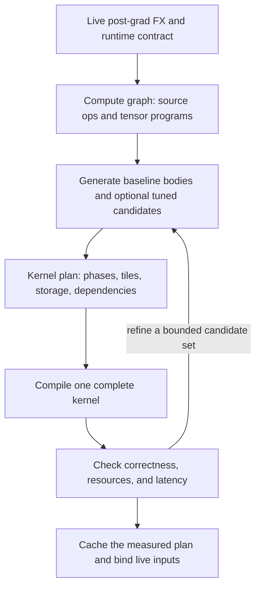

# MegaBake architecture

**Revised: 2026-10-09. Status: proposed compiler, with limited experiments.**

[north-star.md](north-star.md) defines the scope. [RESEARCH.md](RESEARCH.md) records the source review, measurements, and limits of the evidence. [IMPLEMENTATION_PLAN.md](IMPLEMENTATION_PLAN.md) defines the build gates.

[SCHEDULER_REUSE.md](SCHEDULER_REUSE.md) records the deeper implementation review, reusable components, and checks. This revision makes generic operation coverage and fallback behavior explicit.

**Build a compiler that preserves fast device pipelines when it composes them. Prove the cost of that composition before building the full compiler.**

The previous design had useful rules for computation and synchronization. A slow body could still pass each correctness stage and reach a full model. This design keeps those rules. It changes the body interface, the amount of work scheduled at once, and the build order.

### Design basis: Mirage

**Use Mirage as the main reference architecture for lowering, planning, and persistent execution.** Start each subsystem from the matching Mirage implementation, assumptions, and tests. Preserve compatible algorithms and contracts when adapting the code. Explain each departure with a specific correctness, frontend, backend, resource, or measured performance reason. Reuse existing solutions to keep the system simple.

Use both parts of Mirage. Its graph transpiler provides ideas for generating tensor programs and local schedules. MPK provides ideas for task formation, dependencies, and persistent execution. Connect these ideas to the FX contract and CuTe DSL output. The detailed source map is in [SCHEDULER_REUSE.md](SCHEDULER_REUSE.md).

| Design responsibility | Starting point |
| --- | --- |
| Tensor and tile mapping | Mirage's distinction between logical tensors, block tiles, index maps, and physical layouts |
| Body generation | Its reusable device primitives, fusion chains, local schedules, and epilogues |
| Layout and storage | Its compatibility constraints, padding rules, live intervals, and allocation algorithms |
| Candidate generation | Its map/dimension enumeration and pruning, constrained by the selected body family |
| Cross-body execution | MPK's task descriptors, dependency analysis, event grouping, and worker execution |
| Validation | Upstream regression cases, plus differential checks for each adapted contract |

The initial phase runtime is an executable reference for correctness and composition cost. Compare it with an MPK-derived event plan when measurements show useful overlap. Final scheduling choices must follow the workload evidence. A simpler implementation that loses required throughput does not pass the performance gate.

## 1. Scope and success

MegaBake receives a captured PyTorch invocation and produces a CUDA megakernel for its supported regions. PyTorch and Hugging Face keep the model and runtime interface. MegaBake owns region formation, CuTe DSL device bodies, tiling, storage, synchronization, and execution planning.

A full-model request includes the complete captured invocation, its requested outputs, and its state updates. The compiler must not replace that request with a block benchmark. It can reject an unsupported request with a source-linked reason. The scope does not require every operation, shape, or model to fit one kernel.

A successful megakernel has these properties:

1. It covers the declared workload and all observable effects.
2. It preserves guards, bindings, aliases, mutations, and the numerical contract.
3. Its recurring GPU work executes in one workload kernel. This includes required reset, conversion, and state-update work.
4. Every dependency has a visibility rule and a forward-progress argument.
5. It reports complete-call correctness and latency against an equivalent `torch.compile` baseline.

A correct kernel and a faster kernel are separate results. A correct generic megakernel establishes support for its declared workload even if it is slow. It does not pass a performance gate. An eager call, library launch, or CUDA Graph is a useful reference, but does not count as an emitted megakernel.

Start with single-GPU BF16 inference on SM90. Record the actual device partition for each run. The H200 MIG device measured on 2026-10-08 had 60 SMs; a full H200 is a different target. Support prefill and stateful decode as distinct workload regimes in the same compiler.

## 2. Start with the latency budget

Fusion can remove launches, intermediate memory traffic, and some waits. It can also reduce compute throughput, increase resource use, and introduce new waits. Count both sides.

For a dense GEMM, let `A` have shape `[M,K]` and the stored weight have shape `[N,K]`. Ignoring tails and repeated loads:

```text
work             = 2 M N K FLOPs
BF16 tensor bytes = 2 (M K + N K + M N)
weight-dominated arithmetic intensity ≈ M FLOPs/byte
```

The byte estimate is an ideal access count, not measured HBM traffic. Caches, tile overlap, padding, and partial reductions change the real traffic. A useful lower-bound estimate is `max(work / compute_rate, bytes / bandwidth)`. Measure the relevant rates on the actual GPU partition.

At small `M`, reading weights and creating enough parallel work are often the main concerns. At large `M`, tensor-core throughput and data reuse matter more. Context length also changes attention cost. These facts explain the need for different schedules; the name of the mode alone does not choose one.

For a candidate composition, use this accounting model:

```text
potential savings = launches removed + traffic avoided + useful overlap
new costs         = body slowdown + dispatch + synchronization
                  + layout conversion + spills + lost parallelism
```

Accept the performance claim only after measuring the complete workload. These terms interact, so adding isolated timings is a diagnostic, not a proof.

For a simple serial estimate, suppose GEMMs take 90% of baseline time. A 20% GEMM slowdown raises their cost to 108% of baseline time. The workload then loses even if all other work disappears. Removing launches cannot recover that loss.

The local experiments support measuring this budget. A small tile search left large gaps. Adding a larger tile brought a tested large GEMM to approximate library parity, while gaps remained at other shapes. The cost of restarting a body also changed with its configuration. These results select the next experiments; they do not establish a model speedup. See [the measurements](RESEARCH.md#gpu-experiments).

## 3. Use two program representations

A tile is part of a tensor. A CTA is a CUDA thread block. An SM is a GPU processor. An IR is a structured description of a program.

A **lowering** converts an operation into a form that the next compiler stage can use. A **device body** is GPU code that runs inside the megakernel. A **body provider** selects or generates that code. A **contract** states the behavior that an interface must preserve.

Keep a description of the computation and a description of its execution. A catalog of body generators connects them. Temporary fusion candidates and expanded tile graphs do not need separate permanent IRs.



### Compute graph

Keep the live FX graph as source evidence. Import a small tensor description that the planner can use:

```text
Value  = shape, dtype, device, boundary strides, alias relation
Op     = operands, results, attributes, tensor program if known, effects, numerics, FX IDs
Region = source operations, external inputs, every live output, semantic facts
Graph  = values, operations, inputs, outputs, guard and runtime context
```

A region refers to its source operations. It does not copy them into a second graph. Derived uses and costs are analysis results. Physical addresses, worker IDs, and shared-memory swizzles belong in the kernel plan.

The graph must retain every source operation, including operations without a lowering. Import rules translate known semantics into the following families. Model names and recognized fused regions do not define support.

| Family | Required meaning |
| --- | --- |
| Contraction, including GEMM | Output and reduction domains, indexed operands, predicates, accumulation and result types |
| Elementwise and cast | Scalar expression, broadcasts, typed constants, explicit rounding points |
| Reduction | Reduction domain, combiner, accumulation type, output shape and cast |
| View and copy | Coordinate map, strides, alias behavior, whether data movement is required |
| Gather and index | Index source, supported index range, read domain and invalid-index behavior |
| State access | Storage identity, read/write domain and required ordering |
| Tuple and selection | All results and which result each use selects |
| Opaque source operation | Retained FX target/body, all boundaries and known effects; unresolved facts block device lowering |

Do not build a universal symbolic algebra system first. Concrete, guarded maps for these families are enough. For GEMM, `(m,n,k)` reads `A[m,k]` and `W[n,k]`. A view composes that map with a stride map. A data-dependent gather needs a supported access rule or a conservative dependency domain; an affine map alone cannot describe it.

Within an operation, a **tensor program** describes output coordinates, reduction coordinates, indexed loads, predicates, typed scalar expressions, and stores. It is a field of the compute graph, not a third graph IR. Scalar expressions retain casts and evaluation order. An opaque FX call is retained as opaque until an importer or a valid decomposition supplies this meaning.

For example, a convolution importer can express an output as a sum over input channels and filter coordinates. The input address includes stride, dilation, padding, and groups. This can use a generic indexed contraction without first allocating an `im2col` tensor. Pooling uses indexed reductions. These rules require implementation and tests; accepting an FX node alone does not provide them.

MLIR Linalg provides useful precedent for explicit indexing and reduction structure. MegaBake uses that idea without adding MLIR as a new compiler dependency. [Linalg design](https://mlir.llvm.org/docs/Dialects/Linalg/)

### Semantic regions

Recognize RMSNorm, RoPE, attention, and gated MLP from normalized source operations to enable faster candidates. Retain their source bodies and secondary outputs. A semantic name states what is computed; it does not fix the task boundary. A failed matcher must leave the underlying graph available for generic lowering.

Each definition needs an exact matcher, parameters, and a reference expansion or evaluator. Check its numerical behavior and effects. Include epsilon placement, rotation convention, masks, grouped heads, probability casts, and KV effects where applicable.

This separation follows the useful part of the MLC design: graph transformations and tensor schedules solve different problems. A fused graph function still needs a good device schedule. [MLC graph optimization](https://book.mlc.ai/chapter_graph_optimization/index.html)

### Coverage and fallback

Use this order for each region:

1. Import its tensor meaning. Apply a selected PyTorch decomposition when it supplies supported primitives and preserves the workload contract. Keep source links through expansion. Do not erase useful contraction or attention structure as a prerequisite for matching.
2. Keep a correct baseline lowering for those primitives. Generate it when needed as an execution candidate or a correctness reference. A new combination of supported primitives needs no new model matcher.
3. Add legal fused or tuned candidates. Keep the baseline available when matching, resource admission, or tuning fails.
4. If no device plan covers the complete invocation, follow the explicit fallback policy before execution.

Baseline generation uses a few reusable schedules: indexed elementwise work, reductions, and indexed contractions. Use masked loads, explicit output ownership, bounded loops, global intermediates, and ordered phases. Large reductions can loop within one CTA, or use partial results and a later merge phase when numerically allowed. They need not fit entirely in shared memory. This path favors coverage and correctness; it can be much slower and use more workspace than a tuned body.

| Situation | Required behavior |
| --- | --- |
| Unrecognized RMSNorm variant built from supported primitives | Generate its reduction and elementwise expressions; no named RMSNorm body is required |
| New vision block built from supported contractions, indexing, reductions, and maps | Compile its graph through the same planner, without a model-specific registration |
| Known semantics but no tuned configuration for this shape or stride | Use a legal baseline body and report that choice |
| FX call with no importer and no usable decomposition | Preserve it and report its target, FX source, and missing lowering |
| Unknown mutation, RNG contract, custom device operation, or unsupported data-dependent allocation | Require a semantic/effect rule and a legal implementation before admitting it |
| Supported semantics but no legal one-kernel resource or synchronization plan | Report composition failure; scalar fallback does not waive launch legality |

Provide the proposed option `fallback=error|inductor`, independent of `mode`. Default to `error` for megakernel compilation and evaluation. If MegaBake has no valid complete plan, `inductor` permits delegation of the **whole captured invocation** to the pinned Inductor path. That path must support the invocation. Report the delegation reason and actual launch count. This establishes compatibility, but does not count as a megakernel result or a performance-gate pass. The option is not implemented yet.

The version adapter must delegate without recursively entering MegaBake and must keep the same PyTorch wrappers. Make the choice before device execution. Do not catch a failed, partly executed stateful kernel and rerun the invocation. Initial fallback is for the whole invocation; partitioned execution needs a separate alias, effect, and boundary analysis.

Record three independent facts: semantic coverage, execution kind (`megakernel` or `inductor_fallback`), and measured performance. For megakernels, also identify regions that used generic bodies. A missed optimization must not be presented as an unsupported model. An unknown operator must not be presented as supported merely because Dynamo captured it.

## 4. Preserve the PyTorch contract

Use a small adapter for a pinned PyTorch build. Obtain the live FX graph after the selected AOT/Inductor preparation and post-grad passes, before Inductor lowering and scheduling. Functionalization and runtime adaptation can occur in the AOT path; do not assume that one post-grad pass supplies the whole contract.

Preserve the PyTorch wrappers for lifted arguments, output structure, guards, and mutation handling. Refresh tensor metadata after rewrites. Return the compiled callable through the expected wrapper and boxing convention. Bind current runtime inputs and parameters on every call.

The existing capture script has a cache path that can bypass the intended handoff. Repair it before using its result as compiler input. A text trace is an inventory, not an executable frontend contract. Verify the installed wheel's internal API; an adjacent PyTorch checkout can differ.

Start with inference under `no_grad`, concrete guarded shapes, and `fullgraph=True`. Reject unsupported graph breaks or training. Audit wrapper copy-back and materialization when checking the one-kernel requirement.

Numerical policy is part of the workload. Preserve explicit source casts, including casts that no longer require a memory store:

```text
FP32 GEMM accumulation -> BF16 result -> FP32 activation -> BF16 result
```

A fused body must keep those rounding points unless a declared policy permits a change. Split reductions, online softmax, approximate activation functions, and algebraic motion across GEMM need their own checks. Set tolerances before testing. Do not increase them to accept a failing candidate.

## 5. Choose body families before choosing arbitrary tiles

**Maintain a small number of parameterized generators, with optional specialized implementations.** The catalog is not one handwritten kernel per operation variant.

Every provider accepts the region's tensor program, its semantic parameters, and target constraints. It returns a device body or an explicit reason it cannot implement that program. Generated baseline and tuned bodies share the interface in section 6 and all resource, numerical, and synchronization checks.

### Variants without a kernel for each variant

For a norm, separate the row/reduction schedule from the scalar expressions that surround it. A common RMSNorm expansion is:

```text
u[r,c] = cast_fp32(x[r,c])
v[r]   = sum_c(u[r,c] * u[r,c]) / width
y[r,c] = source_cast(u[r,c] * rsqrt(v[r] + epsilon) * weight[c])
```

Generate the exact source program. Epsilon placement, intermediate casts, residual inputs, affine terms, axes, and extra outputs remain explicit. Some variants fit one reduction body with generated expressions before and after the reduction. Others need more phases. A specialized RMSNorm implementation is eligible only when its full semantics match. In particular, a body fixed to `epsilon=1e-6` cannot implement every RMSNorm captured from FX.

For attention, keep a tuned tiled pipeline and compile supported score and mask expressions into it:

```text
score = score_expr(dot(q, k), batch, head, query_index, key_index, bindings)
valid = mask_expr(batch, head, query_index, key_index, bindings)
```

These are typed expressions compiled into device code, not runtime Python callbacks. A score bias, soft cap, causal rule, or window rule can fit this interface without a separate handwritten pipeline. The expressions must satisfy the provider's access and numerical rules. A score transform that depends on a whole score row may require another reduction and does not automatically fit a local score hook.

The attention family also owns head mapping, KV access, softmax state, probability casts, and all requested outputs. Selecting online softmax requires a valid numerical policy. Block skipping requires proof from the mask; it cannot be inferred from arbitrary score data. Dynamic mask metadata has a recurring cost that must stay in the execution plan. PyTorch FlexAttention is a useful example of compiling score and mask variations into a tuned template. Its separately launched implementation is not itself a composable CuTe body. [FlexAttention design](https://pytorch.org/blog/flexattention/)

If an attention variant falls outside this interface, lower its supported source operations through the baseline generators. Account for materialized score tensors and workspace limits. Changes such as a different normalization algorithm can require a new algorithm family; a template is not a universal attention implementation.

### Coupled configurations

A good GEMM is a coupled choice of instructions, tile shape, layouts, warp roles, pipeline depth, and work order. Do not let the outer scheduler choose these fields independently and then ask a generic GEMM to cope.

A body provider returns a small set of legal configurations:

```text
BodyConfig:
    supported operation and numerical policy
    accepted expression hooks and access/effect restrictions
    shape, stride, alignment and tail requirements
    MMA family, CTA tile, cluster shape, work partition
    participating threads, warp roles and register requirements
    shared-memory layouts, stages, barriers and async operations
    accepted input layouts and produced output layouts
    measured performance and resource evidence for this target
```

Begin with these families:

| Work | Candidate family | Main selection criteria |
| --- | --- | --- |
| Small-M projection | Vector/SIMT GEMV, warp MMA, small-M WGMMA | Weight access, enough tiles, padding, reduction cost |
| Larger projection | Hopper TMA/WGMMA pipeline | Reuse, tensor-core utilization, stage count, wave balance |
| Norm, activation, residual, RoPE | Vector or reduction body | Memory traffic, exact casts, local ownership |
| Prefill attention | Fused tiled attention | Q/K/V layout, causal mask, softmax policy, query parallelism |
| Decode attention | KV streaming; split context when useful | Batch/head parallelism, KV length, state layout, partial merge cost |

The families overlap. A large decode batch may use the same GEMM family as prefill. A short prefill can need a small-M body. No constant `M` threshold is universal.

Use the official CuTe Hopper kernels as the first source for GEMM mechanics. Use DeepGEMM and FBGEMM GenAI as targeted references for gaps. Their host APIs do not satisfy the device-body contract. Test any extraction against the original implementation. [CuTe Hopper source](https://github.com/NVIDIA/cutlass/tree/0b55a2f691d69981583568fd9eb69687b1f0de8a/examples/python/CuTeDSL/cute/hopper/kernel/dense_gemm)

Start with one-CTA clusters on SM90 to bound the first experiment. Record the performance cost of that restriction. The plan contains participant scope, so a later cluster body can be added without pretending that it is a single-CTA task. Add it when the measured gap requires it.

## 6. A device body must retain its pipeline

**The unit of dependency need not be the unit of pipeline initialization.**

A dependency can become ready for one output tile. A GEMM worker may process a range of such tiles while retaining its TMA/MMA pipeline. Reinitializing barriers and draining every stage at each tile can destroy the source kernel's advantage.

Use this conceptual device interface:

```text
run(work_iterator, tensor_bindings, scratch, epilogue)
    establish the declared warp roles and pipeline state
    process the assigned ready tiles
    publish outputs at the declared completion points
    drain asynchronous work before releasing scratch or changing roles
```

`work_iterator` supplies tile coordinates and, if supported, reduction ranges. It must not force a whole-GEMM library scheduler or an extra launch. It can be a static arithmetic iterator; no virtual call or general queue is required.

A provider may also expose a tile entry for fine-grained composition. That entry is admitted only after its cost is measured. A basic tile entry that drains all work is useful for correctness, but is not the required performance path for every GEMM.

Every entry must state:

- Which threads participate in each collective and which threads may wait.
- Which scratch, barriers, and descriptors it owns, including alignment and initial state.
- Which outputs are ready on return and whether readiness can be published sooner.
- When all async reads/writes are done and the next body may reuse scratch.
- Which register fragments can feed an epilogue without conversion.
- How it leaves register allocation and warp roles for the next body.

Allocate reusable scratch in the enclosing worker. Remap barrier IDs when needed. Do not assume that calling a function twice resets its barrier phases. A TMA descriptor contains layout and address information; create or bind it for the current call. Cached descriptors must not retain example-tensor addresses.

A phase boundary can drain a pipeline. Inside a phase, keep its normal steady-state loop. Cross-region prefetch is a later optimization with explicit buffer lifetimes. It must not consume an unpublished activation or hold storage needed to finish the current task.

CuTe's experimental task-scheduling API may help check the schedule inside a body. Its warp tasks are distinct from MegaBake's cross-CTA tile dependencies. Evaluate it locally; do not build a second general scheduler around it. [CuTe task scheduling](https://docs.nvidia.com/cutlass/latest/media/docs/pythonDSL/ts_general/ts_introduction.html)

## 7. One compiler, two workload modes

The intended option is `--mode prefill|decode`, with an equivalent backend configuration. This interface is proposed; it is not implemented in the current checkout.

The mode chooses policy defaults and validates the captured workload. The graph still determines the computation. Changing the flag cannot create a KV cache, remove outputs, or turn a no-cache forward into stateful decode.

| Property | Prefill policy | Decode policy |
| --- | --- | --- |
| Workload facts | Batch, query length, existing KV prefix, mask | Batch, query/draft count, valid KV lengths, capacity, state writes |
| GEMM priority | Reuse and throughput when M is large | Weight bandwidth and parallelism when M is small |
| Initial work schedule | Long ranges within each phase | Static ranges; finer readiness only where it removes real idle time |
| Attention | Tiled query/key work with valid causal offsets | Stream KV; split context only if merge cost is repaid |
| Fusion priority | Epilogues and expensive intermediate traffic | Launch cost, vector chains, weight reuse, state-update locality |
| Correctness evidence | Complete prompt outputs and any requested cache | Multiple advancing steps, updated state and capacity boundaries |

The plan key includes actual dimensions and state format as well as mode. Start decode with a bounded contiguous cache. Add paged or ragged layouts through explicit access contracts when a workload requires them. Runtime valid lengths must stay within guarded capacities. Do not specialize on their values without valid guards.

The TPU reference supports this separation through distinct prefill and fused decode paths. Its TPU layouts and DMA schedule do not transfer directly to CUDA. [Inspected TPU implementation](https://github.com/Inferact/tpu-megakernels/blob/4048f0820aa4ff8787f707ca9d99b2bada9751aa/qwen/decode_megakernel.py)

## 8. Start with phases; refine only the useful dependencies

A **phase** is an ordered part of the one kernel. It contains one body family or a compatible local composition. Persistent CTAs process ranges of tiles. A phase boundary uses a valid grid barrier. Workers with no tiles still join the barrier. It does not launch a new kernel.

For a first MLP plan:

```text
phase 0: gate/up projection candidates, with SiLU/multiply where legal
barrier: all values needed by the down projection are ready
phase 1: down projection and any supported residual epilogue
```

Compare separate gate/up ranges, a combined projection, and paired local computation. Packing weights has a validity and setup cost. Do not concatenate weights every call outside the measured kernel. A paired body may lose through extra accumulators even when it avoids a store.

The down projection reduces across the MLP intermediate dimension. Giving it a matching output tile does not make its input complete. It needs all required producer tiles, or an explicit split reduction with a final combination.

Phase ordering gives a small first runtime and a clear progress proof. It can lose overlap. Keep the dependencies in the plan so that measured bottlenecks can be refined into tile events without changing the semantic graph.

### Tile readiness when needed

For a candidate body configuration, derive the input and output regions from its tile maps. Add dependencies for overlapping producer writes and consumer reads, plus alias and state ordering. Include every part of a reduction. A same-CTA assignment alone does not prove that register fragments have compatible ownership.

Represent an event as a set of distinct producers and consumers. Its count is the number of contributing producers, not a guessed tensor extent. Begin with exact overlap checks on concrete fixtures. Use regular tile ranges to avoid quadratic expansion on a full model.

Identical prerequisite sets can share an event. Consumers with identical prerequisites can share the completion condition. Remove edges only when equivalent dependency reachability is proved. Recheck unique contributions, cycles, and all required source dependencies after event changes.

Keep arbitrary prerequisite sets in the kernel plan. MPK's single wait/completion event slots are a compact runtime encoding with graph restrictions. They must not constrain the compute graph. If an event optimization cannot encode a graph, retain more events or use the correct phase plan. Operation-level reachability alone does not prove that a residual tile dependency is redundant.

Use static assignment first. Include data edges and per-worker order in the wait graph. All edges must respect a common topological order. With resident workers, finite bodies, and no hidden resource wait cycle, the earliest unfinished work can run. Dynamic claiming is justified only by measured imbalance; it then needs unique claims, bounded queues, fairness, and termination with work in flight.

MPK supplies valuable examples of mapped tasks, events, and compact ranges. Its inspected runtime also uses a preparation kernel and can split workers and schedulers into separate launches. Adapt the useful algorithms to MegaBake's launch contract. [Inspected MPK runtime](https://github.com/mirage-project/mirage/blob/f9eb70c254acefc9f3667b2a973d0dcf25471fce/include/mirage/persistent_kernel/persistent_kernel.cuh)

## 9. Make synchronization and resources admission checks

### Launch and progress

The first runtime uses a cooperative launch on a supported device, with the grid bounded by the **compiled complete kernel's** active-block limit. Verify the actual MIG configuration. An ordinary grid with an occupancy estimate is not a proof that a global spin barrier is safe. [CUDA cooperative groups](https://docs.nvidia.com/cuda/cuda-programming-guide/04-special-topics/cooperative-groups.html)

The installed DSL exposes a cooperative launch option. A tested grid-barrier implementation is still required. Proving that integration is gate G0, before the full frontend or scheduler. The `grid_sync` operation in a plan is a requirement, not a claim that this checkout has a working DSL primitive for it.

Initialize per-call event state inside the kernel, then establish grid-wide visibility before any worker reads it. Use invocation-private workspace. Reuse it only after the previous invocation has completed. Independent concurrent calls need separate state.

### Publication

A producer must finish relevant writes and async operations before it publishes readiness. Use device-scope release/acquire semantics, with CTA synchronization so that all participating threads are covered. For a many-producer counter, the atomic chain must carry every producer's writes to the consumer. A volatile flag or a relaxed increment alone is insufficient.

For ordinary global stores, test this candidate protocol:

1. Each producer CTA finishes its writes.
2. All participating threads in that CTA synchronize.
3. One thread in each producer CTA increments the completion counter with acquire-release semantics.
4. One thread in the consumer CTA polls with acquire loads until all producers have reported completion.
5. The consumer CTA synchronizes before its threads read the produced data.

Verify the exact generated protocol. TMA and other proxy accesses need their additional fences and completion rules. [CUDA memory model](https://docs.nvidia.com/cuda/cuda-programming-guide/05-appendices/cuda-cpp-memory-model.html)

Generation counters, queue termination, and cross-task prefetch each need additional correctness proofs. The first phase runtime does not require them.

### Resources

A launch has a fixed block size and resource envelope. Different phases can use different subsets of threads, but they must preserve collective participation. Compile the complete mixture of body types and measure registers, shared memory, local memory, occupancy, and code size.

Sequential bodies can reuse shared scratch. That does not automatically reduce the compiled register requirement or the launch's shared-memory reservation. Warp register redistribution has hardware rules; it does not create a new block configuration at a function boundary. Paged scratch management does not remove the enclosing launch's resource limit.

Reject a plan that spills excessively, exceeds launch limits, or cannot sustain its required workers. Keep the reason in the candidate report. A good standalone body is only the first admission test.

## 10. Plan memory with ownership and lifetime

| Location | Use | Proof required |
| --- | --- | --- |
| Registers | Body-local accumulators and epilogues | Same thread/fragment ownership; bounded live registers |
| Shared memory | Work within a CTA or declared cluster | Compatible layout, participants, barriers and live ranges |
| Global workspace | Cross-CTA handoff and long-lived values | Publication, sufficient extent, lifetime and alias safety |
| Recompute | Cheap pure work | Numerical validity, no hidden effects, lower measured cost |

One kernel can use global workspace. Eliminating launches does not mean every intermediate stays on chip.

Use distinct slices first. Reuse a slice only after all consumers, including async readers, finish. With phase barriers, phase lifetimes can prove reuse cheaply. With tile events, use dependency reachability or explicit release events. List order on one worker does not prove that another worker has finished reading.

Keep logical access maps, task tile maps, and physical layouts separate. Mirage's `get_dtensor_tile_layout` constructs a layout from an already chosen tile shape and global strides. It is useful adapter code, not a tile optimizer. Use CuTe's layout operations as the backend representation. See [the source review](RESEARCH.md#what-to-reuse).

Reuse Mirage's allocation core only with lifetimes established by MegaBake. Its shared-memory allocation algorithm is separable from its threadblock lifetime analysis. Its search range propagation can return a subset of accessed tiles in some cases; that analysis cannot be used unchanged to prove dependency coverage. See [the reuse decisions](SCHEDULER_REUSE.md).

Tail predicates must protect memory and satisfy collective instruction rules. Cover partial tiles, noncontiguous boundary tensors, and degenerate dimensions such as `M=1`.

## 11. Search a small legal space, then measure

Use staged selection:

1. Recover workload facts and retain exact semantics.
2. Obtain legal configurations from body providers.
3. Prune impossible layouts, resource use, insufficient parallelism, and clearly excessive traffic.
4. Compare standalone bodies with strong per-operation baselines.
5. Compare the same bodies in resident ranges and in a representative mixed-body kernel.
6. Build a few complete plans and check the whole invocation.
7. Keep the fastest correct measured plan. Report gaps against the strongest equivalent baseline.

Start with a few useful tile choices, a small set of pipeline configurations, and a few worker counts. Add a candidate only to address a measured gap. Search body configuration and outer plan together when one changes the other's resources or layout.

Record why each candidate was rejected. Keep the search budget and raw samples. The MLC book's schedule search is a useful model: define a legal space, measure candidates, and keep the evidence. A learned cost model is unnecessary at this stage. [MLC automatic optimization](https://book.mlc.ai/chapter_auto_program_optimization/index.html)

Cache by graph identity, guards, shapes, strides, types, semantic constants, mode/state layout, numerical policy, body revision, toolchain, and actual GPU resources. Parameters remain runtime data. Any packed or folded parameter needs an explicit invalidation rule for replacement and mutation.

Avoid expanding identical transformer layers into duplicated device code. Specialize body variants by actual configuration, and bind layer-specific tensors through data. Measure code size and instruction-cache effects before adding more dispatch variants.

## 12. Evidence required before expansion

A body must pass four contexts: its original launch, a resident range, a mixture with the next required body, and the complete region. Then test a block and a complete model. Keep stateful decode in the early fixture set.

The local research covers only the first two contexts for selected GEMMs and an Inductor MLP baseline. It does not prove heterogeneous composition, grid synchronization, attention, KV mutation, or full-model performance.

First, test a small set of CuTe bodies under a legal persistent launch. Measure whether their complete region beats the equivalent compiled baseline. If a workload regime fails, fix the bodies or resource plan before adding more IR, matchers, or scheduler features.

Follow [IMPLEMENTATION_PLAN.md](IMPLEMENTATION_PLAN.md). Its gates make an architectural failure visible while the implementation is still small.
