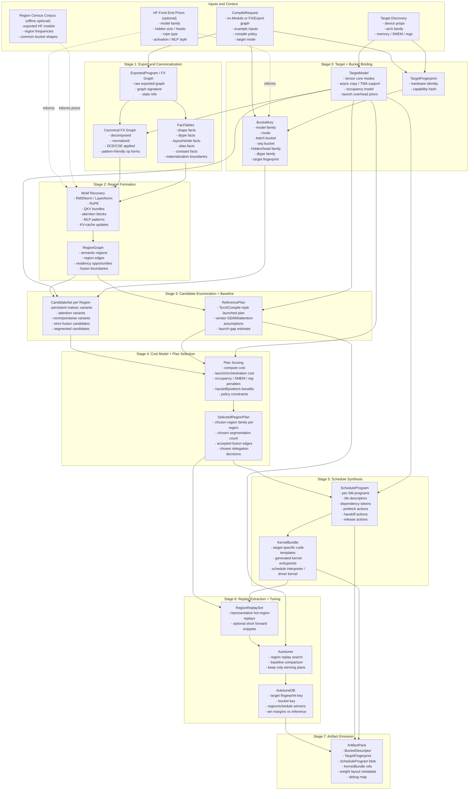
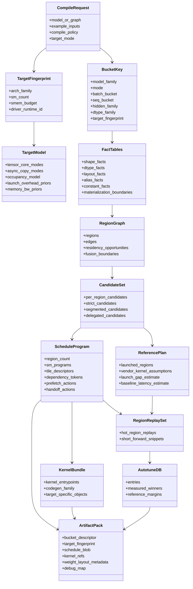
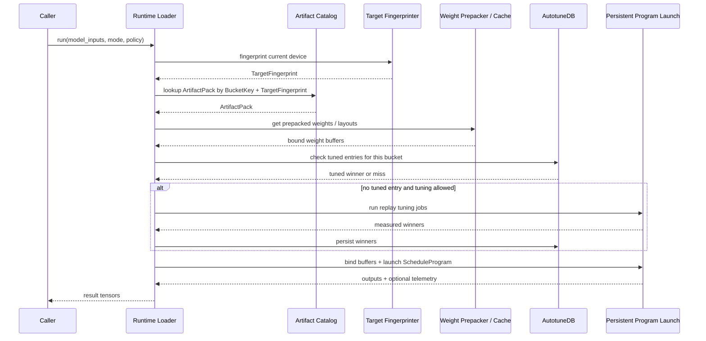

# Megabake V2 Detailed Dataflow Diagram

This file is the diagram-first companion to `MEGABAKE_V2_ARCHITECTURE.md`.

Its purpose is to answer, in strict dataflow terms:

- what goes into each stage
- what comes out of each stage
- how each stage transforms its inputs
- which objects are persistent artifacts versus transient compiler state
- where target modeling, baseline comparison, and tuning enter the pipeline

The diagrams below are intentionally redundant with the architecture doc. The
goal here is not brevity. The goal is to make the system traceable end to end.

## 1. End-to-End Compile-Time Dataflow

## 2. Core Data Objects

## 3. Stage Contracts

Each stage below is defined by:

- **goes in**
- **does**
- **comes out**
- **must not do**

### Stage 0: Target + Bucket Binding

**Goes in**

- `CompileRequest`
- runtime device properties
- optional HF model metadata
- optional corpus priors from prior region-census runs

**Does**

- fingerprints the target device
- builds `TargetModel`
- constructs the `BucketKey`
- decides which workload regime this compile belongs to

**Comes out**

- `TargetFingerprint`
- `TargetModel`
- `BucketKey`

**Must not do**

- mutate graph semantics
- choose region boundaries
- choose final kernel family

### Stage 1: Export + Canonical FX + FactTables

**Goes in**

- raw PyTorch model or FX graph
- example inputs
- `TargetModel` only as a light advisory input

**Does**

- `torch.export`
- decomposition
- canonicalization
- dead-code elimination
- constant folding
- shape / dtype / layout / alias propagation
- virtual view tracking
- explicit copy insertion only where needed

**Comes out**

- canonical FX graph
- `FactTables`

**Must not do**

- choose semantic regions
- choose strict-vs-segmented plan
- emit task/schedule records

### Stage 2: Motif Recovery + RegionGraph

**Goes in**

- canonical FX graph
- `FactTables`
- optional HF priors
- optional offline region-census priors

**Does**

- recognizes transformer motifs and generic tensor motifs
- groups nodes into semantic regions
- records region-to-region edges
- records residency and fusion opportunities

**Comes out**

- `RegionGraph`

**Must not do**

- fix per-SM schedule
- choose final tile descriptors
- encode low-level runtime actions

### Stage 3: Candidate Enumeration + ReferencePlan

**Goes in**

- `RegionGraph`
- `TargetModel`
- compiler policy (`strict`, `budgeted`, `auto`)
- delegation policy

**Does**

- enumerates valid Megabake candidate families per region
- enumerates valid segmentation candidates
- builds a TorchCompile-style `ReferencePlan`

**Comes out**

- `CandidateSet`
- `ReferencePlan`

**Must not do**

- assume Megabake wins by default
- assume strict fusion is always best

### Stage 4: Cost Model + Plan Selection

**Goes in**

- `CandidateSet`
- `ReferencePlan`
- `TargetModel`
- policy constraints

**Does**

- scores candidate compute cost
- scores orchestration / launch cost
- estimates occupancy / SMEM / register penalties
- estimates handoff and prefetch benefits
- compares candidate plans against the reference launched plan

**Comes out**

- `SelectedRegionPlan`

This plan contains:

- chosen region family per region
- chosen segmentation plan
- chosen delegation decisions
- chosen residency strategy
- expected win / loss margin versus the baseline

**Must not do**

- emit final code objects
- tune by itself without replay validation

### Stage 5: ScheduleProgram Synthesis

**Goes in**

- `SelectedRegionPlan`
- `TargetModel`

**Does**

- assigns work to SMs
- builds tile descriptors
- builds dependency tokens
- inserts prefetch / handoff / release actions
- chooses persistent program structure

**Comes out**

- `ScheduleProgram`

**Must not do**

- rediscover graph semantics
- re-open region boundaries without explicit policy reason

### Stage 6: Target-Specific Code Generation

**Goes in**

- `ScheduleProgram`
- chosen region-family implementations
- `TargetModel`

**Does**

- lowers selected regions into target-specific code objects
- emits persistent schedule driver kernel logic
- binds schedule layout to codegen family

**Comes out**

- `KernelBundle`

**Must not do**

- choose bucket families
- choose launch count
- re-run semantic fusion logic

### Stage 7: Replay Extraction + Baseline-Gated Tuning

**Goes in**

- `ScheduleProgram`
- `KernelBundle`
- `ReferencePlan`

**Does**

- extracts hot region replays
- optionally extracts short forward snippets
- tunes tile choices / micro-variants
- measures against the reference launched baseline
- rejects candidates that lose in default performance mode

**Comes out**

- tuned entries in `AutotuneDB`
- measured win margins

**Must not do**

- pretend analytical scores are enough forever

### Stage 8: ArtifactPack Emission

**Goes in**

- tuned `ScheduleProgram`
- tuned `KernelBundle`
- `BucketKey`
- `TargetFingerprint`
- weight layout metadata
- debug metadata

**Does**

- serializes everything needed for runtime execution
- stores enough metadata to replay / inspect / debug the plan later

**Comes out**

- `ArtifactPack`

**Must not do**

- leave any runtime-critical scheduling decisions implicit

## 4. Runtime Sequence

## 5. HF-Aware Front-End Without Losing Generality

The architecture should deliberately account for the fact that a large fraction
of real workloads will come from HF transformer models, without turning the core
IR into a transformer-only IR.

### HF should help with:

- workload priors
- bucket formation priors
- motif priors
- tuning corpus selection
- region-census tooling

### HF should not be required for:

- graph correctness
- semantic truth
- execution legality
- non-transformer support

The exported FX graph remains the source of truth. HF metadata is advisory.

## 6. Region Census Tooling

The architecture should include an offline tool that exports a corpus of HF
models and reports:

- recovered region kinds
- most common region transitions
- most common bucket shapes
- most common fusion boundary types
- rare / unsupported structures

This tooling is not part of the runtime path. It is part of architecture and
compiler design hygiene.

## 7. Strict Dataflow Invariants

These invariants are the easiest way to check that v2 is not drifting back
toward v1 mistakes.

### Invariant A
Layer 1 must not decide GPU scheduling.

### Invariant B
Layer 2 must not collapse into packed low-level task records.

### Invariant C
Layer 3 must not need to rediscover semantic regions.

### Invariant D
Runtime must not rebuild the schedule graph from scratch.

### Invariant E
Default performance mode must compare against a launched reference baseline.

If any of these fail, the architecture is drifting.
