# MegaBake V2.2 Detailed Dataflow

This is the diagram-first companion to
[`MEGABAKE_V2_ARCHITECTURE.md`](./MEGABAKE_V2_ARCHITECTURE.md). Object names, stage numbers, and
execution distinctions are normative and match
[`MEGABAKE_V2_IR_AND_REUSE_PLAN.md`](./MEGABAKE_V2_IR_AND_REUSE_PLAN.md).

## 1. Complete compile-time flow

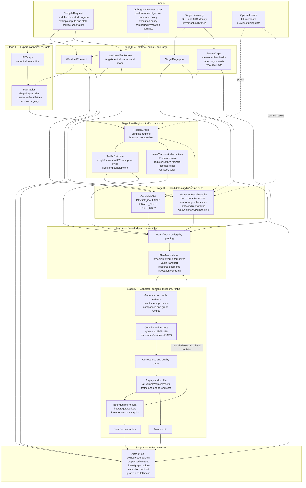

Stage 5 may revise implementation configuration, value transport, or resource segmentation. It may
not reopen exported semantics or invent a different numerical policy.

## 2. The three compiler representations

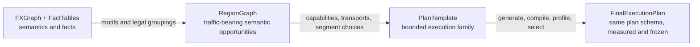

`PrecisionLayoutPlan`, `ValueTransportPlan`, `InvocationContract`, and `ResourceEnvelope` are plan
objects, not additional semantic IRs.

## 3. Workload-contract axes

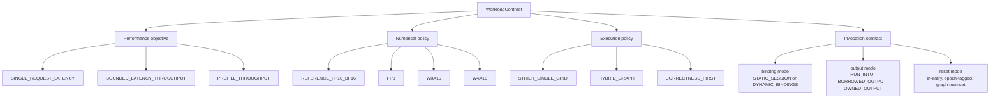

Changing any axis creates a different acceptance class. Quantized throughput cannot satisfy a
reference-precision batch-one latency claim.

## 4. Core object relationships

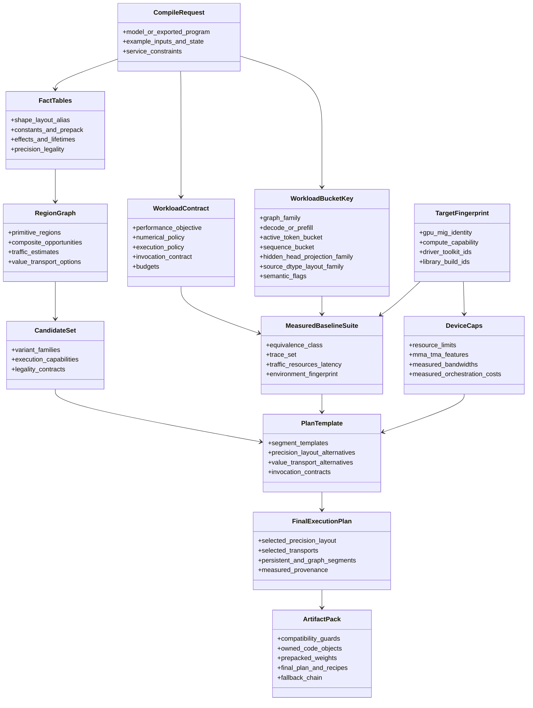

## 5. Execution-domain decision

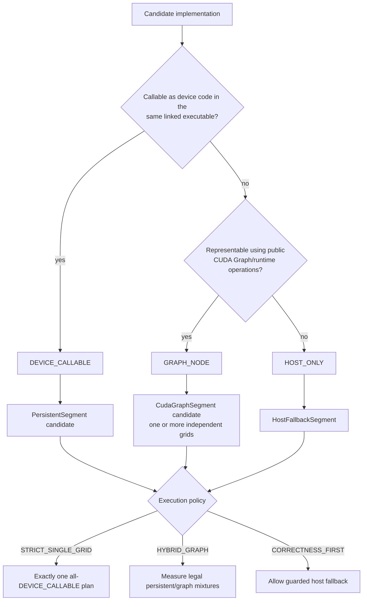

A traced private `CUfunction` remains `GRAPH_NODE`/research diagnostic. Its numeric handle never
changes capability.

## 6. Traffic-first plan decision

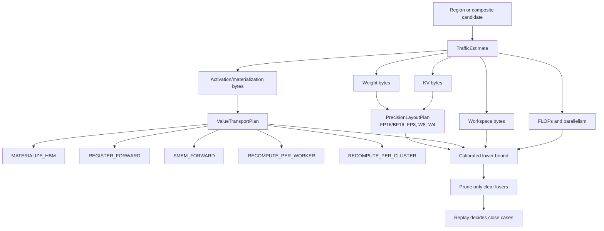

## 7. Resource-class segmentation

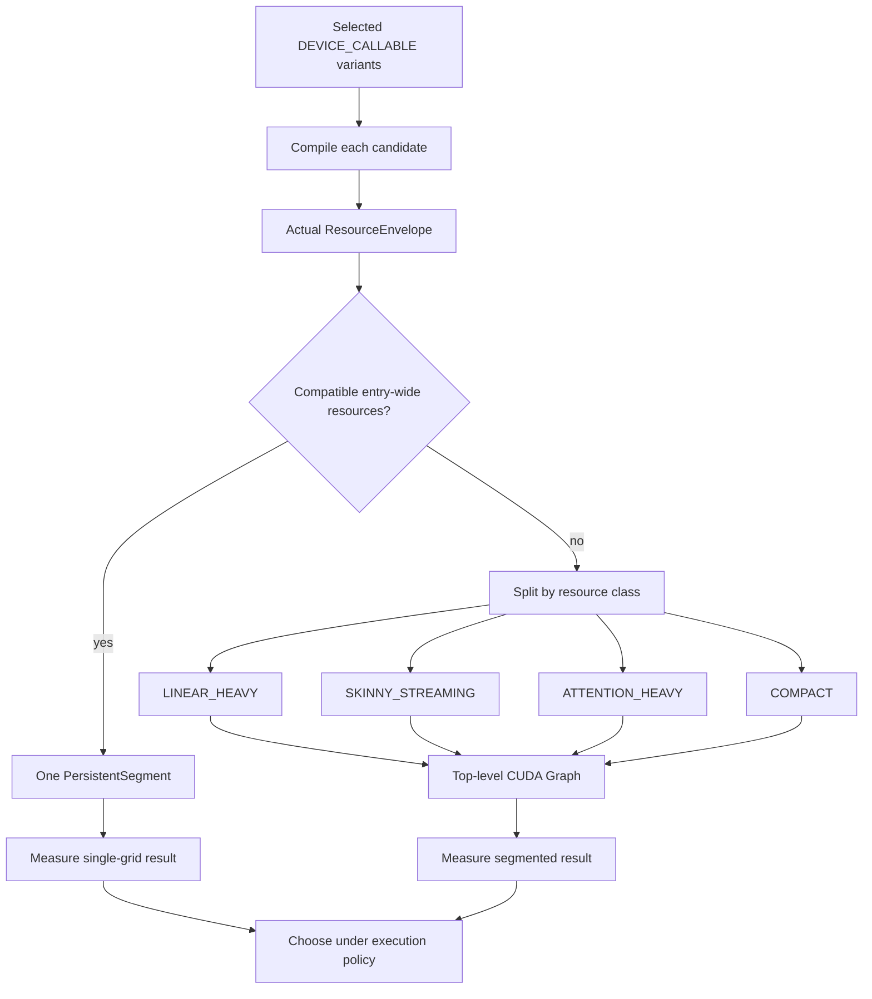

Splitting adds grid transitions but can recover occupancy, reduce spills, and remove maximum-SMEM
reservation from compact phases. The result is measured, not assumed.

## 8. Fixed-bucket persistent flow

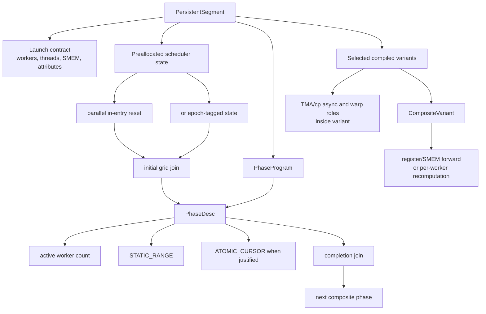

There is no per-task counter clone and no arbitrary dependency spin loop. Joins separate meaningful
composite phases rather than syntax-level FX operations.

## 9. Transformer-composite flow

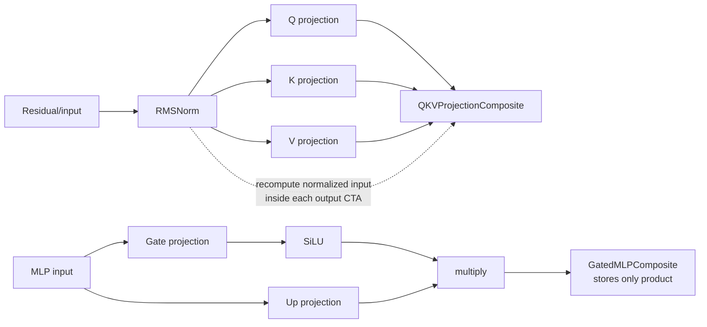

The compiler may concatenate/group QKV weights or compute gate/up dot products together. It accepts
the composite only when HBM traffic or joins fall and compiled resources remain legal.

## 10. Binding and output flow

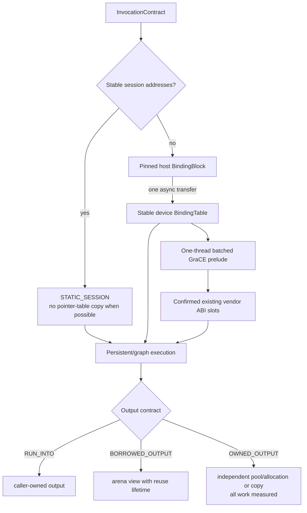

The GraCE prelude edits launch values, not a vendor signature or body.

## 11. Serving-throughput flow

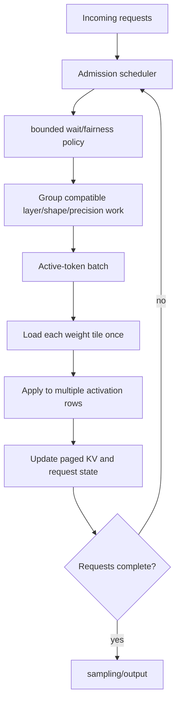

This scheduler exists because batching raises arithmetic intensity and amortizes weight bytes. It is
not part of the batch-one fixed-phase executor.

## 12. Runtime sequence

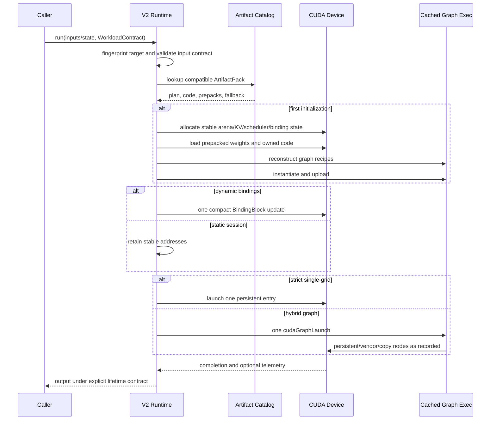

## 13. Baseline and acceptance flow

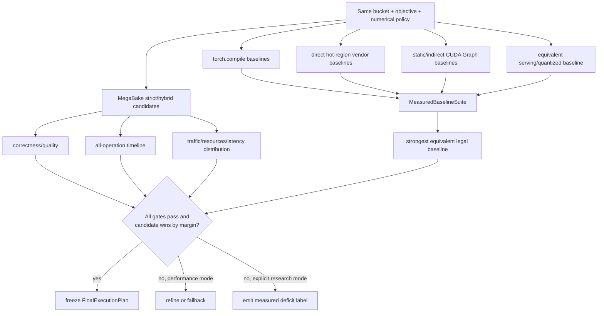

## 14. Stage contracts

### Stage 0 — contract, bucket, and target

- Produces `WorkloadContract`, target-neutral `WorkloadBucketKey`, `TargetFingerprint`, and
  calibrated `DeviceCaps`.
- Does not choose regions or kernels.

### Stage 1 — export, canonicalize, facts

- Produces `FXGraph + FactTables`.
- Does not select execution plane, precision tactic, or schedule.

### Stage 2 — regions, traffic, transport

- Produces `RegionGraph`, `TrafficEstimate`s, and legal value-transport alternatives.
- Does not claim actual register/SMEM residency.

### Stage 3 — candidates and baseline suite

- Produces `CandidateSet` and `MeasuredBaselineSuite`.
- Labels every implementation capability and equivalence class.
- Never promotes a private handle or parameter pack into a portable candidate.

### Stage 4 — bounded plan enumeration

- Produces a small set of legal `PlanTemplate`s.
- Uses traffic and resources to reject clear losers, not to pronounce an analytical winner.

### Stage 5 — generate, compile, measure, refine

- Produces `FinalExecutionPlan` and `AutotuneDB` entries.
- May revise execution configuration, transports, and resource segmentation.
- Measures all work, including resets, copies, and binding.

### Stage 6 — artifact emission

- Produces `ArtifactPack` with owned code, prepacks, recipes, contracts, and fallbacks.
- Does not serialize live CUDA handles or defer compilation decisions to runtime.

## 15. Strict invariants

1. Stage and object names match all V2.2 documents.
2. Workload objective, numerical policy, execution policy, and the compound invocation contract are
   orthogonal.
3. `RegionGraph` describes semantics and traffic opportunities, not launch count.
4. Only `DEVICE_CALLABLE` variants enter persistent segments.
5. Vendor work remains separate GPU grids even inside one graph submission.
6. Worker IDs identify CTA slots, not physical SMs.
7. Machine pipelines live in compiled variants.
8. Register/SMEM forwarding and recomputation require compiled contracts.
9. Resource-incompatible variants are split unless a measured one-grid result wins.
10. Fixed buckets use `PhaseProgram`; dynamic admission is a separate serving scheduler.
11. Every reset, copy, allocation, and output-lifetime cost is visible.
12. The strongest equivalent measured baseline gates acceptance.
13. Runtime binds and launches; it does not reconstruct compiler decisions.
