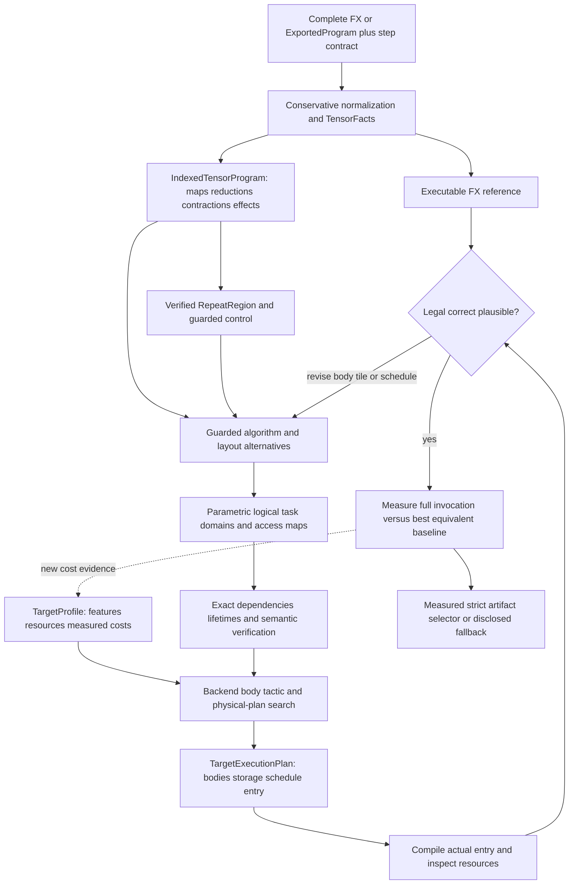
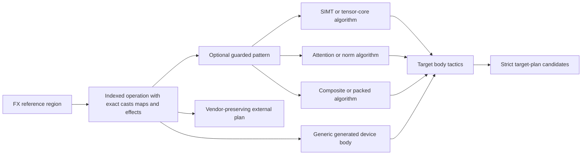
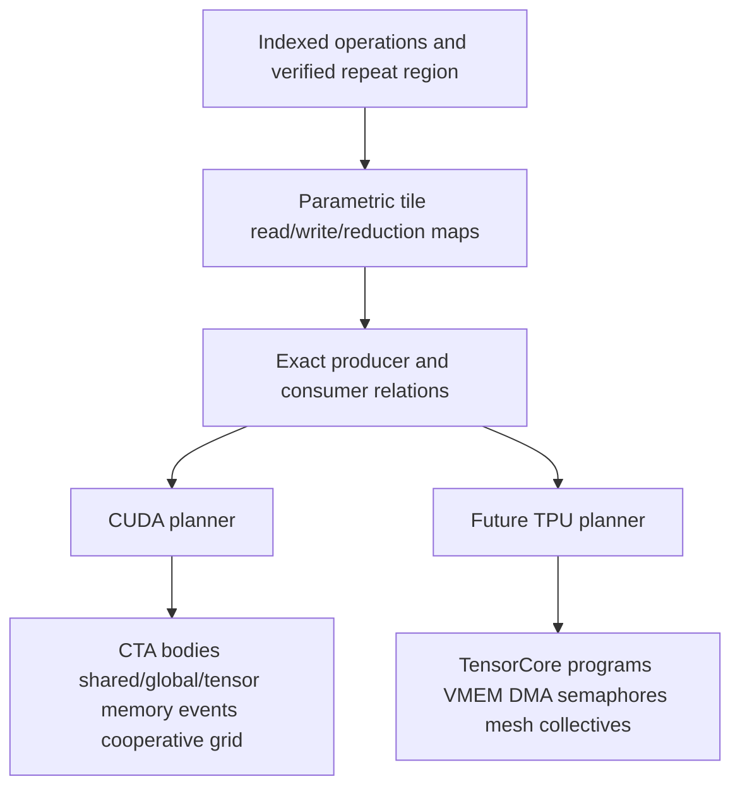
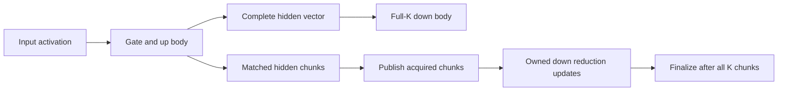
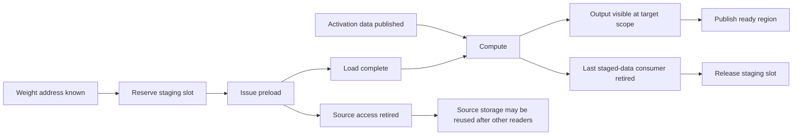
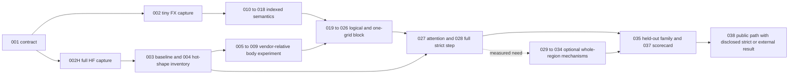

# MegaBake V3: compiler and execution diagrams

Status: diagrams for the revised proposed architecture, 2026-09-27. The [architecture](MEGABAKE_V3_ARCHITECTURE.md), [IR](MEGABAKE_V3_IR_AND_REUSE_PLAN.md) and [pipeline contract](MEGABAKE_V3_PIPELINING_AND_SCHEDULING.md) own the definitions. Arrows below show legal information flow, not measured speedup.

## 1. FX to measured artifact



The graph includes a feedback loop because a body can force a different tile or layout and a compiled entry can expose resource cliffs. The compiler searches bounded alternatives; it does not run indefinitely. An `ExternalPlan` branches from the same indexed semantics and may retain vendor calls. It is scored separately from the strict one-grid candidate.

## 2. Semantic identity versus FatOp pattern



A model-family name is unnecessary for the generic route. A pattern adds an algorithm only if its guard and reference relation are valid. An unsupported custom operation receives a strict diagnostic; fallback is visible. One semantic algorithm may have different device implementations for Ampere, Hopper and Blackwell.

## 3. One projection, several shape-and-target tactics

```text
Indexed reference: Y[b,n] = sum_k X[b,k] * W[n,k], with exact casts/epilogue

Algorithm alternatives:
  K-parallel SIMT GEMV          -> many row tasks, warp/CTA K reduction
  Y^T = W X^T tensor-core      -> large output-channel axis, narrow padded batch
  split-K / smaller N tile     -> more parallel tasks, paid finalizer
  ordinary tiled GEMM          -> larger batch regime

Each algorithm -> target-specific body(s) -> body/resource Pareto set
               -> mixed whole-entry compilation -> complete-step measurement
```

A 64-channel tensor-core tile produces nine independent output tiles at N=576 and 64 at N=4096 before K splitting. The output tile count, visible SMs and selected body's resource footprint decide whether that tactic is useful. No source-level algorithm is assumed fastest for every CUDA target.

## 4. Neutral dependence, distinct physical programs



The common relation can say that a next-layer weight address is known and a buffer is free while the activation is still pending. CUDA might stage one tile; a TPU may issue an earlier VMEM DMA. Neither physical choice appears as a mandatory logical cohort or lookahead depth. [Inferact's TPU design](https://inferact.ai/blog/tpu-megakernels) makes that difference concrete.

## 5. Optional schedules from one logical region

```text
Barrier control:
  all projection tiles -> uniform grid join -> all attention tiles

Static ready-head candidate:
  producer workers:  Q/K/V head group 0 -> publish -> group 1 -> publish
  consumer workers:        wait/acquire -> attention 0
                                  wait/acquire -> attention 1

Dynamic/hybrid candidate for irregular work:
  routing result -> register bounded expert tasks -> ready queue/dispatch
```

These schedules have the same indexed reference but different body/layout and coordination costs. A packed QKV tensor-core body might publish a larger region later yet still win through matrix efficiency. The target planner measures both. A queue is optional for data-dependent or imbalanced work; static programs are the initial dense-decode candidate.

## 6. Streamed versus full MLP



The two paths are alternatives. `RU` exists only if the selected down body exposes a real continuation and its accumulator fits the entry. Chunk readiness cannot finalize the output early. Full-K tensor-core quality may outweigh the overlap. Exact gating/cast semantics are common to both paths.

## 7. Movement and storage lifetime



An address-ready signal cannot replace activation readiness. Source read retirement and destination visibility may be distinct async events. The allocator overlays storage only after every old access retires. Global-address-space activation handoff may hit L2 but still costs latency and publication; Hazy measured this as a major part of its B200 step. [Hazy breakdown](https://hazyresearch.stanford.edu/blog/2025-05-27-no-bubbles)

## 8. Evidence levels

| Evidence | Establishes | Does not establish |
|---|---|---|
| FX/reference equivalence | Semantic correctness for transformed regions | Fast body choice |
| Target feature and compiled-resource report | Instruction/invocation legality | Device numerical correctness or speed |
| Standalone body timing | One tactic's local quality under recorded conditions | Mixed-entry performance |
| Lean persistent-entry timing | Composition/participation cost for a small mixture | Full-step result |
| Full-step numerical/state validation | Correct invocation on selected target | Speedup |
| Unprofiled complete-call samples | Target/workload-specific latency | Universal model or SM guarantee |

Mechanism traces and ablations explain a result. The primary strict result needs correct state/logits, one owned compute grid and a measured win over the strongest equivalent `torch.compile` path under the same contract. [Performance protocol](MEGABAKE_V3_PERFORMANCE_MODEL.md)

## 9. Work-order handoffs and the first decisive result



The first optimization proof is the body comparison in G1, followed by the unfamiliar FX block in G2. A tiny captured graph proves the frontend/IR route; it cannot substitute for a complete cached HF step. The current named `SemanticGraph` has a `ReferenceRegion` escape hatch, shown as a strict-coverage gap in the [implementation inventory](MEGABAKE_V3_IMPLEMENTATION.md#2-what-the-current-repository-gives-us). Each arrow is an evidence handoff, not a presumption that the next stage wins on the GPU.
