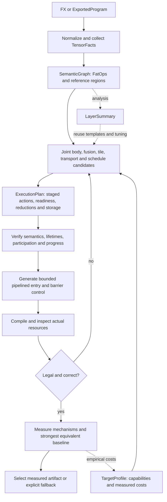
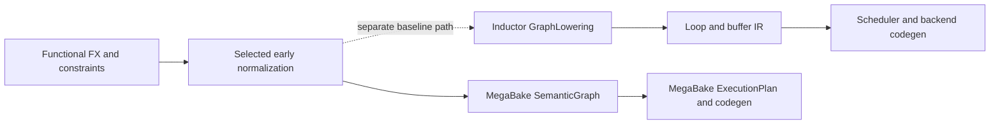
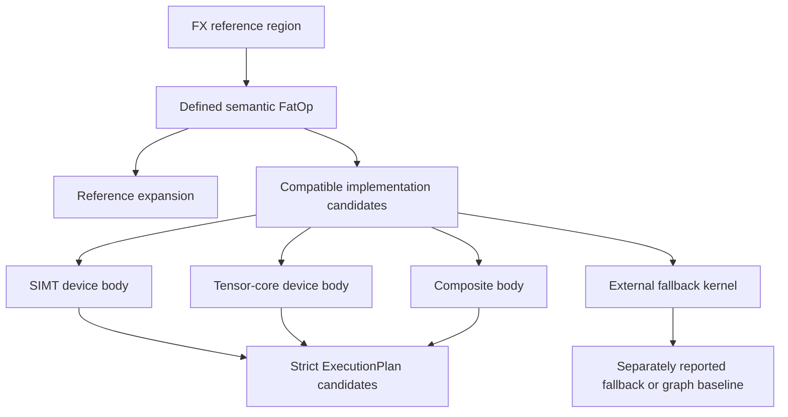
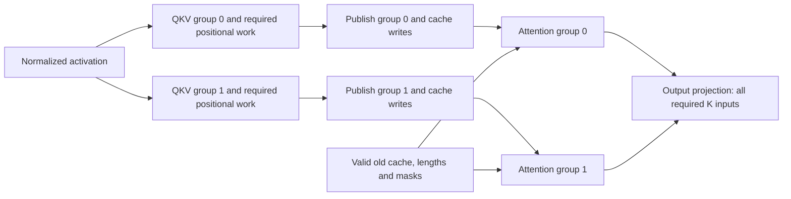
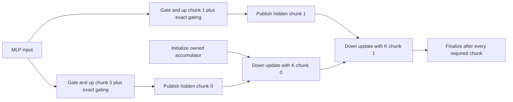
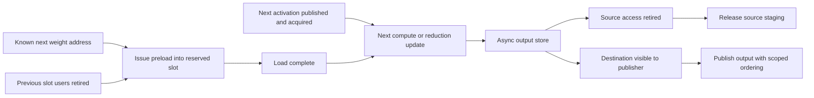
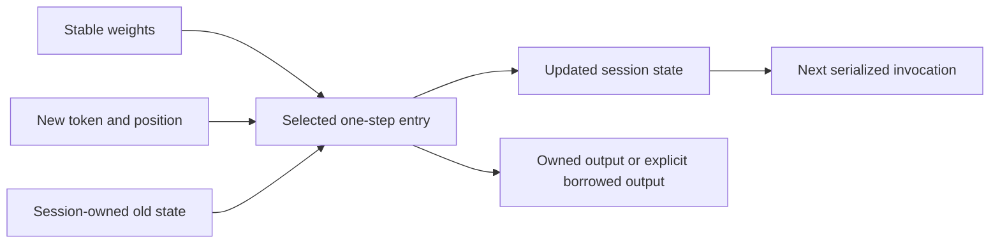

# MegaBake V3: architecture and dataflow diagrams

Status: pipeline-first proposal, 2026-09-09; not implemented. These diagrams summarize the contracts in
[architecture](MEGABAKE_V3_ARCHITECTURE.md) and [IR](MEGABAKE_V3_IR_AND_REUSE_PLAN.md).

## 1. End-to-end compiler



Candidate enumeration is bounded. Exhaustion returns an explanation or fallback; the back edge
is not an instruction to search indefinitely. Without a GPU, compilation may be possible but the
measurement edge remains unavailable and no winner is asserted.

Three representations remain: normalized FX, SemanticGraph and ExecutionPlan. The staged action
graph is inside ExecutionPlan; TargetProfile and LayerSummary stay side analyses. Body, tiling
and schedule choices are coupled until selection, not finalized in separate irreversible passes.

## 2. Inductor reuse boundary



This is a proposed adapter boundary, not a claim that PyTorch exposes a public “all optimization
finished” hook. Some FX passes already fuse; some optimizations only exist in later stages.
See the pinned-source discussion in [IR §2](MEGABAKE_V3_IR_AND_REUSE_PLAN.md#2-the-actual-inductor-handoff).

## 3. Semantic identity versus implementation choice



A semantic match never forces one algorithm. An external candidate does not enter an owned
persistent grid merely because its operation matches the FatOp.

## 4. Two schedules, one execution-plan contract

```text
Host: bind inputs and state -> launch one cooperative grid -> retain valid outputs

Barrier control:
  all producer tiles -> grid join -> all consumer tiles -> grid join

Primary pipelined region:
  producer cohort:  tile 0 --publish--> tile 1 --publish--> tile 2 ...
                               |                       |
  consumer cohort:        consume 0                consume 1 ...
  local staging:      preload next independent weights while current work runs

  all workers: region join only where dependencies/reuse require it
```

The sketch shows dependencies, not scaled durations or guaranteed overlap. Cohort splits and
mixed static worker programs are candidates; compare an optimized phase assignment too. A fixed
graph can execute asynchronously without a universal ready-task queue.

Logical tile count can greatly exceed worker count. Every worker reaches each retained grid join,
including workers without arithmetic there. Actual compiled resources bound the cooperative grid;
workers are not pinned to physical SMs. All coexisting stages/accumulators count against the common
entry envelope. See [runtime legality](MEGABAKE_V3_PIPELINING_AND_SCHEDULING.md#10-forward-progress-is-part-of-legality).

## 5. Where fusion and fine-grained readiness help



Group 0's attention does not require group 1's unrelated projection. GQA/head grouping follows
actual footprints. Output projection still waits for every needed input unless a supported
reduction continuation is selected. This is not a complete decoder graph; residuals and other
live values remain in SemanticGraph and cannot be dropped by this illustration.



Two chunks are shown for clarity. An owner can retain its accumulator across updates; independent
global partials plus a finalizer are another candidate, not a hidden requirement. Chunk readiness
permits an update, never premature final output. Weight inputs and numerical casts are implicit
in this sketch but explicit in the plan.

## 6. Movement readiness is not activation readiness



Read-complete and write-visible are distinct completions, not interchangeable flags. Actual
backend barriers/proxy ordering and consumer acquisition remain required. Buffer overlay follows
proven release-before-reuse; the timing estimate is never its safety proof.

## 7. State and memory ownership



Pure graph semantics expose old/new state. The plan may place them in the same allocation only
after proving in-place safety. Independent concurrent sessions require independent mutable state
and workspace or another explicit ownership protocol.

## 8. Evidence flow

| Input | What it may decide | What it cannot establish |
|---|---|---|
| FX and reference execution | Semantics, shapes, effects | Best device algorithm |
| CUDA queries and documentation | Feature/launch legality | Achieved bandwidth or speedup |
| Exact-shape microbenchmarks | Candidate quality under recorded conditions | Whole-entry performance |
| Joint stage/pair experiments | Lead time, contention and useful bounded overlap | All shapes or whole-model speedup |
| Compiled resource report | Actual register, stack and shared-storage requirements | Correctness or a speed win |
| End-to-end unprofiled trials | Measured workload-specific latency | Universal model/hardware guarantees |
| Layer/config metadata | Candidate grouping and hints | Mathematical identity by itself |

This separation is the main defense against another architecture expanding around unverified
performance assumptions.
