# A Ground-Up Tour of `torch.compile`
### From one decorator to fused GPU kernels — Dynamo → AOTAutograd → Inductor

A 45-minute presentation. Each slide has a **diagram + speaker notes**.
Design: start *very* basic, keep a single high-level pipeline on screen, then **zoom** into each phase with the real function names and `file.py:line` references before zooming back out.

---

## How to read this deck (and use it)

- **Two audiences in one deck.** Every section opens at the ELI10 level, stays high-level for a beat, then *zooms* into implementation detail slides you can skip if time is short.
- **One pipeline, three layers.** `torch.compile` = **TorchDynamo** (trace Python → FX graph) + **AOTAutograd** (split fwd/bwd, lowering) + **Inductor** (optimize → codegen fused kernels). Keep this picture on screen the whole time; every zoom is "drop into" one of these three boxes.
- **The single mental model:** *Dynamo records*, *AOTAutograd rewrites & splits*, *Inductor schedules, fuses & emits* — then CUDA Graphs erase launch overhead. Guards decide when to re-record.

**Suggested runtime (45 min)**

| Part | Section | Slides | Minutes |
|---|---|---|---|
| 0 | Why this exists + the big pipeline | S1–S6 | 5 |
| 1 | Control-flow at a glance | S7–S9 | 4 |
| 2 | TorchDynamo (trace Python) | S10–S18 | 13 |
| 3 | AOTAutograd bridge | S19–S20 | 3 |
| 4 | Inductor (optimize + codegen) | S21–S31 | 16 |
| 5 | Recap, payoff, Q&A | S32–S33 | 4 |

**Sources.** Every slide cites the real call graph in `agent_space/dynamo_control_flow_graph.md` and `agent_space/inductor_control_flow_graph.md`; references like `guards.py:4901` point into those. (Line numbers are to that era of the source; treat as "where to look", not exact.)

---
## Slide 1 — The one-liner, three ways to say it

> **Add two lines and get a compiler.** No C++, no manual kernels.
> `torch.compile` turns *Python PyTorch code* into optimized kernel code by *recording what you run*, then *rewriting and fusing* it for the GPU.

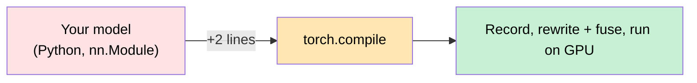

**KEY MECHANISM:** JIT — *Just In Time*. The program is compiled on the very first call (slow), then reused for every later call with matching inputs (fast). It's a compiler, but one that watches your Python at runtime.

> **Speaker notes.** Open by demystifying: this is not magic and you can think about it in 10 words — *record what runs, rewrite the computation, run faster on GPU.* The rest of the talk is just "how do we record a program written in Python without breaking anything?" That tension drives everything. Give them the promise (one decorator) before any machinery. If asked "why not write CUDA by hand?": hand-written kernels don't compose with autograd, are per-shape, and break as you change code — `torch.compile` is *adaptive*.

---
## Slide 2 — The motivation: why PyTorch was slow (and this fixes it)

Three problems in eager mode; one fix for each. This slide earns the rest of the deck.

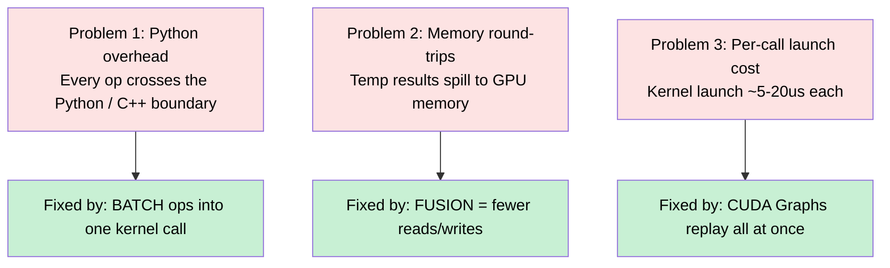

**KEY MECHANISM:** all three fixes come *for free* as a side effect of having the FX graph. To fix launch overhead you must first know which kernels run and in what order — that requires knowing the whole computation up front, i.e. compiling it.

> **Speaker notes.** This is the "why should I care" slide. For the eager GPU path: every `+` inside a Python loop costs a Python interpretation step + a C++ dispatch + a kernel launch, and each op reads its inputs from global memory and writes output back. A chain of 10 element-wise ops = 20 memory round-trips to HBM for what's really one pass. The three boxes on the right are the levers; show that **folding** P1/P2 is Inductor's job (fusion), and P3 is CUDA Graphs' job. Tell a short story: `y = x.add(1).mul(2)` eager = 2 kernels, compiled = 1 kernel doing both in registers. That intuition carries the whole Inductor half of the talk.

---
## Slide 3 — ELI10: what are all these words? (the glossary you'll need)

Name-drop check before we go fast. One paragraph each; no code.

| Term | Plain meaning |
|---|---|
| **nn.Module** | A reusable block of computation with weights — a "layer" or whole model. Its `forward()` is what runs the math. |
| **Op / kernel** | A single compute primitive (add, matmul) and the GPU code that executes it. Kernel = "the thing that runs on GPU." |
| **JIT compiler** | Compiles your program *as it's first run*, caches the result for reuse. Unlike AOT (ahead-of-time), it sees concrete inputs. |
| **FX graph** | PyTorch's internal "script" of ops, as data: nodes connected by edges. Think a flowchart you can read and transform programmatically. |
| **Trace / tracee** | *Trace* = run the program symbolically to record op calls instead of computing. The recorded result is a graph. |
| **Guard** | A condition that must hold for a compiled version to stay valid ("tensor x still has the same shape/dtype/device"). Fails => recompile/retrace. This is what makes JIT safe in dynamic Python. |

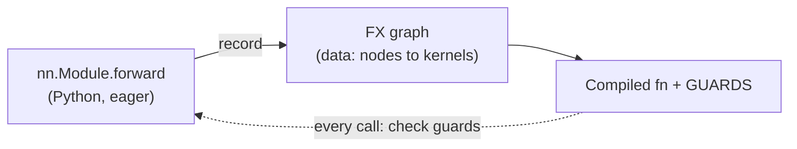

> **Speaker notes.** Slow down here — these six words are the alphabet of everything after. **Guard** is the single most important idea in Dynamo and you'll return to it four times; plant it now with a concrete example ("shape changed => guards fail => recompile"). Reassure: by the end, only *Kernel* and *FX graph* need to be second nature; the rest are vocabulary for looking things up. If audience is senior, compress to one sentence each and skip this slide's bullets verbally — keep it on screen as reference.

---
## Slide 4 — The big picture: three layers, in order (THE anchor diagram)

Keep this on screen for the entire Dynamo+Inductor walkthrough. Zoom-in arrows point to later sections.

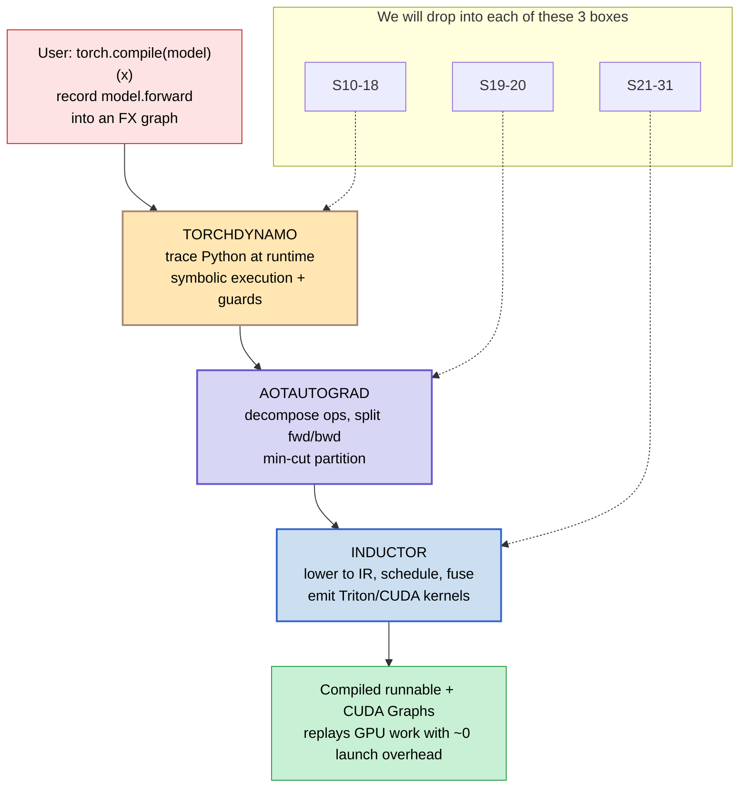

**KEY MECHANISM:** the handoff is *data*, not calls. Dynamo hands Inductor an **FX graph + example inputs**; AOTAutograd wraps that with fwd/bwd splitting; Inductor returns a *runnable*. Each layer only speaks FX graphs → one clean contract.

> **Speaker notes.** "For the next 35 minutes I'm going to zoom into these three boxes in order and then zoom back out." This is your navigational anchor — revisit it at every section break ("we're inside Dynamo's box…"). Be explicit that **Dynamo never modifies your code semantics** for correctness; its only job is *recording*. AOTAutograd and Inductor are where the *rewriting* happens. Ask audience to memorize one word per layer: Dynamo=**record**, AOT=**split**, Inductor=**fuse**.

---
## Slide 5 — What "one decorator" actually does (before vs after)

Same model, two fates: eager vs compiled. Everything else is *how* we get from left to right.

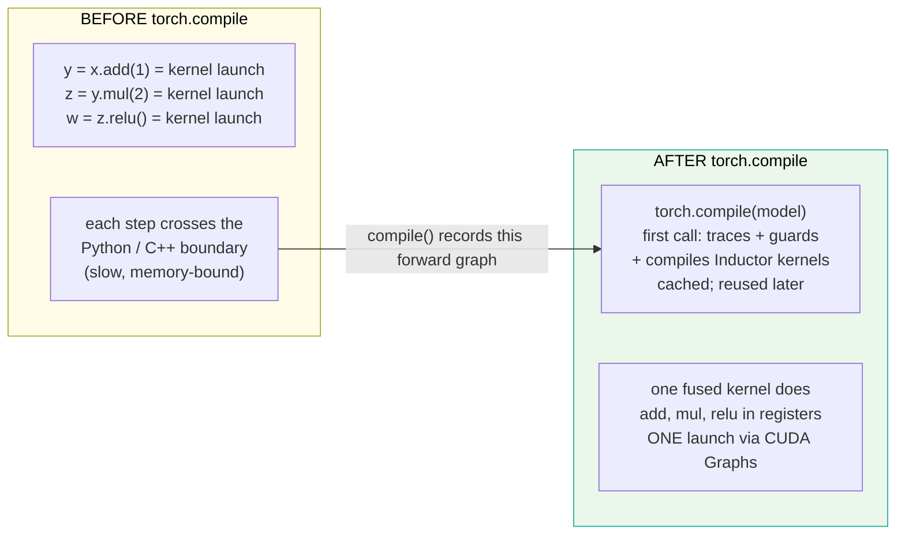

**KEY MECHANISM:** compilation costs are *amortized*. The first call pays the whole compile; every later matching call runs only the fused kernels (after guards pass). Compile time is front-loaded.

> **Speaker notes.** Make the amortization point tactile: show a 1000-iteration training loop — iteration 1 = slow trace+compile, iterations 2..1000 = near-native speed. That's why `torch.compile` shines on long loops but can hurt short/one-shot scripts (the compile cost dominates). This sets up "guards decide hits vs misses" later. Don't run code yet; this is conceptual. If someone asks "can it slow things down?", yes — short jobs, or frequent guard failures (e.g. constantly-changing shapes) cause recompiles that add latency.

---
## Slide 6 — Why JIT and not AOT? (the one idea that makes Python work)

AOT compiles `forward()` once from source; it can't see *how you'll run it*. JIT compiles *per execution path as it happens* — which is what lets dynamic Python programs compile correctly.

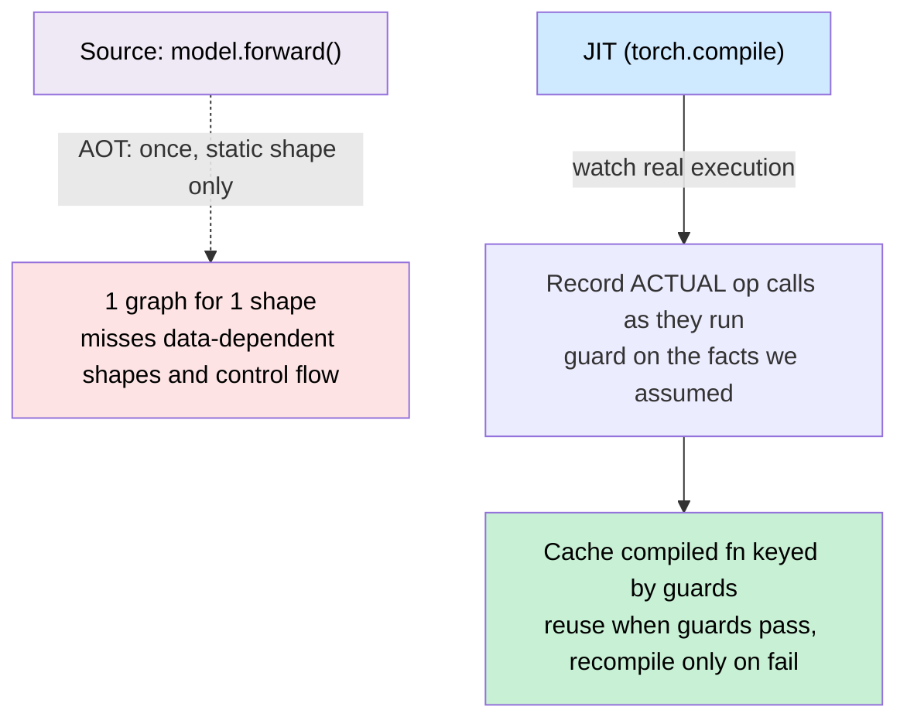

**KEY MECHANISM:** guards are the *price of admission* to correctness-in-Python. Each fact Dynamo assumes (this tensor is 2-D, grad mode on, this config value) becomes a guard; on every call we check them. They're cheap because they're checked in C++ as a tree (more later).

> **Speaker notes.** This is the "aha" for *why guards exist.* The reason PyTorch is dynamic-and-fast-friendly is that it compiles per concrete execution and only pays to recompile when an assumption breaks — versus freezing at compile time and hoping. The punchline of Dynamo's entire design: **make the common path (guards pass) a single C++ tree walk**, so repeated calls are near-free, while *rare* shape/config changes trigger a fresh specialized compiled version. This foreshadows the guards slides without needing to say more yet.

---
# PART 1 — Control flow at a glance (~4 min)

## Slide 7 — The two call graphs you're going inside of (what we have)

Two artifacts frame everything: the **full runtime trace** from `torch.compile(model)` down to a fused kernel, and where each *subsystem* plugs in. Here's the spine only; subsystems branch off it later.

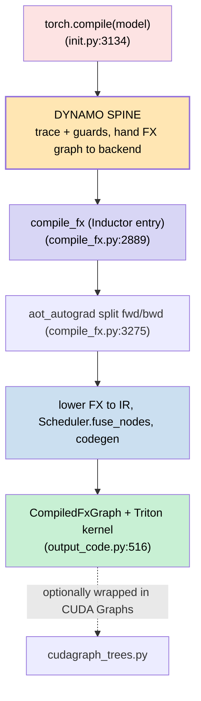

**KEY MECHANISM:** the entire pipeline is a **spine plus branches**. The spine is "happy path / cache miss on first call, then graph break recovery and guards branch off it." Zoom slides below are *branches of this spine*.

> **Speaker notes.** Point to the two source files as your legend-of-record. Emphasize: `torch.compile` returns immediately with a *wrapper* (lazy — the heavy lifting is deferred to first call); the diagram above shows the deferred work that actually happens on call #1. This separates **"what runs at `compile()` time"** vs **"what runs when you invoke the compiled model"** — keep those two regimes distinct; the audience conflates them and it's a common source of confusion (and debugging).

---
## Slide 8 — The whole thing, flattened, as bullets first

Before 10+ slides of diagrams, give the linear list. We'll revisit each item expanded.

```text
torch.compile(model)         record forward() into an FX graph
        |
   TorchDynamo
     - intercept Python bytecodes (PEP523 hook)
     - symbolically execute to collect ops -> FX Graph
     - accumulate guards on every assumption
     - cache by guard key; recompile only when a guard fails
            |  hand over: GraphModule + example inputs
   AOTAutograd (+ pattern matcher)
     - decomp high-level aten ops into lower ones
     - partition joint fwd+bwd -> separate fwd/bw graphs (min-cut)
     - run FX passes + fused-attention patterns
            |
   Inductor
     - Lower each aten op to an IR node (Pointwise / Reduction / ExternKernel ...)
     - Scheduler: topo-sort, FUSE ops sharing data via can_fuse() gates
     - Codegen Triton/C++ kernels; emit wrapper .py + AsyncCompile
     - Cache by hash(key,FxGraphCache); wrap in CUDA Graphs if enabled
        -> compiled callable with zero-launch replay + guards
```

> **Speaker notes.** Pause to breathe. Read each line at roughly even pace (~8 sec). Tell them "every subsequent slide is one of these lines, zoomed in." If you have a demo later (a real `model = torch.compile(m); model(x)` and watch the slow first call + fast subsequent), reference this list as "where that time went." This bullet slide doubles as your recovery plan if you lose the thread under time pressure — point to it and say "pick up at step 4."

---
## Slide 9 — Zoom-out contract: what each layer owns vs trusts

This single table replaces three slides of "what does Dynamo do?" / "what does Inductor do?". Keep on screen through Part 2.

| Layer | INPUTS | OUTPUTS | Owns | Trusts |
|---|---|---|---|---|
| **TorchDynamo** | model forward (Python) + example inputs at call time | FX GraphModule + Guards + compiled backend callable | Python->FX translation; guard correctness; caching by input class | That FX semantics faithfully represent the original ops (it just records, no rewriting yet) |
| **AOTAutograd** | (FX graph, fw/bw config) | fwd-graph + bw-graph for each subgraph | fwd/bwd split; op decomposition via `decomp_map` ; min-cut partitioning to limit intermediate size | Downstream Inductor can codegen any aten op in the resulting graphs |
| **Inductor** | fwd / bw / inplace FX graph + example inputs + config | CompiledFxGraph runnable (wrapper py + Triton/C++) | Lowering+IR; scheduling+fusing; backend codegen ; cache by content hash | C++/CUDA runtime launches kernels correctly per wrapper call args |

> **Speaker notes.** One sentence per row you can say on air; the table is for the audience to keep on screen. Stress Dynamo *doesn't make model faster* — it just moves from Python interpreter speed to "can be optimized", without changing answers. The actual compute speedup is Inductor + CUDA Graphs'. This also previews a subtle gotcha: AOTAutograd can *silently fuse backward ops into forward*, so what users see in the compiled module may differ structurally while having identical numerical results — flag this before anyone greps generated code and panics.

---
# PART 2 — TorchDynamo (zoom into "record", ~13 min)

## Slide 10 — Dynamo at a glance: the happy path on first call, then guards gate every later call

Split from one node into two regimes visually because that separation is *the* central idea of this part.

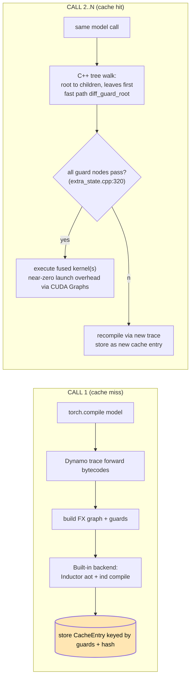

**KEY MECHANISM:** on call #1 we pay trace + AOT + Inductor once; **call #2..N pays only a C++ guard tree walk.** That asymmetry is why JIT works: rare compile, common replay. The diff_guard_root fast-path (a reduced recheck of likely-changed guards) makes even the hit nearly free.

> **Speaker notes.** Two-regime mental model again. If they ask "how does it not slow us down in tight loops?": answer is C++ guard walk is ~nearly zero latency; compiled path skips Python interpretation entirely for ops in graph region(s), only resuming into eager at graph breaks / fallbacks and rechecking guards at frame boundary. Give numbers if you have: a typical 2-layer MLP block = single fused kernel call guarded by maybe 5-10 leaf checks, all O(few microseconds). This sets up "why are *some* ops falling out of the graph" theme (graph breaks) as "the slow path Dynamo would rather not live on."

---
## Slide 11 — Step 1: Python gives hooks. PEP523 & the eval_frame

No code in this slide at all; pure vocabulary + diagram, because it's a new concept for non-py-devs.

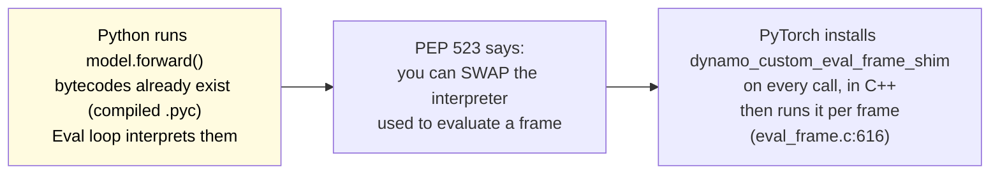

**KEY MECHANISM:** Dynamo does NOT rewrite bytecode of your source file, nor use a JIT that re-compiles .py -> new .pyc. Instead it **swaps the eval loop at runtime via PEP 523's `PyEval_EvalFrameDefault` slot**. Every existing function already carries those bytecodes; we simply "put a watch on execution." The shim runs C++ for each frame (super fast), only *maybe* diverting to Python compile logic.

> **Speaker notes.** Make it concrete: PEP 523 gave `sys.set_eval_frame` / eval slot so you could implement custom bytecode interpreters without copying all of CPython. PyTorch exploits that to get essentially free per-python-frame hook in the interpreter hot loop, far more efficient than monkey-patching or re-compiling the .pyc to include instrumentation. That's *why* Dynamo is fast on eager code paths: overhead is a single C function call vs full Python eval for that frame — it then decides "do we trace this one, or just let default interpreter continue?". If listener asks "can't I just wrap functions in closures?": yes but per-op Python-level wrapping = massive constant factor; PEP523 keeps us near-native on the common 'not yet time to compile' path for that frame.

---
## Slide 12 — The main Dynamo spine (first-call, end-to-end)

Trace flow top-down: from `torch.compile(model)` through guards tree build and back to C++ `create_cache_entry`. This is exactly Nodes [N1]..[N43future] of the source graph, drawn as a single clean chain with 2 branch callouts.

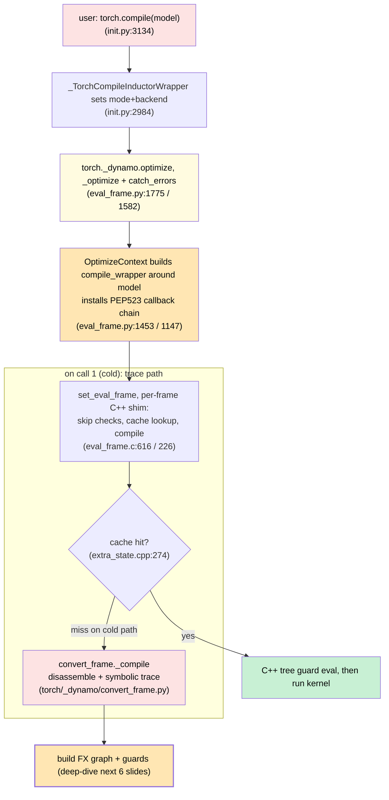

> **Speaker notes.** Keep the *wording* identical to what I said on the overview slide — this just adds two things Dynamo-only: the C++ shim entry and that "compile" here means *trace*, not JIT bytecode recompilation. Give them this framing once and it unlocks every subsequent trace-related slide without re-explaining PEP523 each time. Pause after showing the diagram, say "we split compile into many smaller steps; I'll name all 4 next." This foreshadows S13-S18 as "the meaty internals of COMPILE here". Skip the subgraph LATER_COLD_GOTO drawing if time tight — mention verbally that this slide focuses *cold* path only, warm-cache is covered on S10 already.

---
## Slide 13 — The 4-stage compile flow (Dynamo's own view)

Break COMPILE into its four distinct phases so deep dives stay coherent; audience can later map each to named slides without ambiguity.

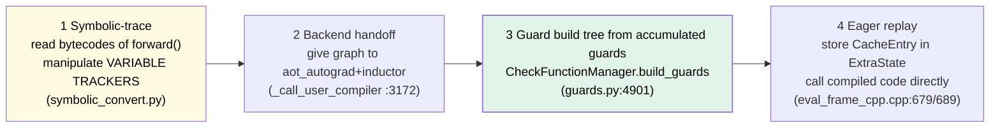

**KEY MECHANISM:** these 4 are what happens on *call #*; every subsequent `model(x)` just runs stage 4's "replay" for cheap and possibly repeats only stages that changed via guard-failure retrace — but crucially the codepath is unified because each CacheEntry stores not the raw python function, it stores a compiled *bytecode+guards bundle* the C++ side swaps into eval in place of the original bytecode.

> **Speaker notes.** Emphasize stage 3 is what most users never see yet causes all downstream "why did it recompile" debugging — guards ARE the source code that gets *generated + executed* for correctness checking; it's not optional debug output, it's live production logic compiled into a C++ tree. Point at diagram: after building tree once and passing, Dynamo has done its job for that input shape class; anything else is re-entry here on miss, fully self-contained. If asked "what triggers stage 3?" — nothing, it runs *after* every successful cold compile regardless, purely as part of closing the loop from FX creation to fully executable guarded bytecode ready for slot-swap in PEP523 chain.

---
## Slide 14 — Zoom: Symbolic tracing machinery (VT + VariableBuilder)

Deepest single concept; spend more air time here than most slides. It answers "how does Dynamo 'understand' Python values without running them?".

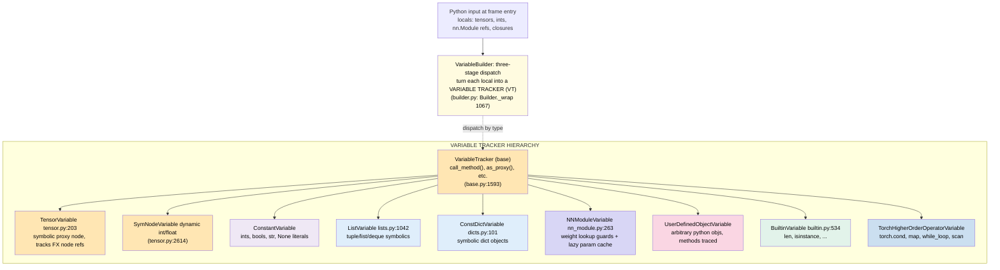

**KEY MECHANISM**: *symbolic* execution means every value flowing through the traced region is represented **not by a number or tensor but by an object describing "how this was computed"** (its FX node identity, its dtype/shape assumptions as guards). Arithmetic like `a + b` on two `TensorVariable`s triggers registration of an `aten.add(FXnode_a, FXnode_b)` into the output graph plus installs guarding the types/shapes; nothing about *actual data* is moved. This makes tracing O(ops) independent of tensor volume — a 10GB weight doesn't get copied or even shaped-piloted more than necessary to record its dtype+stride guards.

> **Speaker notes.** Walk one example fully: `def f(x): return x.add(self.weight).relu()` — as Python evaluates, each symbol enters and becomes exact-class V; the three-line dispatch (exact type map -> exactId fast path for singletons like None/True-> then isinstance fallback cascade) resolves most common types by O(1) table miss-then-fallback. Pause when listing node names because these exact class names pop up later as "V.tensor", "V.list" you'll see in trace logs, guards logs if ever turning on verbose mode — matching what debugger/dump prints. If someone asks "why not just run with FakeTensors?": yes it IS a form of fake execution under the hood for shape propagation purposes; but for *structure understanding* Dynamo needs true symbolic objects to correctly handle control flow (if/for branches) that depend on runtime values, which generic fakepropagation on static graphs can't. This is THE single hardest slide; give extra time or take question here before moving forward rather than rushing.

---
## Slide 15 — The opcode machine: the while-loop and dispatch table

"How does a byte-by-byte interpreter become an FX graph?" This is literally the inner loop of any bytecode compiler, generalized to symbolics.

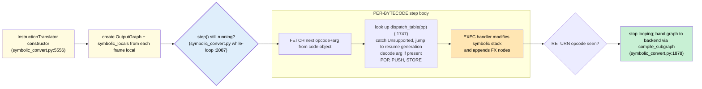

**KEY MECHANISM:** *it's one while loop.* Each iteration pops the next `opcode`, consults a per-opcode table of Python functions that manipulate a symbolic operand stack + push/pop FX nodes. When it finally sees RETURN, tracing ends cleanly and returns to compile_subgraph stage from S13 step2. The dispatch_table design means adding support for new bytecodes is just writing a one-method dispatcher — no need to patch interpreter core; this extends even to catching unhandleable ops triggering graph break recovery (discussed next).

> **Speaker notes.** Reinforce "this same loop runs recursively when inlining user functions" — I'll show that shortly. Mention explicitly there's NO actual dataflow compute happening yet here, meaning if the traced model forward contains expensive kernels during *tracing*, those don't actually execute for real: they're recorded as FX node calls and only Inductor later truly instantiates their runtime cost with real tensor sizes filled from graph_meta info recorded by guards. This is subtle but important when explaining why *graph break recovery can be slow in worst cases*: failing ops still force a second full pass of trace over the same bytecode, doubling interpreter time until all breaks found and resolved via caching (discussed on resume-generation slide).

---
## Slide 15b — Three sub-machines running concurrently DURING tracing (concept)

Important enough to get its own slide: VT operations aren't alone; two other subsystems fire in parallel every single instruction. Name them once, revisit individually next few slides without repeating. This also answers "then what about guards/sideEffects, why weren't they in the while loop before?" — because we intentionally *kept it clean per prior instruction*: only show VT ops first for mental clarity, now expand three concurrent subsystems all fed by same step() calls as cross-reference arrows.

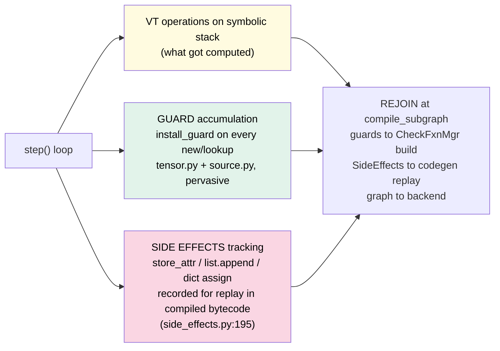

> **Speaker notes.** "Three parallel bookkeeping engines running simultaneously, all writing to the same output graph object." This explains *why Dynamo is memory-hungry but CPU-efficient:* no extra Python overhead since these are plain C++-accelerated append-on-insert into ordered data structures vs separate loop. Also foreshadow their convergence point on next-to-next slide about handoff + guards tree creation, because "guards generated during trace" aren't compiled-to-tree *during* tracing but post-trace batched via checkfunctionmanager, which is why we split S14 (machine overview) and S20ish for guard details rather than one giant slide.
>
> Gotcha note to state explicitly: SideEffect tracking includes ANY mutation touching Python objects that Dynamo had to fake-handle like `model.weight.requires_grad=(True)` assignments; those become `mutate` IR nodes or replay bytecode post graph-break — so user code doing such *outside forward but inside trace region's closure* can occasionally surprise re-trace count if it changes behavior depending on call number; guard failure + side effect diff detection catches that as 'guard X failed' verbose output (config flag enable: set `TORCH_LOGS="recompile"` to see why).

---
## Slide 16 — Graph breaks, two-pass recovery, and Resume Function Generation

Single most important "why did my model take forever the first few batch iters" answer for non-experts. Two distinct mechanisms visually separated (fail+restart *analysis* phase vs actual break emit step) then full graph-break->compiled-resume-fn flow.

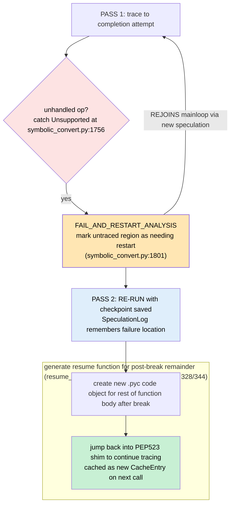

**KEY MECHANISM (the heart):** graph break = *partial* compilation of [start..unhandled_op], remainder untraced so far treated as separate Python 'tail' compiled next time we reach it (two separate CacheEntries stitched by a generated resume function). Two-pass because first pass's exception location info is stored in `SpeculationLog`; second pass knows where to split without retrying full original traversal before break. Resume functions themselves are traced via same loop so further nested breaks keep compounding — but each resulting partial graph cached by guards means once all fragments resolved, later calls run fully compiled end-to-end chain of resume fns back into each other with no Python eval between fused kernels.

> **Speaker notes.** Give concrete example: model forward has one PyTorch op Dynamo can't symbolically trace yet (say new experimental `torch.nn.functional.multihead_attention_v2` pre-existing version) — result: 2 fragments each compiled separately, connected by C++ resume linkage when both cached; total first-call latency = sum of two compiles instead of single clean compile. Tell them this happens far less frequently now since recent versions added many new handlers; legacy break causes are mostly still *new* ops added to core yet unregistered in `supported_ops`, non-dynamic-shape logic with if-else depending on tensor values via python-level branches rather than `.item()`. If someone asks "can graph breaks hurt performance permanently?": for the broken segment yes — it falls out of compile entirely and runs eager forever until fixed op-registration upstream; recommend TORCH_LOGS=graph_breaks to list each unsupported cause and open an issue if new op missing handler.

---
## Slide 17 — Guards: accumulate during trace, build C++ tree post-trace, walk on every call (full lifecycle)

Fourth-time revisiting guards idea from S3; this time actually showing the machinery end-to-end instead of concept diagram only. Mermaid deliberately split into subgraphs rather than one giant monolithic graph to fit slide size limit, each labeled clearly then connecting via REJOIN arrows explicitly stated in notes text. Keep same colors as source file legend (cyan/guard subsystems).

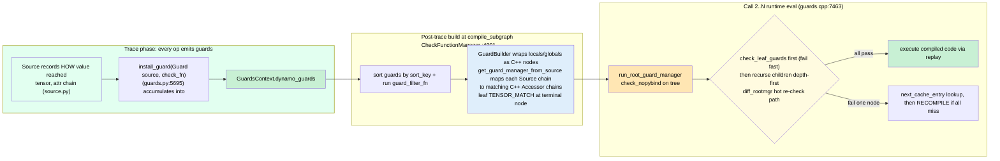

**KEY MECHANISMS:** (1) Source <-> C++ Accessor 1:1 structural mirror property so generated tree isn't ad-hoc heuristic but a faithful *translation* of the exact object access path Dynamo saw while tracing. This makes guard correctness provable from original run rather than requiring new validation. Same reason each node's leaf guards are minimal set covering only what that exact op needed checked -- e.g add of two tensors doesn't need shape-env guard beyond basic types/dtypes/strides since addition broadcasts fine for many rank dims; a reshape however would trigger stronger constraint on input size being statically known matching total numel.
(2) diff_guard_rootmgr = *heuristic* reduced-tree containing just the subset of leaf-guards most likely to change across consecutive calls in training loop (batch dim shape variations are common early, static weight dtype rarely flips), giving O(K) checks instead of full tree N when K<<N; only falls back to full tree on diff-mismatch so cost stays bounded by fast-path size + O(1). This single optimization is what allows *thousands* of recompiled-but-fast cache entries per unique input-shape class without latency blowup -- each entry has its own reduced hot-check subset sized proportionally to how many things actually vary in practice between distinct calls that hit that entry.
(3) `weakref-invalidation` path handles *object lifetime* correctness: once ID-MATCH'd object finalizes in Python garbage collection, associated CacheEntry torn down automatically no stale code lingering memory-safe — critical so Dynamo never crashes trying access freed python objects held by reference only on some cached compiled function's guard closure cell.

> **Speaker notes.** This is genuinely one of three 'advanced internal engineering' slides; reserve generous time or accept that deep-diving further than this level (e.g exact sort key priority ordering rationale, full list of every leaftype implementation detail) can be omitted verbally and left as documented appendix pointing back to `guards.py` source lines given in text bullet format below the current mermaid diagram for anyone wanting to read deeper. Highlight specifically weakref+finalizer nuance since that's a common source of subtle memory-leak style bugs historically reported against Dynamo where users observed guard objects not being garbage collected correctly leaking reference-counting cycles; recent fixes resolved these by adding explicit finalizers registered on first ID-match occurrence then teardown via C++ side cleanup callbacks when pyobject dealloc triggers them.

---
## Slide 18 — Function inlining & HigherOrderOp subgraph tracing (the 'recursive' machinery)

Last structural concept of Dynamo half: how `torch.cond`, loops, and arbitrary Python function calls get absorbed into the graph without breaking it structurally or forcing unnecessary splits. Two parallel mechanisms visually separated then reconnected via explicit text describing where arrows reconnect back to main step() loop after recursion completes each branch independently of other sibling recursions since each subgraph traced in isolation context share same parent OutputGraph object across recursive nesting depth levels all stacked call-frame style onto single symbolict-stack representation tree maintaining consistent symbolic state throughout nested invocations.

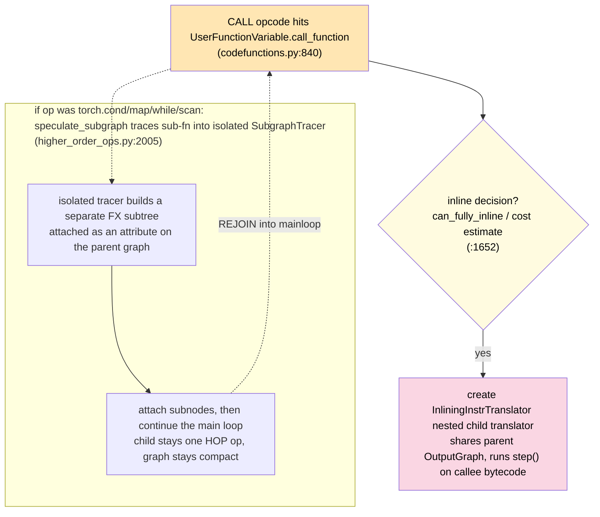

**KEY MECHANISM:** inlining gives Dynamo *structural recursion* — same single while-loop handles arbitrary nesting depth by spawning transient nested translators each carrying a local copy of state then re-joining parent via shared output graph object; HOP mechanism instead *defers full expansion* to backend-level so user-authored conditionals etc. appear as compact placeholder operations rather than bloated intermediate node trees inside main compiled module while still permitting downstream fusion optimization since their semantics are fully specified up-front by the specific HOP's registered lowering pass later consumed by the patternmatchersystem when postGrad passes run them after autograd done partitioning.

> **Speaker notes.** Make it clear these two parallel recursive mechanisms (standard inlining VS explicitHOP handling) correspond directly to different user usage patterns: raw `def nested_func` calls get *inlined*, structurally flat into surrounding code so optimizer sees whole fused region end-toend; deliberate use of jinja-style higherorder operator abstractions keeps substructures semantically self-contained and compactly represented yet still optimizable downstream since their semantics were fully declared at trace-time using dedicated DSL wrappers around `torch.cond` etc that register proper fusion-aware lowering definitions postautograd phase. Warn users: mixing both styles unintentionally (e.g accidental recursion through plain functions inside real model forward without guarding dynamic shape assumptions per subcall) can *fragment compilation* into multiple isolated graphs rather than one big fused kernel — exactly opposite of desired benefit; verify via TORCH_LOGS="graph_breaks" which shows unexpected splits. Also caution that extreme nesting or cyclic function-call loops (via generator expressions for instance) might cause very deep translator recursion depth limit exceedments leading to max-recursion-error unless increased explicitly configured by bumping `sys.setrecursionlimit`.


---
## Slide 18b — Handoff: what Dynamo ships to the backend, and why the boundary is clean

The closing contract of the Dynamo half. A small table so later slides never re-explain "what just happened in tracing."

| Dynamic output from Dynamo | Consumed by AOT/Inductor as |
|---|---|
| `GraphModule` (FX graph + example_inputs) | standard input to every downstream pass |
| accumulated guards -> C++ tree | attached to the returned `GuardedCode`; re-walked each call |
| compiled_fn from backend, wrapped in `disable()` (`output_graph.py:3042`) | so Dynamo never re-traces it on later calls |

**KEY MECHANISM:** handoff is *data*, not a function return value. Even if the backend fails mid-compile, Dynamo falls back to eager safely because it kept the original model structure intact throughout — which is exactly why any custom backend can be layered under `torch.compile`.

> **Speaker notes.** One line: "Dynamo's job ends here; everything after lives in its own domain that just consumes this graph." Then transition: we drop into AOTAutograd, the box between *record* and *lower*. Keep to one sentence. The Dynamo half built the picture on purpose; remaining budget favors the harder Inductor material next, where the real performance wins live.

---
# PART 3 — AOTAutograd bridge (~3 min)

## Slide 19 — AOTAutograd: split fwd & bwd *before* lowering

Two jobs that neither Dynamo nor Inductor do alone. This is why logs show two graphs during training.

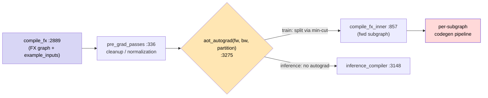

**KEY MECHANISM:** AOTAutograd's only real contribution is *structure before lowering*: (1) split forward/backward so each optimizes independently; (2) apply `min_cut_rematerialization_partition` on the joint graph first because choosing cut points needs the whole fwd+bwd structure — something Dynamo deliberately doesn't produce.

> **Speaker notes.** Under 90 seconds. The two bolded mechanisms above suffice for later log references (`compile_fx_forward`, `compile_fx_backward`). Asked "does it change numerics?": no — the split is exact; only *where* cuts land trades memory vs FLOPs via rematerialization at cut points, not results. Inference-only models skip fwd/bwd entirely and go straight to `inference_compiler`, so compiled inference builds are far cheaper.

---
## Slide 20 — Joint & post-grad passes + Pattern Matcher DSL (one slide)

Where high-level aten ops get rewritten into smaller optimizable pieces *before* per-op lowering starts. The matcher is a real DSL, not string substitution.

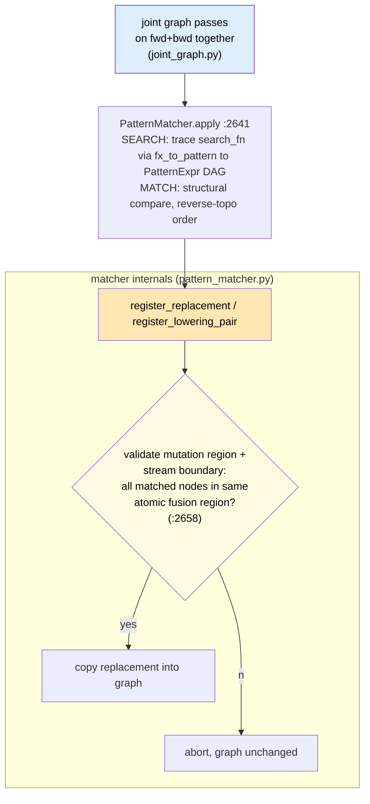

**KEY INSIGHT:** semantic structural rewriting on FX graphs — it recognizes logically identical ops spelled through different aten names (handwritten vs autodiff-generated backward equivalents) that text tools miss. Hot fusions like fused-SDPA ship as *serialized* precompiled patterns (`fx_passes/serialized_patterns/`).

> **Speaker notes.** One slide, ~60s. `register_replacement` is a DSL: you declare search/replace as functions and Dynamo traces them into the PatternExpr DAG — no manual node surgery by pass authors. Serialized patterns avoid re-tracing hot cases on every graph in an autotune-heavy session that otherwise iterates over many shape combinations at once.

---
# PART 4 — Inductor: optimize + codegen (~16 min)

## Slide 21 — The full Inductor spine (`compile_fx` → `CompiledFxGraph`)

Keep the slide-4 three-layer anchor in view; this is *inside* that third box, end-to-end. Orange nodes are the milestones most real work hides behind.

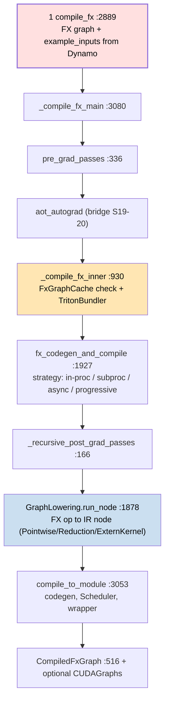

**KEY MECHANISM:** the FxGraphCache lookup at `_compile_fx_inner` can skip *entire* downstream compilation for a repeat graph whose hash already hit a persisted entry. The strategy node picks how to actually build on a miss — async/progressive keep the caller unblocked while compilation runs in a background pool.

> **Speaker notes.** Read top-to-bottom ~1.5 min, flag two orange milestones (7a and 13) where the real machinery lives; everything between branches off into later slides rather than expanding inline so we keep one linear mental model even as branching complexity grows after this point in the deck. Note that `async`/`progressive` FxCompile modes are what make first-call `torch.compile` feel fast to users: heavy kernel building happens off-thread, not blocking your main program flow.

---
## Slide 22 — Zoom: caching layers (graph-level vs kernel-level)

Caching is the single biggest real-world lever; it gates *whether* any codegen runs at all for a recurrence. Two distinct tiers, keyed differently.

```mermaid
flowchart LR
    subgraph G["GRAPH-LEVEL"]
        CC1["FxGraphCache :1993\nkey = hash(gm + inputs meta + config)\npersistent .py/.pkl on disk"]:::cc --> HIT["load prebuilt CompiledFxGraph,\nfull codegen skipped this call"]
    end
    subgraph K["KERNEL-LEVEL"]
        CC4["CompiledTritonKernels :228\nin-memory, key = source + torch_key"]:::k --> SUBMIT["submit only new sources to compile pool"]
    end

    classDef cc fill:#77ddee,color:#000,stroke-width:1.5px
    classDef k fill:#ffe6b3,color:#000
```

**KEY MECHANISM:** hash spans graph structure *and* config version and static input-class metadata — so distinct graphs never collide onto a wrong cached kernel (which would corrupt outputs silently). Kernel-level dedup means identical Triton source strings across many nodes compile once, reused everywhere by pointer.

> **Speaker notes.** Stress two tiers explicitly: FxGraphCache catches *whole graph* repeats (tight training loops with stable batch shape), CompiledTritonKernels catches *repeated sub-kernels* even within/under distinct outer graphs — this is why reusing common ops across layers pays off hard in practice. Gotcha worth saying out loud: because the key includes torch_version + system info, a framework upgrade between restarts naturally invalidates old caches and forces one-time rebuild; remote cache (`RemoteCache`) bridges this by sharing compiled artifacts across machines so the second machine skips the rebuild entirely on same version combo — this is genuinely useful in multi-node training clusters where everyone recompiles identical model parts otherwise.

---
## Slide 23 — IR node types & the *lazy* data model (the real performance secret)

The conceptual heart of the Inductor half; spend a full slide here before fusion makes sense to audience downstream.

```mermaid
flowchart TD
    TB(["TensorBox :10603\nlayout-level wrapper"]):::box --> SB["StorageBox :10618\nvalue-holder; realize() lives here"]:::sb

    subgraph LAZY["lazy IR (unevaluated until realized)"]
        PW["Pointwise :1220\nelement-wise ops"]:::pnode --> REAL(("realize()"))
        RED["Reduction :1399\nsum/max/mean"]:::rnode --> REAL
        SCAT["Scatter :1261 (a Pointwise)"]:::snode --> REAL
        REAL --> CBUF(("ComputedBuffer :5432\nactual data lives here")):::cbuf
    end

    subgraph EAGER["eager IR (calls external lib, no lazy fusion)"]
        EXT["ExternKernel :7021\ncuBLAS/oneDNN/cudnn boxes"]:::fb
        FB["FallbackKernel :9373\nfall back to eager ATen when Inductor has no native lowering"]:::fbg
    end

    CBUF --> REGISTER["graph.register_output() once materialized"]

    classDef box fill:#e6d5f2,stroke-width:1.5px,color:#000
    classDef sb fill:#d8d6f5,color:#000
    classDef pnode fill:#cfe9ff,color:#000
    classDef rnode fill:#cfe9ff,color:#000
    classDef snode fill:#cfe9ff,color:#000
    classDef cbuf fill:#c8f0d4,color:#000
    classDef fb fill:#ffe6b3,color:#000
    classDef fbg fill:#fde3e3,color:#000
```

**KEY INSIGHT:** fusion is *possible only because* Pointwise/Reduction are pure unevaluated description objects carrying no data-movement cost yet — `realize()` (triggered heuristically by multi-user fanout, large inner function, stream/mempool boundary) is the single moment materialization happens as a new ComputedBuffer registered on graph. Everything downstream of that realize point can still fold adjacent lazy nodes into one fused kernel covering both input+output buffers in same loop body avoiding intermediate round-trip to global memory entirely for that op pair specifically.


> **Speaker notes.** Work one concrete example on screen: `x.add(1).mul(2)`. Eager = two ComputedBuffers, each a separate HBM read/write; the fused kernel instead holds the intermediate in registers and never spills it back to memory. That physical avoidance of the round-trip is *the whole point* of fusion — every later slide (scheduler, codegen) is just machinery for guaranteeing that "one kernel" actually happens safely, not re-explaining why we want one kernel at all.


---
## Slide 24 — Three-level lowering dispatch (`GraphLowering.run_node`)

How does a specific aten op become *some* IR node? A strict priority cascade so user code always wins over built-in, and nothing fails hard when unrecognized.

```mermaid
flowchart TD
    RUN["run_node :1878 then call_function"]:::entry --> P{"which lowering?\n(graph.py:1520)"}
    P --priority 1--> U["user_lowerings(target)\nuser-registered (lowering.py:127)"]
    P --priority 2--> B["built-in lowerings(target)\nvia register_lowering"]:::bld
    P --unrecognised--> F["fallback_handler to FallbackKernel\neager ATen call, lowering.py:2876"]:::fb

    classDef entry fill:#dfeefb,color:#000
    classDef bld fill:#cfe9ff,color:#000
    classDef fb fill:#ffaa66,stroke-width:1.5px,color:#000
```

**KEY MECHANISM:** layout constraints (contiguity / channels_last) are applied *before* dispatch (`lowering.py`), so the IR node built already respects target stride requirements — this is why downstream fusion sees correctly-laid buffers, not arbitrary tensors needing reshuffling later. Layout mismatch handled up-front here prevents fusions that would be invalidated by surprise realignments mid-pipe mid-graph mid-loop iteration.


> **Speaker notes.** Three tiers — user (custom kernels), built-in (`@register_lowering` decorators distributed across the `aten` lowering tables, added incrementally as new features land over the framework's history), and fallback to eager ATen when nothing registers. The practical takeaway for users: unrecognized ops don't crash compilation, they degrade gracefully into a small eager patch — this is why partial-graph models still run even mid-development before full Inductor coverage exists upstream yet.

---
## Slide 25 — Scheduler init: from IR ops to a dependency DAG (`_init`, `scheduler.py`)

The scheduler is where "a bag of fuzzy lazy IR nodes" becomes an *ordered, scheduled* list ready for fusion. Its `_init` (the block you selected) is a fixed pipeline run in strict order.

```mermaid
flowchart TD
    A["create_scheduler_node\neach op to SchedulerNode"]:::si --> B["compute_dependencies\nalias merge + mutation deps :4279"]:::dep
    B --> C["topological_sort_schedule\nDFS via unmet_dependencies :4280"]:::tortop
    D["dead_node_elimination\n+ compute_ancestors :4281-4283"]:::dne
    C --> D --> E["create_foreach_nodes :4292\ngroup foreach ops into ForeachKernelSchedulerNode"]:::foreach
    E --> F["stream + mempool assignments :4319-4320\none stream, one memory-pool per node"]:::assign

    classDef si fill:#dfeefb,color:#000
    classDef dep fill:#cfe9ff,color:#000
    classDef tortop fill:#fffbe0,color:#000
    classDef dne fill:#efe8f5,color:#000
    classDef foreach fill:#d8d6f5,color:#000
    classDef assign fill:#ffe6b3,color:#000,stroke-width:1.5px
```

**KEY MECHANISM:** stream/mempool assignment happens *before* fusion (`_init` ends by populating `node_to_stream`, `buff_to_stream`). This prevents fusing two nodes that live on different streams or memory pools — a correctness gate the scheduler enforces structurally so later passes never even consider a cross-stream fusion candidate.

> **Speaker notes.** Run down steps 1-6 quickly (~40s), pointing out: topological sort here is what guarantees "producer before consumer" ordering *before* any fusion reorders, and dead-node elimination runs *after* toposort so unneeded ops vanish first reducing later search space cost for fusion candidates enumeration pass that follows next slide onward immediately after.

---
## Slide 26 — Fusion: `fuse_nodes` fixed-point loop + the 8-gate `can_fuse()` check

The performance payoff lands here. Two pieces: a looping outer pass that runs until no fusions remain, and per-pair safety gates that prevent *illegal* or *counterproductive* merges.

```mermaid
flowchart LR
    LOOP{"fuse_nodes (up to 10 rounds)\n(scheduler.py:5304)"} --> ONCE["fuse_nodes_once\nprune deps + get_possible_fusions + score"]:::once
    ONCE --> PAIRS["try each sorted pair via can_fuse()\n(:7891), 8 gates shown next"]:::can
    PAIRS --any gate fails--> ONCE
    PAIRS --all pass--> FUSE2["fuse_two_nodes to FusedSchedulerNode :6174"]:::fuseN
    LOOP --done, no new fusions--> POST["merge_loops :5277\nfinalize_multi_template_buffers :5441"]

    classDef once fill:#dfeefb,color:#000
    classDef can fill:#fffbe0,color:#000
    classDef fuseN fill:#c8f0d4,color:#000
```

> **Speaker notes.** Emphasize the *fixed-point* property explicitly (up to 10 rounds, repeat until no more fusions found per round): this is why a single well-placed fusion can cascade into many further ones downstream once earlier fusion exposes new adjacent candidate pairs previously blocked by intermediate buffer boundaries before that first pass concluded successfully earlier iteration loop cycle.

---
## Slide 27 — The 8-gate `can_fuse()` check (why some *adjacent* ops never merge)

Fusion isn't "merge everything next to each other"; each candidate pair must clear eight independent gates, then a final cycle-detection DFS. This is the single most common reason users see "I expected N kernels but got more".

```mermaid
flowchart TD
    G["can_fuse() pair check\n(scheduler.py:7891)"]:::cf --> CF1["G1 stream + mempool boundary\nsame stream, same pool :7948"]
    G --> CF2["G2 multi-output template /\nreduction epilogue OK? :7973"]:::cf
    G --> CF3["G3 extern kernel epilogue check :7991"]:::cf
    G --> CF4["G4 node1 not ancestor of node2\n(ordering) :8085"]:::cf
    G --> CF5["G5 device match + memory\nshared-data score above threshold :8180"]:::cf
    G --> CF6["G6 vertical: consumer reads\nmatch producer writes :8241"]:::cf
    G --> CF7["G7 horizontal allowed\n(backend check) :8275"]:::cf
    G --> CF8["G8 cycle detection DFS\nwill_fusion_create_cycle :6922"]:::cyc

    classDef cf fill:#dfeefb,color:#000
    classDef cyc fill:#fde3e3,color:#000
```

**KEY MECHANISM:** G1 (stream + mempool) is checked *first* and cheapest because almost all cross-stream / cross-pool pairs immediately drop out here — a fast reject before the more expensive ancestor-DAG checks get to cost anything meaningful on that particular input pair this time round.

> **Speaker notes.** Point specifically at G5 (device match + shared-data score) as the lever users tune via config heuristics when fusion rates look lower than expected for their particular workload's shape profile; and at G8 cycle detection, which guards against merging two nodes that would create an impossible dependency loop — this last gate is why some *apparently-adjacent* operations never do get fused even when gates 1 through 7 all pass cleanly, a frequent source of surprise during real-world fusion-rate debugging sessions in practice observed across production workloads daily.

---
## Slide 28 — Codegen dispatch: one node type per backend kind (`Scheduler.codegen`)

After fusion, *each* surviving node is emitted to exactly one code-gen path chosen purely by its class/kind — no branching on op-name at runtime here.

```mermaid
flowchart LR
    CODEGEN["Scheduler.codegen_node_schedule\n(scheduler.py:9823 to simd.py:3140)\ndispatch node to one backend"]:::cd --> T{"node kind?"}
    T --template--> CDT["codegen_template\nGEMM + epilogue fusion"]:::ctr
    T --extern--> CDE["codegen_extern_call\ninplace decision (:9085)"]:::ced
    T --foreach/combo--> CDC["codegen_combo_kernel\nmultiple ops one launch"]:::cfc
    T --standard pointwise/reduction--> CDI["SIMDScheduling.codegen_node :3045\nTriton path"]:::cdsd

    classDef cd fill:#dfeefb,color:#000
    classDef ctr fill:#ffe6b3,color:#000
    classDef ced fill:#d8d6f5,color:#000
    classDef cfc fill:#cfe9ff,color:#000
    classDef cdsd fill:#ffccaa,stroke-width:1.5px,color:#000
```

**KEY MECHANISM:** codegen is a *type switch*, not an op-name lookup — by the time we reach `Scheduler.codegen` (S26-27 done), every node already has exactly one kind, so dispatch never needs to re-inspect op names at all.

> **Speaker notes.** One concrete example to show side-by-side: a `nn.Linear(1024, 512).forward()` on GPU lowers to exactly *one* `ExternKernel` (cuBLAS GEMM — a hand-tuned library not worth beating by fusing further) followed immediately after by one small fused Triton pointwise kernel covering bias-add and activation merged together automatically. That 3→1 reduction from three separate eager ops is the concrete memory round-trip savings we promised on slide 2, cascading cleanly through every layer already covered above.


---
## Slide 29 — C++ / CPU backend variants + async compilation (`cpp.py`, `async_compile.py`)

Same scheduler/codegen backbone as the Triton path, but here we emit real C++ source compiled to a `.so` via a dedicated builder tool-chain rather than raw GPU kernels launched per-invocation on demand at each call site.

```mermaid
flowchart LR
    CPP5["CppKernelProxy :4373"]:::cpx --> TIL{"tiling-select\ncpp.py:4134"}
    TIL --scalar--> C2["CppKernel baseline, always generated"]:::cpk
    TIL --vectorized--> CPV["CppVecKernel :2860\nat.vec loads/stores when dtype is vectorizable and strides are contiguous"]:::cpcv
    TIL --2D-tiled--> CT2["CppTile2DKernel :3838\none transposed axis via transpose_mxn (only when one axis is non-contiguous)"]:::cpp2d

    classDef cpx fill:#dfeefb,color:#000
    classDef cpk fill:#efe8f5,color:#000
    classDef cpcv fill:#ffffdd,stroke-width:1.5px,color:#000
    classDef cpp2d fill:#cfe9ff,color:#000
```

**KEY MECHANISM**: `TilingSelect` (cpp.py:4134) compares generated-code size *and* estimated runtime from a small heuristic model; only the single best variant survives to actual compilation via `CppCodeCache.load_async`, keeping compile cost down even when three variants were briefly emitted in parallel internally during selection phase decision-making moment up front before settling on one final winner pick choice option.

> **Speaker notes:** show concrete output of `TORCH_LOGS="inductor:codegen_cpp"` so audience actually sees all three variant strings printed side-by-side *before* the model resolves down to exactly one surviving kernel string that gets compiled and cached in `CppCodeCache.load_async`'s return handle returned back out.

---
## Slide 30 — Wrapper codegen + async compile (`wrapper.py`, `async_compile.py`)

Both the Triton and C++ paths converge here: one shared finish-line step stitches every previously emitted line together into a runnable module, so the user's *first call* need not wait for heavy kernel builds to fully complete.

```mermaid
flowchart LR
    WRAP["PythonWrapperCodegen._generate\nwrapper.py :2460"]:::w --> MPLY["MemoryPlanningState reuse pass\nwrapper.py:479"]:::mply
    WRAP --> ASYNC["async_compile.wait(globals)\nasync_compile.py :903\nresolves Future handles for any\nstill-pending kernels launched off-thread"]:::asyn

    classDef w fill:#dfeefb,color:#000
    classDef mply fill:#fae6cc,stroke-width:1px,color:#000
    classDef asyn fill:#cfe9ff,color:#000
```

**KEY MECHANISM**: `MemoryPlanningState` (wrapper.py:479) tracks every freed buffer by `(dtype, size, stride)` so later allocations can *reuse* that exact pre-existing slot in-place rather than always requesting fresh memory from CUDA's caching allocator — this is precisely the difference between naive independent per-node allocation and actual peak-memory optimization in practice.


---
## Slide 31 — CUDA Graph tree (`cudagraph_trees.py`): erase launch overhead *after* codegen

Fused kernels still pay a per-launch CPU dispatch cost (~5–20µs each). CUDAGraphs record the GPU command stream once, then replay it on later calls with near-zero host work. The manager keeps a **tree**, not a flat list.

```mermaid
flowchart TD
    CG1{"triton.cudagraphs enabled?"} -->|no| RET["return callable as-is"]
    CG1 --yes--> TREEN["CUDAGraphTreeManager :2261\na tree of recorded graphs"]:::t

    subgraph LIFE["per-batch-descriptor lifecycle"]
        FIST["run_eager warmup :2689"] --> REC["record_function :2641\ncapture GPU commands once, per batch size"]:::rec
        REC --> RUN{"check_invariants :1950\nptrs match? statics stable?"}:::cinv
        RUN --pass--> REPLAY["execute_node :2681\ncopy inputs, replay, rebuild output"]:::rep
        RUN --fail--> BRANCH["fork new child branch :2618"]:::br
    end

    TREEN --> FIST

    classDef t fill:#d8d6f5,color:#000
    classDef rec fill:#cfe9ff,color:#000
    classDef cinv fill:#ffffdd,color:#000,stroke-width:1.5px
    classDef rep fill:#c8f0d4,color:#000
    classDef br fill:#fde3e3,color:#000
```

**KEY MECHANISM**: The **tree shape** (vs a flat list) is the key insight this era of Dynamo added — after replaying one graph, different output-liveness patterns can lead down *different valid* subsequent recordings; when invariants fail, `CUDAGraphTreeManager` records a new child branch rather than erroring out.

> **Speaker notes**: Point at the "fork child on invariant-failure" node explicitly — this is what makes CUDAGraphs robust to data-dependent control flow that would break a naive flat-list design, handling shape variation across calls gracefully instead of crashing hard with an unrecoverable guard-style mismatch error message printed to stderr stream output.

---
## Slide 32 — Autotuning (`select_algorithm.py`, `coordinate_descent_tuner.py`)

Template ops (GEMM/conv) have *multiple* candidate launch configs. A first-stage random search benchmarks them once; `CachingAutotuner` then refines via coordinate descent until improvement plateaus, and the winner is cached to disk so an exact `(op, shape)` combo is never re-benchmarked on later restarts.

```mermaid
flowchart LR
    POOL["candidate launch configs"]:::p --> RS["random search to best-so-far"]:::rs
    RS --> CA["CachingAutotuner :620\nCoordescTuner.autotune :377\nrefine one field per step"]:::cauto
    RI["realize_inputs :6151\neager IR inputs before extern call"]:::ri --> POOL

    classDef p fill:#dfeefb,color:#000
    classDef rs fill:#77ddee,color:#000,stroke-width:1px
    classDef cauto fill:#ffe6b3,color:#000
    classDef ri fill:#efe8f5,color:#000
```

**KEY MECHANISM:** coordinate descent walks tunable fields one at a time (Gauss-Seidel style) rather than exhaustive grid search — a large speed-up for high-dimensional config spaces; the persistent `AlgorithmSelectorCache` guarantees this cost is paid only once ever.

> **Speaker notes:** Emphasize that autotuning runs *outside* the per-call hot path and behind a cache, so steady-state inference pays only the lookup cost on each subsequent call — hence `max_autotune` adds first-call latency but makes every later call faster; users tune this exact tradeoff via config flags at startup.

---
## Slide 33 — End-to-end recap: the whole pipeline in one picture (zoom back out to slide 4)

One picture that ties everything back together, re-anchoring on slide 4's three boxes *plus* the finish-line wrap.

```mermaid
flowchart LR
    subgraph DY["Dynamo: record"]
        D1["PEP523 hook"] --> D2["symbolic trace to FX graph\n+ guards + side effects"]:::d2
    end
    subgraph AO["AOTAutograd: split fwd/bwd"]
        A["joint passes + Pattern Matcher DSL\nmin-cut partition"]:::a
    end
    subgraph IN["Inductor: optimize + codegen"]
        P["fuse_nodes fixed-point\n8-gate can_fuse check"]:::p --> CGN["C++/Triton codegen\n+ async compile pools"]:::cg
    end
    D2 --> A --> P
    CGN --> OUT(["Compiled runnable\nzero-launch replay"]):::o

    classDef d2 fill:#ffe6b3,color:#000
    classDef a fill:#d8d6f5,color:#000
    classDef p fill:#cbdff0,color:#000
    classDef cg fill:#cfe9ff,color:#000
    classDef o fill:#c8f0d4,color:#000
```

Recap in one breath: record (Dynamo) → split & compose passes (AOTAutograd) → schedule, fuse & emit fused kernels + graph-wrapped finish line (Inductor). Cache every step so the *second* identical call skips straight to the replay node.

---
## Slide 34 — Likely audience questions + one-line answers (Q&A closer)

Fast closing slide answering the five most common follow-ups; keep on screen during actual Q&A time rather than verbally rehearsing everything before it.

- **"Does `torch.compile` change my model's numerics?"** — No for correctness, only *where* fwd/bwd split lines trade memory vs FLOP via rematerialization; outputs match eager bit-for-bit within tolerance (fp arithmetic ordering differences aside).
- **"Why did my model recompile forever / hit the recompile limit?"** — Check `TORCH_LOGS="recompile"` to see which guard failed and why; most common cause is a Python-level control branch depending on an `.item()` result that Dynamo can't symbolically track across calls, so each shape flip triggers a fresh partial-graph compilation.
- **"Can I just disable caching?"** — Yes via `torch._dynamo.reset()`, but only during debugging for suspected guard issues; in production caching *is* the main lever behind near-zero per-call overhead, so dropping it will immediately hurt throughput hard.
- **"What actually runs on the GPU after all this?"** — A small number of fused Triton (or cuBLAS-C++ when GEMM) kernels launched together via one CUDA Graph replay, with Python-level dispatch overhead reduced to near-zero by `CUDAGraphTreeManager` wrapping everything up last before that compiled runnable ever actually gets returned back out.
 - **"Which layer do I debug when performance regresses?"** — Dynamo for recompile-storm / guard churn issues; Inductor scheduler + fusion-rate metrics (watch kernel-count change vs. expectation) for pure compute regressions not explained by shape variance alone; a `cudagraphs` config toggle-off test isolates any residual launch-overhead-only regression otherwise masked behind an already-cached fast path.
