# `torch.compile` 45-Minute Main Deck

This is a presentation-ready, ELI10-style deck outline for an end-to-end `torch.compile` talk. It preserves the same cadence that made the earlier `vLLM & torch.compile` deck work well:

`promise -> map -> Dynamo -> handoff -> Inductor -> reuse recap`

## How To Use This File

- Use the `Excalidraw camera` lines as your zoom instructions for the two large source diagrams.
- Use `Text on slide` as the visible slide copy.
- Use `Speaker notes` as the spoken explanation.
- Use the `Mermaid` block as the clean, simplified diagram for the actual slide when the raw Excalidraw crop feels too busy.
- Keep the main talk to the `15` slides below. The appendix is for Q&A or reviewer-heavy audiences.

## North Star

Keep repeating this line:

`torch.compile` has two big jobs: Dynamo captures a safe graph from Python, and Inductor turns that graph into fast reusable code.

The four artifacts to keep naming are:

1. Python code
2. FX graph
3. Guards
4. Generated code and wrapper code

If a slide does not make one artifact become the next one, it is probably too detailed for the main deck.

## Main Deck (`45 min`)

### Slide 1: `torch.compile`: from Python to reusable kernels

Time: `1 min`

Excalidraw camera:
- Use a custom title ribbon, not a raw crop.
- Show only: user code, capture, compile, reuse.
- Hide everything else.

Text on slide:
- One call site can trigger a whole compiler pipeline.
- First call usually pays the compile cost.
- Later calls try to reuse compiled work safely.

Speaker notes:
The whole talk is the story of what happens after one innocent-looking `torch.compile(model)(x)` call. I want the audience to remember one split for the entire talk: the first call usually compiles, and later calls usually try to reuse.

Mermaid:
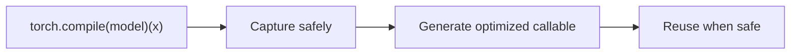

Grounding:
- Verified against `torch.compile`, `_TorchCompileInductorWrapper.__call__`, `torch._dynamo.optimize`, and `torch._inductor.compile_fx`.

### Slide 2: Why `torch.compile` exists

Time: `3 min`

Excalidraw camera:
- Use a custom side-by-side comparison, not a raw crop.
- Left side: eager step-by-step execution.
- Right side: compiler path with region-level optimization.

Text on slide:
- Eager PyTorch sees the next operation.
- A compiler can see a larger region and optimize across it.
- The goal is speed without changing user-visible semantics.

Speaker notes:
Eager execution is fantastic at doing the next thing correctly. A compiler becomes useful when seeing a whole region reveals opportunities that single operators cannot see: rewrites, fusion, better memory movement, fewer launches, and reuse on later calls.

This is not a story about replacing PyTorch. It is a story about keeping PyTorch semantics while giving the runtime a chance to do bigger, more global optimization work.

Mermaid:
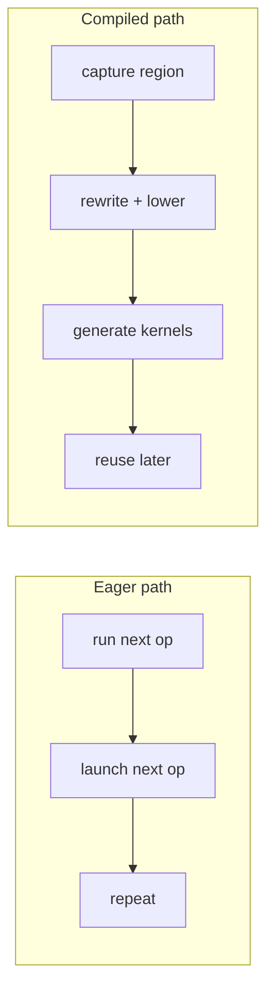

Grounding:
- The compiled path described here is grounded by the Dynamo and Inductor control-flow docs plus the `compile_fx` and `compile_fx_inner` code paths.

### Slide 3: The only mental model you need

Time: `3 min`

Excalidraw camera:
- Use `Frame 0` from `torch_compile_zoom_storyboard.md`.
- Highlight: user code, Dynamo, AOTAutograd, Inductor lowering, scheduler/fusion, codegen/cache, reuse.
- Mute all branch-heavy detail.

Text on slide:
- Dynamo captures a safe FX graph from Python.
- AOTAutograd decides inference vs forward/backward compile units.
- Inductor lowers, fuses, generates code, compiles it, and returns a reusable callable.
- Track four artifacts: Python, FX graph, guards, generated code.

Speaker notes:
If the audience remembers nothing else, this is the model to remember. Dynamo is the capture half. Inductor is the optimization and code generation half. AOTAutograd is the bridge that decides what exact graph units Inductor should compile, especially for training.

Mermaid:
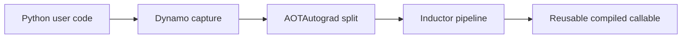

Grounding:
- Verified against `_TorchCompileInductorWrapper.__call__`, `compile_fx`, `_compile_fx_main`, `dynamo_common.aot_autograd`, and `compile_fx_inner`.

### Slide 4: Runtime split: miss path vs hit path

Time: `2 min`

Excalidraw camera:
- Use `Frame 10` from `torch_compile_zoom_storyboard.md`.
- Left: capture/trace/lower/compile/cache.
- Right: guard check/cache hit/run compiled code/recompile on miss.

Text on slide:
- Cache miss: capture, trace, lower, generate, compile, cache.
- Cache hit: check guards, then run compiled code.
- Recompile happens only when the old assumptions stop being true.

Speaker notes:
I like introducing this split early because it keeps the whole talk anchored. When people get lost in internals, I come back here: are we explaining the miss path, or are we explaining the hit path?

Mermaid:
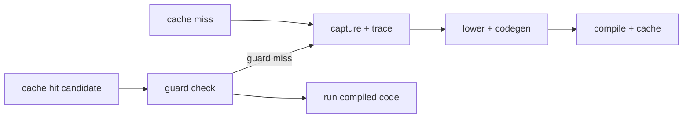

Grounding:
- Verified against the Dynamo cache lookup path and the reuse path described in `eval_frame_cpp.cpp`, `guards.py`, and the guard-evaluation sections of the control-flow docs.

### Slide 5: Dynamo overview: where Python gets intercepted

Time: `2 min`

Excalidraw camera:
- Use `Frame 1`.
- Keep visible: `torch.compile`, wrapper creation, frame hook, cache lookup, trace loop, backend handoff, guard build.
- Grey out: deep `VariableTracker` detail, guard-builder internals, side-effect replay internals.

Text on slide:
- `torch.compile` wraps the callable so runtime execution enters Dynamo.
- Dynamo intercepts Python frames through the frame-eval hook.
- Each frame gets a simple question: reuse old compiled code, or trace now?

Speaker notes:
Dynamo lives right at the Python boundary. Its first job is not "optimize." Its first job is "intercept safely." The wrapper eventually installs the callback, the CPython frame-eval hook sees frames, and the runtime decides whether a cached compiled result is reusable or whether tracing needs to happen now.

Mermaid:
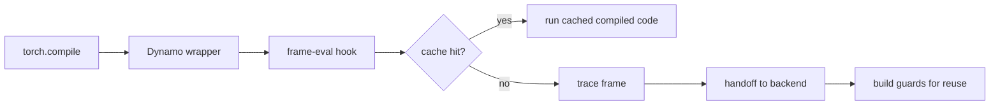

Grounding:
- Verified against `_TorchCompileInductorWrapper.__call__`, `torch._dynamo.optimize`, `OptimizeContext.__call__`, `compile_wrapper`, and the C frame-eval hook path.

### Slide 6: Dynamo trace loop: one loop, three jobs

Time: `4 min`

Excalidraw camera:
- Use `Frame 2`.
- Keep visible: `trace_frame`, `InstructionTranslator`, `tracer.run`, `step`, the three parallel systems block, and `compile_subgraph`.
- Grey out: entry plumbing, cache-hit path, deep guard-tree detail.

Text on slide:
- Dynamo symbolically executes bytecode one instruction at a time.
- The trace loop builds the FX graph, accumulates guards, and records side effects together.
- `compile_subgraph` seals the region and calls the backend.

Speaker notes:
This is the heart of Dynamo. The `InstructionTranslator` runs a bytecode loop, but that loop is doing three jobs at once: building an FX graph, recording the assumptions needed for safe reuse, and remembering mutations that must be replayed later.

This is why the compiler story feels complicated if you track functions only. It gets much simpler if you track artifacts instead: by the end of this loop, we have a graph, guards, and a replay plan.

Mermaid:
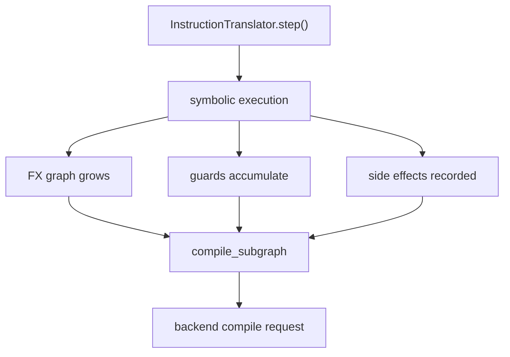

Grounding:
- Verified against `trace_frame`, `InstructionTranslator.__init__`, `InstructionTranslator.run`, `InstructionTranslator.step`, `OutputGraph.__init__`, and `OutputGraph.compile_subgraph`.

### Slide 7: Graph breaks are planned detours

Time: `3 min`

Excalidraw camera:
- Use `Frame 3`.
- Keep visible: `step`, unsupported/restart path, `step_graph_break`, `compile_subgraph`, and resume path.
- Mute most happy-path detail.

Text on slide:
- Graph breaks happen when Dynamo cannot safely keep tracing the current region.
- Dynamo compiles the prefix it understands and emits a resume function for the rest.
- A graph break is partitioning, not total failure.

Speaker notes:
This is one of the most important slides to get right. A graph break is not the compiler "crashing." It is Dynamo saying, "I can safely optimize up to here, then I will let Python continue and rejoin later."

The detailed story is two-pass: first Dynamo discovers the break, then it uses that knowledge to compile the prefix and create a resume function. That detail is useful to say out loud, but do not overload the slide with it.

Mermaid:
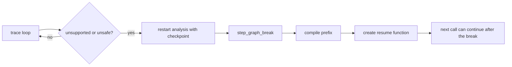

Grounding:
- Verified against `InstructionTranslator.step`, `InstructionTranslator.step_graph_break`, `RestartAnalysis`, `OutputGraph.compile_subgraph`, and `ContinueExecutionCache`.

### Slide 8: Guards are the reuse contract

Time: `3 min`

Excalidraw camera:
- Use `Frame 4`.
- Keep visible: cache lookup, guard build, `GuardedCode`, later-call guard evaluation, hit vs recompile.
- Grey out: trace-loop detail and `VariableTracker` family detail.

Text on slide:
- A compiled region is reusable only if the old assumptions still hold.
- Dynamo turns those assumptions into guards and stores them with the compiled result.
- Guard hit runs compiled code. Guard miss recompiles.

Speaker notes:
This is the price of safe reuse. Dynamo is allowed to specialize only because it remembers what it assumed. Later calls are cheap when those assumptions still hold, and correct when they do not because the system recompiles instead of pretending the old code is still valid.

Do not deep-dive the whole guard tree here. In the main deck, just teach the lifecycle: accumulate during tracing, build after tracing, check on later calls.

Mermaid:
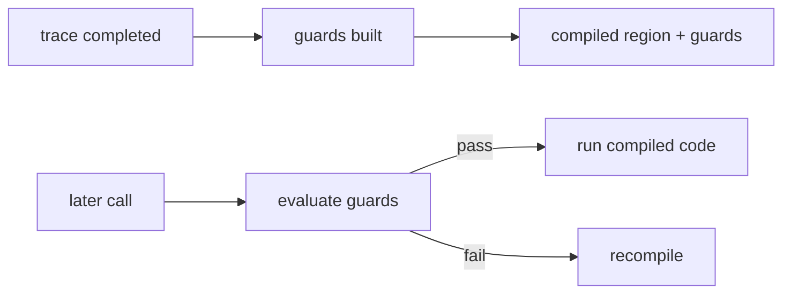

Grounding:
- Verified against `DynamoOutput.build_guards`, `CheckFunctionManager`, `GuardBuilder`, the C++ guard manager runtime, and Dynamo cache lookup.

### Slide 9: AOTAutograd is the bridge

Time: `3 min`

Excalidraw camera:
- Use `Frame 5`.
- Keep visible: backend handoff from Dynamo, `compile_fx`, AOTAutograd split, forward/backward vs inference branch.
- Grey out: deep Dynamo internals and deep Inductor internals.

Text on slide:
- After Dynamo capture, the compiler artifact is an FX graph, not raw Python.
- AOTAutograd decides whether we stay on an inference path or split into forward and backward graphs.
- Inductor compiles those graph units, not the original Python frame.

Speaker notes:
This bridge slide matters a lot because it prevents the talk from feeling like "Dynamo ends, then unrelated compiler stuff starts." The handoff is explicit. `compile_fx` orchestrates AOTAutograd, and AOTAutograd determines what exact units Inductor should compile.

For inference, the story is straighter. For training, the joint graph is partitioned into forward and backward regions after joint-graph passes run.

Mermaid:
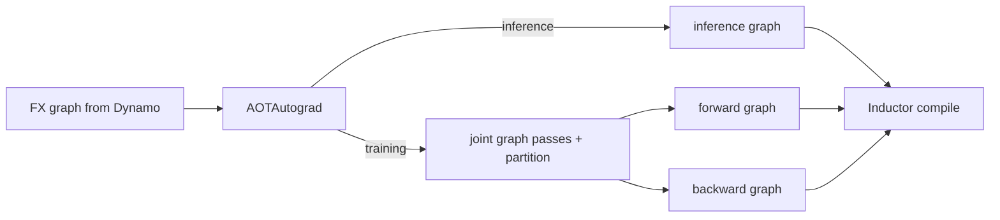

Grounding:
- Verified against `compile_fx`, `_compile_fx_main`, `dynamo_common.aot_autograd`, `partition_fn`, `compile_fx_forward`, and `compile_fx_backward`.

### Slide 10: Inductor overview: a pipeline, not a single kernel generator

Time: `3 min`

Excalidraw camera:
- Use `Frame 6`.
- Keep visible: pre-grad passes, AOTAutograd/partition, post-grad passes, lowering, scheduler, codegen, async compile, return.
- Grey out: pattern DSL detail, Triton reduction variants, detailed CUDAGraph branching.

Text on slide:
- Inductor is a multi-stage pipeline.
- It rewrites graphs, lowers them to IR, schedules work, generates code, compiles it, and caches it.
- The result is a compiled callable returned to Dynamo.

Speaker notes:
This is the moment to reset the audience before the second half. Inductor is not one pass and not one kernel generator. It is a pipeline that takes graph units and keeps turning them into lower-level artifacts until the output is actual runnable compiled code.

Mermaid:
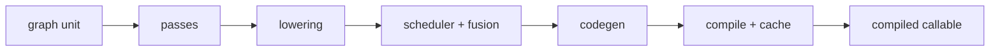

Grounding:
- Verified against `compile_fx_inner`, `_compile_fx_inner`, `GraphLowering`, `Scheduler`, wrapper codegen, and `CompiledFxGraph`.

### Slide 11: FX passes and lowering: keep options open

Time: `4 min`

Excalidraw camera:
- Use `Frame 7` as the main crop.
- Add one small callout from `Frame 6` to remind people that pre-grad, joint, and post-grad passes all feed into lowering.
- Grey out scheduler and later backend detail.

Text on slide:
- FX passes rewrite the graph before and after the autograd split.
- `GraphLowering` walks FX nodes and dispatches each one to a lowering.
- The IR stays lazy until `realize()` decides an intermediate must materialize.

Speaker notes:
There are two big ideas here. First, Inductor does graph rewrites at multiple phases, not just once. Second, lowering does not immediately turn every intermediate into a concrete allocated buffer. The IR stays lazy to preserve fusion opportunities as long as possible.

That `realize()` moment is important to explain simply: it is the point where the compiler stops treating a computation as a symbolic plan and decides it must become a real stored intermediate.

Mermaid:
```mermaid
flowchart LR
    A["pre-grad / joint / post-grad passes"] --> B["GraphLowering.run"]
    B --> C["lowering dispatch"]
    C --> D["Pointwise / Reduction IR"]
    C --> E["Extern IR"]
    D --> F["lazy IR stays unfused"]
    F --> G["`realize()` when needed"]
    G --> H["ComputedBuffer"]
```

Grounding:
- Verified against `pre_grad_passes`, `post_grad_passes`, `PatternMatcherPass.apply`, `GraphLowering.run`, `GraphLowering.run_node`, `lowering.py` dispatch, `TensorBox`, and `StorageBox.realize`.

### Slide 12: Scheduler and fusion: where small ops become executable units

Time: `4 min`

Excalidraw camera:
- Use `Frame 8`.
- Keep visible: scheduler init, dep DAG, fusion rounds, fused nodes, memory planning callout.
- Grey out backend-specific codegen detail and appendix-only `can_fuse` internals.

Text on slide:
- The scheduler builds dependencies and orders the work.
- Fusion is tried repeatedly until no more useful merges remain.
- Memory planning rides along so the wrapper knows what can be reused or freed.

Speaker notes:
This is the performance engine of the main Inductor story. Lowering gave us a graph of IR operations. The scheduler turns that into executable units by building dependencies, trying fusion in rounds, and deciding buffer lifetimes.

A very practical point to say out loud: fusion is not a single pass. The scheduler keeps trying until it reaches a fixed point or an iteration limit. That makes the pipeline feel much less like a straight line and much more like a planner.

Mermaid:
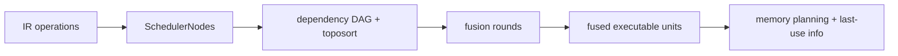

Grounding:
- Verified against `Scheduler.__init__`, `create_scheduler_node`, `compute_dependencies`, `create_foreach_nodes`, `fuse_nodes`, `merge_loops`, and `compute_last_usage`.

### Slide 13: Codegen: Triton on GPU, C++ on CPU, wrapper around both

Time: `4 min`

Excalidraw camera:
- Use `Frame 9`.
- Keep visible: Triton path, C++ path, wrapper generation, async compile wait point.
- Grey out earlier lowering and fusion detail.

Text on slide:
- Scheduled work is sent to a backend-specific code generator.
- GPU path emits Triton kernels. CPU path emits C++ kernels.
- Wrapper code launches kernels, manages buffers, waits for compilation, and returns outputs.

Speaker notes:
At this point the compiler stops mostly reasoning about graphs and starts writing actual machine-facing programs. On the GPU side, Triton code is emitted. On the CPU side, C++ kernels are emitted. Around both, the wrapper code becomes the orchestration layer that allocates, launches, frees, and returns.

This is also the right place to say that the wrapper is not a boring detail. It is the execution envelope for the generated kernels.

Mermaid:
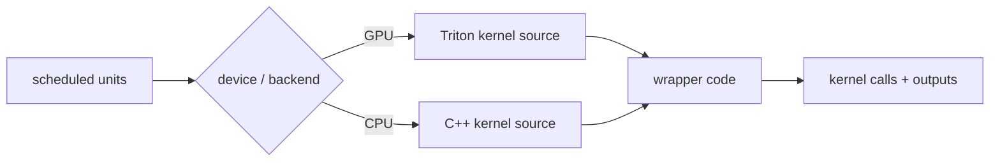

Grounding:
- Verified against `Scheduler.codegen`, `SIMDScheduling.codegen_node`, `codegen_node_schedule`, `TritonKernel.codegen_body`, `TritonKernel.codegen_kernel`, `PythonWrapperCodegen.write_prefix`, and `PythonWrapperCodegen._generate`.

### Slide 14: Compilation, caches, and optional CUDAGraph replay

Time: `3 min`

Excalidraw camera:
- Start with `Frame 9`.
- Add one callout for the optional CUDAGraph branch from the Inductor source graph.
- Keep visible: async compile, graph cache, code cache, optional cudagraph wrap.

Text on slide:
- `AsyncCompile` overlaps compilation work using threads or subprocesses.
- Caches try to skip recompiling the same graph and the same generated code.
- If enabled and valid, CUDAGraph trees can turn repeated CUDA execution into replay.

Speaker notes:
There are three different "make it cheaper next time" ideas here. One is compiling in parallel. One is caching the compiled artifacts. One is CUDAGraph replay on CUDA, which can remove repeated launch overhead when the runtime invariants keep holding.

Do not over-teach the CUDAGraph tree in the main flow. It is enough to say that it has warmup, recording, replay, and branching when invariants no longer match.

Mermaid:
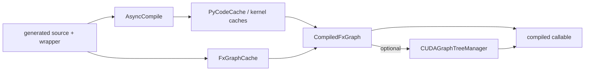

Grounding:
- Verified against `AsyncCompile.triton`, `AsyncCompile.wait`, `FxGraphCache`, `PyCodeCache`, `CompiledFxGraph`, and `CUDAGraphTreeManager`.

### Slide 15: Recap: first call compiles, later calls try to reuse

Time: `3 min`

Excalidraw camera:
- Use `Frame 10`, then briefly zoom back to `Frame 0` for the last sentence.
- Left: capture/trace/lower/fuse/generate/compile/cache.
- Right: guard-check/reuse path.

Text on slide:
- First call: capture safely, lower lazily, fuse, generate, compile, cache.
- Later calls: guard check, cache hit, run compiled code; otherwise recompile.
- Debug by asking which artifact is wrong: graph, guards, or generated code.

Speaker notes:
This is the whole talk in one slide. Dynamo captures safely. AOTAutograd defines the compile units. Inductor lowers lazily, schedules aggressively, generates code, compiles it, and caches it. Later calls live on the fast path only when the old assumptions remain true.

If you want the closing line to sound like the previous deck style, use this one: `torch.compile` is really an artifact pipeline. Python becomes a graph, the graph becomes specialized code, and later calls try very hard to stay on the reuse path.

Mermaid:
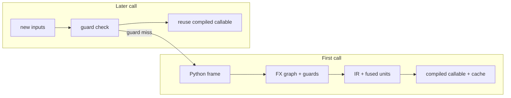

Grounding:
- Verified end to end against the Dynamo and Inductor control-flow docs and the code paths listed in the grounding section below.

## Appendix (`Q&A / reviewer mode`)

### Appendix A1: The two-pass graph-break story

Excalidraw camera:
- Reuse `Frame 3`.
- Highlight the restart edge and the resume edge.

Text on slide:
- First pass discovers the unsafe point.
- Second pass compiles up to the last resumable checkpoint.
- The suffix continues through a resume function.

Speaker notes:
This is the deeper version of the graph-break story: Dynamo does not necessarily know the best boundary immediately. The speculation log and restart flow let it learn, then come back with a better prefix-compile plan.

Mermaid:
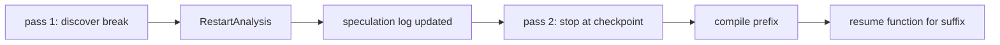

Grounding:
- Verified against `compile_frame`, `RestartAnalysis`, `InstructionTranslator.step`, and `step_graph_break`.

### Appendix A2: How guards become a fast runtime check

Excalidraw camera:
- Use the guard sections of the Dynamo graph, including the guard-build and guard-tree areas.
- Highlight only one `Source -> Guard -> GuardManager` chain.

Text on slide:
- Tracing accumulates guards from sources.
- Post-trace build turns them into a C++ guard tree.
- Later calls run that tree before reuse.

Speaker notes:
This is the "how" behind the reuse contract. In the main deck, we hid the implementation detail. Here we can show the lifecycle clearly: `Source` objects describe how values were reached, `Guard` objects describe what must stay true, and the build step turns that into a C++ guard manager tree for fast runtime checking.

Mermaid:
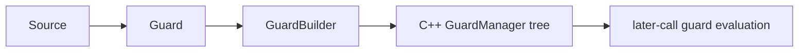

Grounding:
- Verified against `Source`, `install_guard`, `CheckFunctionManager`, `GuardBuilder.get_guard_manager_from_source`, and the C++ guard runtime.

### Appendix A3: `VariableTracker` and higher-order-op subgraphs

Excalidraw camera:
- Use the trace-loop region plus the HOP tracing subgraph from the Dynamo diagram.
- Highlight `VariableBuilder`, `VariableTracker`, and the HOP branch.

Text on slide:
- Python values are wrapped as `VariableTracker` objects during tracing.
- Standard bytecode stays in the main translator.
- Higher-order ops can trace nested subgraphs through `speculate_subgraph`.

Speaker notes:
This appendix slide explains why Dynamo can reason about very different Python values in one symbolic loop. `VariableBuilder` converts live Python values into symbolic objects, and special families like higher-order ops can trace nested subgraphs instead of only tracing flat operator calls.

Mermaid:
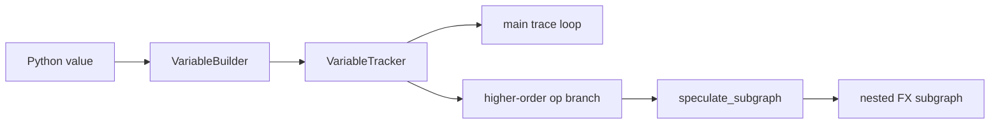

Grounding:
- Verified against `VariableBuilder.__call__`, `VariableBuilder._wrap`, `TorchHigherOrderOperatorVariable`, and `speculate_subgraph`.

### Appendix A4: Pattern matcher across pre-grad, joint, and post-grad passes

Excalidraw camera:
- Use the Inductor passes region plus a small pattern-matcher callout.
- Highlight pre-grad, joint, post-grad, and `PatternMatcherPass.apply`.

Text on slide:
- Pattern matching is reused across multiple Inductor pass phases.
- A pass walks the graph and tries registered patterns.
- Successful matches rewrite the graph before lowering or codegen.

Speaker notes:
This is worth showing only if the audience wants to know where many graph rewrites actually come from. The same general pattern infrastructure is reused at multiple points in the pipeline, not just once.

Mermaid:
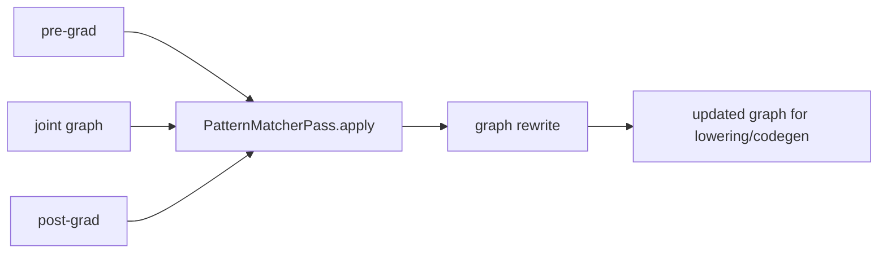

Grounding:
- Verified against `pre_grad_passes`, `post_grad_passes`, `partition_fn`, and `PatternMatcherPass.apply`.

### Appendix A5: Triton codegen has four reduction modes

Excalidraw camera:
- Use the Triton/reduction branch of the Inductor diagram.
- Highlight `_get_heuristic`, `codegen_body`, and the four reduction cases.

Text on slide:
- Pointwise: no reduction loop.
- Reduction: loop over reduction tiles.
- Persistent: keep reduction data in registers when possible.
- Cooperative: multiple CTAs collaborate with synchronization.

Speaker notes:
This is exactly the kind of backend detail that reviewers may love and most general audiences do not need. If you show it, keep it as a taxonomy, not a proof.

Mermaid:
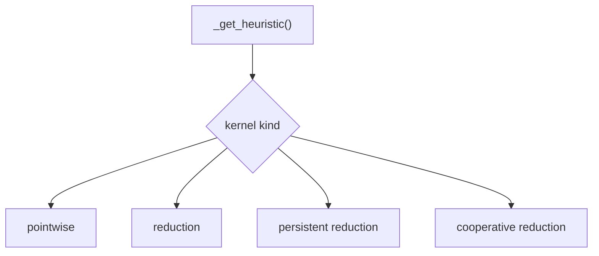

Grounding:
- Verified against `TritonKernel._get_heuristic`, `TritonKernel.codegen_body`, and the reduction sections of the Inductor control-flow graph.

### Appendix A6: CUDAGraph trees are trees, not lists

Excalidraw camera:
- Use the CUDAGraph branch of the Inductor diagram.
- Highlight warmup, record, replay, invariant check, and branch creation.

Text on slide:
- Warmup happens before recording.
- Recorded paths are replayed only if invariants still match.
- Mismatch can create a new branch, not just fail the whole feature.

Speaker notes:
The reason it is a tree is that execution history matters. After one replay, different liveness or pointer patterns can make a different next recording valid. That is why the runtime stores branches instead of a flat queue of graphs.

Mermaid:
```mermaid
flowchart LR
    A["warmup"] --> B["record"]
    B --> C["replay candidate"]
    C --> D{"invariants match?"}
    D -->|"yes"| E["replay existing node"]
    D -->|"no"| F["record new branch"]
```

Grounding:
- Verified against `CUDAGraphTreeManager.add_function`, `run_eager`, `record_function`, `execute_node`, and `check_invariants`.

## Grounding Used To Fact-Check The Deck

The major claims in this deck were checked against the two source control-flow docs and these code paths:

- `torch/__init__.py`
  - `_TorchCompileInductorWrapper.__call__`
- `torch/_dynamo/eval_frame.py`
  - `optimize`
  - `_optimize`
  - `OptimizeContext.__call__`
- `torch/_dynamo/convert_frame.py`
  - `compile_frame`
  - `_compile`
  - `trace_frame`
  - `CatchErrorsWrapper`
- `torch/_dynamo/symbolic_convert.py`
  - `InstructionTranslator.step`
  - `InstructionTranslator.run`
  - `InstructionTranslator.step_graph_break`
  - `InliningInstructionTranslator`
- `torch/_dynamo/output_graph.py`
  - `OutputGraph.__init__`
  - `OutputGraph.compile_subgraph`
- `torch/_dynamo/guards.py`
  - `CheckFunctionManager`
  - `GuardBuilder`
- `torch/_dynamo/variables/builder.py`
  - `VariableBuilder.__call__`
  - `VariableBuilder._wrap`
- `torch/_dynamo/variables/higher_order_ops.py`
  - `speculate_subgraph`
  - `TorchHigherOrderOperatorVariable`
- `torch/_dynamo/resume_execution.py`
  - `ContinueExecutionCache`
- `torch/_inductor/compile_fx.py`
  - `compile_fx`
  - `_compile_fx_main`
  - `compile_fx_inner`
  - `partition_fn`
  - `compile_fx_forward`
  - `compile_fx_backward`
- `torch/_inductor/fx_passes/pre_grad.py`
  - `pre_grad_passes`
- `torch/_inductor/fx_passes/post_grad.py`
  - `post_grad_passes`
- `torch/_inductor/pattern_matcher.py`
  - `PatternMatcherPass.apply`
- `torch/_inductor/graph.py`
  - `GraphLowering`
  - `GraphLowering.run`
  - `GraphLowering.run_node`
  - `GraphLowering.codegen`
  - `GraphLowering.compile_to_module`
- `torch/_inductor/ir.py`
  - `TensorBox`
  - `StorageBox.realize`
  - `StorageBox.realize_hint`
- `torch/_inductor/scheduler.py`
  - `Scheduler.__init__`
  - `create_scheduler_node`
  - `create_foreach_nodes`
  - `fuse_nodes`
  - `compute_last_usage`
  - `Scheduler.codegen`
- `torch/_inductor/codegen/simd.py`
  - `codegen_node`
  - `codegen_node_schedule`
  - `codegen_node_schedule_with_kernel`
- `torch/_inductor/codegen/triton.py`
  - `codegen_body`
  - `_get_heuristic`
  - `codegen_kernel`
- `torch/_inductor/codegen/wrapper.py`
  - `write_async_compile_wait`
  - `write_prefix`
  - `_generate`
- `torch/_inductor/async_compile.py`
  - `AsyncCompile.triton`
  - `AsyncCompile.wait`
- `torch/_inductor/codecache.py`
  - `FxGraphCache`
  - `PyCodeCache`
- `torch/_inductor/output_code.py`
  - `CompiledFxGraph`
- `torch/_inductor/cudagraph_trees.py`
  - `CUDAGraphTreeManager`
  - `add_function`
  - `run_eager`
  - `record_function`
  - `execute_node`
  - `check_invariants`

## Short Build Advice

- Build the full-map slide first.
- Then build slides `5-8` from the Dynamo diagram.
- Then build slide `9` as the bridge.
- Then build slides `10-14` from the Inductor diagram.
- End by returning to the miss-vs-hit split on slide `15`.

If you keep returning to the artifact story, this will feel like a narrative, not like code archaeology.
