# A Ground-Up Tour of `torch.compile` (revised)
### From one decorator to fused GPU kernels — Dynamo → AOTAutograd → Inductor

A 45-minute presentation. Each slide has a **diagram + speaker notes**.

**What this revision is for.** The previous deck had the right ELI10 cadence (promise → pipeline → zoom) but never put a *complete* picture on screen. You got either three boxes, or a linear spine that dropped VT / HOP / guards / fusion / caches on the floor. This version adds the missing thing: **condensed end-to-end maps** — every major subsystem from the verified control-flow graphs, collapsed to one node each, cache-hit vs cache-miss color-coded — then the rest of the talk is just zooming into those nodes.

Cadence (same as the vLLM talk): **basics → one full map → zoom Dynamo → zoom Inductor → return to the map.**

---

## How to read this deck (and use it)

- **Three hero maps, reused constantly.** S5 is the whole system. S8 is all of Dynamo. S21 is all of Inductor. Put the relevant map up, trace it in ~90 seconds *without* explaining every box, then zoom. Return to it at every section break.
- **Green = cache hit. Orange = cache miss.** That coloring is the talk. First call walks orange; later matching calls walk green. If you lose the room, point at the colors.
- **Collapsed node ≠ missing node.** Every *named subgraph* in the two source control-flow graphs appears on S8 or S21 — as a spine node, a collapsed side node, or a lookup table pulled off the map (opcode table, guard `create_fn`, Triton ops, …). If it has a name in the source diagram, it is on the map. Opening a box later is a zoom, not new material.
- **Two audiences.** ELI10 on the maps; `file.py:line` on the zoom slides. Skip zooms if time is short — the maps still give the whole picture.
- **One sentence to repeat:** Dynamo *records*, AOTAutograd *splits*, Inductor *fuses and emits*. Guards decide when to re-record.

**Suggested runtime (45 min)**

| Part | Section | Slides | Minutes |
|---|---|---|---|
| 0 | Promise, why, glossary | S1–S4 | 5 |
| 1 | The maps (whole system + how to read) | S5–S7 | 5 |
| 2 | Dynamo: condensed map, then zooms | S8–S18 | 13 |
| 3 | AOTAutograd bridge | S19–S20 | 3 |
| 4 | Inductor: condensed map, lookup tables, zooms | S21–S21b, S22–S30 | 15 |
| 5 | Recap on the same maps + Q&A | S31–S32 | 4 |

**Sources.** Condensed maps are a collapse of `agent_space/dynamo_control_flow_graph.md` and `agent_space/inductor_control_flow_graph.md` (the diagrams verified against the codebase). Line numbers are "where to look", not a frozen HEAD.

**Color legend (same on every map)**

| Color | Meaning |
|---|---|
| **Green** | Cache **HIT** / run compiled / done |
| **Orange** | Cache **MISS** / first compile / recompile |
| Yellow | Dynamo spine / graph-break |
| Purple | Variable trackers / AOTAutograd |
| Cyan / teal | Guards (accumulate, build, C++ tree, eval) |
| Pink | Side effects |
| Blue | Inductor spine / lowering |
| Salmon | Scheduler / fusion |
| Gold | CUDA Graphs |
| Grey | Skip / eager / alternate exit |

---

## Slide 1 — The one-liner

> **Add two lines and get a compiler.** No C++, no manual kernels.
> `torch.compile` turns *Python PyTorch code* into optimized kernel code by *recording what you run*, then *rewriting and fusing* it for the GPU.

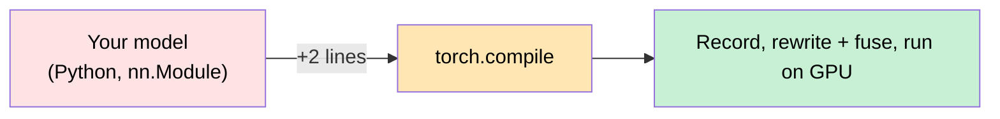

**KEY MECHANISM:** JIT — compile on the first call (slow), reuse on every later call whose inputs still match (fast). A compiler that *watches Python at runtime*.

> **Speaker notes.** Demystify in 10 words: *record what runs, rewrite the computation, run faster on GPU.* The rest of the talk is "how do you record a dynamic Python program without breaking it?" Promise first, machinery later. If asked "why not write CUDA by hand?": hand-written kernels don't compose with autograd, are per-shape, and rot as the model changes. `torch.compile` is adaptive.

---

## Slide 2 — Why eager PyTorch was leaving performance on the table

Three problems; one compiler-shaped fix for each. This slide earns the rest of the deck.

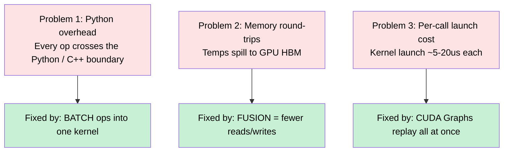

**KEY MECHANISM:** all three fixes need the *whole* computation up front. You cannot fuse or graph-capture what you have not recorded. That is why there is a compiler at all.

> **Speaker notes.** Concrete: `y = x.add(1).mul(2)` eager = 2 kernels, 2 HBM round-trips; compiled = 1 kernel, intermediate in registers. Folding P1/P2 is Inductor (fusion). P3 is CUDA Graphs. You cannot do either without Dynamo's FX graph. That intuition carries both halves of the talk.

---

## Slide 3 — ELI10 glossary (the six words you need)

Name-drop check before we go fast. The talk is easier if everyone tracks **artifacts**, not function names.

| Term | Plain meaning |
|---|---|
| **nn.Module** | A block of computation with weights. `forward()` is the math. |
| **Op / kernel** | A compute primitive (add, matmul) / the GPU code that runs it. |
| **JIT** | Compile *as it first runs*, cache the result. Sees concrete inputs. |
| **FX graph** | PyTorch's internal script of ops, as data: nodes and edges. |
| **Trace** | Run the program *symbolically* to record op calls instead of computing. |
| **Guard** | A condition that must still hold for a compiled version to be valid. Fail => recompile. This is what makes JIT safe in dynamic Python. |

**Four artifacts to track for the rest of the hour**

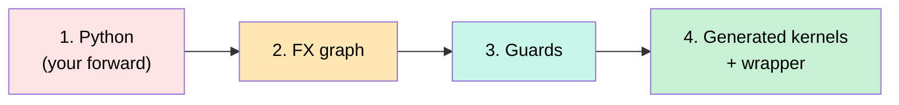

If a later slide does not say which artifact just got produced, it is too detailed — skip it.

> **Speaker notes.** Slow down. **Guard** is the most important word in Dynamo; you will return to it four times. Plant it with a concrete example: "shape changed => guards fail => recompile." Senior audience: one sentence each, leave the table on screen as a legend.

---

## Slide 4 — Architecture: three layers (the names)

Keep this up as the *name* slide. The *control-flow* slide is next — that is the one you actually navigate with.


**KEY MECHANISM:** the handoff is *data*, not calls. Dynamo ships an **FX graph + example inputs**. AOTAutograd ships fwd/bwd graph *units*. Inductor ships a *runnable*. One contract all the way down.

> **Speaker notes.** Memorize one verb per layer: Dynamo = **record**, AOT = **split**, Inductor = **fuse**. Dynamo does not make the model faster; it makes the model *compilable*. The speedup is Inductor + CUDA Graphs. "For the next 35 minutes we zoom into these three boxes — but first I will show you the *actual* control flow of all three at once."

---

# PART 1 — The maps (~5 min)

This is the vLLM move: **show the whole control flow before explaining any box.**

---

## Slide 5 — THE map: whole-system control flow in one picture

Every later slide is a zoom into a box on this picture. Trace **green** (later calls) then **orange** (first call). Side boxes are real subsystems, collapsed — not decoration.

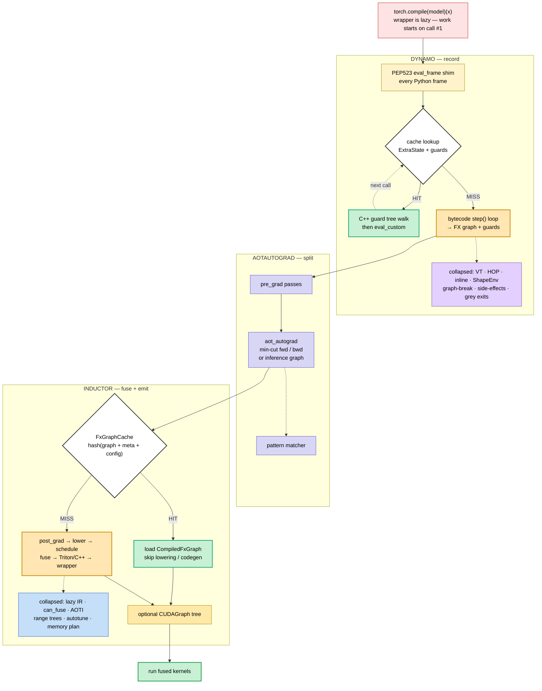

**Read it in 20 seconds**

1. There are **two cache layers**, not one. Dynamo cache (guards) and Inductor cache (graph hash). Green at *either* layer skips the expensive work below it.
2. Orange is long; green is short. That asymmetry *is* JIT.
3. Purple / cyan / salmon boxes on the side are not a second pipeline. They branch off the orange chain and **rejoin** it.

> **Speaker notes.** This is the subway map. Do **not** explain VT or `can_fuse` yet. Finger on the screen: "Call 2..N is this short green loop. Call 1 is the long orange chain through Dynamo, AOT, Inductor." Then: "I am about to open the Dynamo box as its *own* complete map, still condensed. After that we zoom. If you remember one picture from this talk, remember this one — green vs orange, two caches."

---

## Slide 6 — How to read the maps (and what "collapsed" means)

Same idea as the source control-flow graphs: **one spine, branches that rejoin.** The source graphs explode every branch. These maps keep the spine and squash each branch to one node.

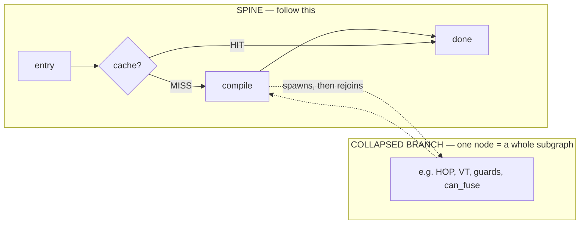

| On the map you see | In the source graph that is | We zoom at |
|---|---|---|
| `VT · HOP · inline` | VariableBuilder + VT hierarchy + inlining + `speculate_subgraph` | S12, S17 |
| `graph-break · side-effects` | two-pass restart + resume fn + `SideEffects` track/replay | S14–S15 |
| Dynamo `cache lookup` | `lookup` + C++ guard eval + diff-guard + LRU + precompile | S10, S16 |
| grey exits | callback disabled / skipfile / recompile-limit / SkipFrame | S10 |
| `ShapeEnv` | dynamic-shape guards | S16 |
| `pattern matcher` + joint | pre-grad + **joint** (SDPA) + post-grad PatternMatcher DSL | S19–S20 |
| `lazy IR · can_fuse` | IR types + `realize()` + GraphLowering internals + 8-gate `can_fuse()` | S23–S26 |
| scheduler node types | `SchedulerNode` / `Fused` / `Foreach` / `Extern` (VT analog) | S25 |
| Inductor `FxGraphCache` | graph-level + kernel-level + remote + TritonBundler | S22 |
| `CUDAGraph tree` | warmup / record / replay / fork child | S29 |
| AOTInductor | C++ wrapper path vs Python wrapper | S28 |
| range trees · Triton ops | Triton indexing + OpsHandler/CSE | S21b, S27 |

**Lookup tables are pulled off the maps on purpose** — same move as the opcode `dispatch_table`. Dynamo: S9 (opcode, VariableBuilder stages, guard `create_fn`). Inductor: S21b (lowering priority, codegen kind, Triton ops, `TilingSelect`, FxCompile strategies).

> **Speaker notes.** 45 seconds. "When I say collapsed, I mean: the 40-node HOP subgraph from the source diagram is one box. Same treatment for ShapeEnv, skipfile exits, AOTInductor, range trees — they were not forgotten; they are one node. Lookup *tables* (opcode, guard create_fn, Triton ops) stay off the map so it remains a map. Completeness check is the inventory table under S8 and S21."

---

## Slide 7 — The only runtime split that matters: miss vs hit

Same map as S5, read as two columns. Compilation cost is *amortized*.

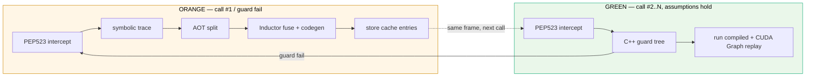

**KEY MECHANISM:** call #1 pays Dynamo + AOT + Inductor once. Call #2..N pays a C++ guard walk (microseconds) and then fused kernels. Recompile only when a guard fails.

> **Speaker notes.** Make amortization tactile: 1000-step training loop — step 1 is slow, 2..1000 are fast, *if* shapes/dtypes stay in the same class. Short one-shot scripts can get slower (compile dominates). Constantly-changing shapes = orange forever = the compiler hurting you. That is also why `fullgraph=True` and `dynamic=True` exist as knobs, but do not open those yet.

---

# PART 2 — TorchDynamo (~13 min)

**You are here:** the yellow Dynamo box on S5. First we put Dynamo's *entire* control flow on one slide, then we open boxes.

---

## Slide 8 — Dynamo, entire, condensed (hero map)

This is `dynamo_control_flow_graph.md` with **every named subgraph** squashed to one node. **Green = hit. Orange = miss. Grey = eager/skip exit.** Lookup *tables* (opcode, VariableBuilder stages, guard `create_fn`) are S9, not this picture.

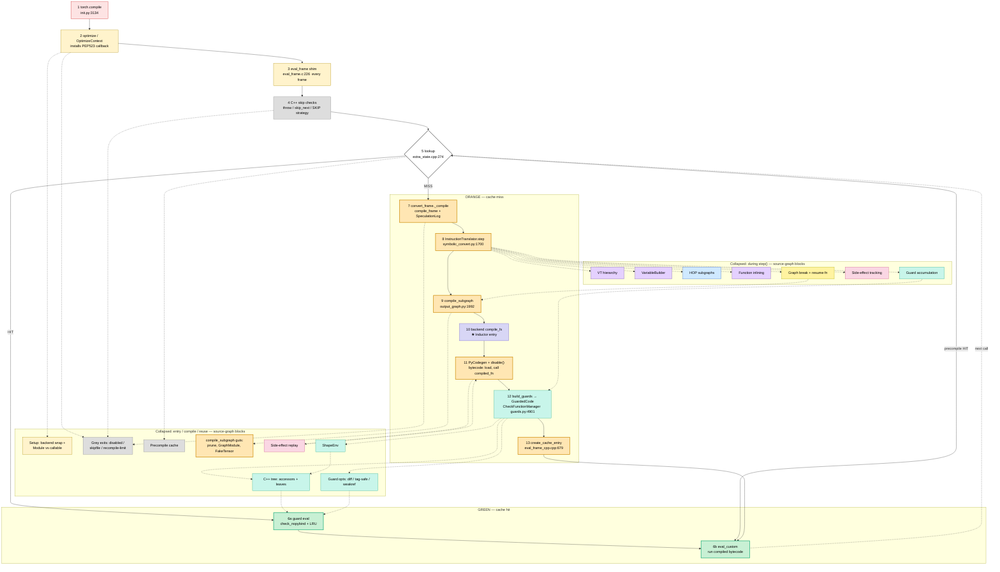

**Completeness inventory** — every named subgraph / major branch in `dynamo_control_flow_graph.md` maps to a node here, or to a lookup table on S9:

| Source subgraph / branch | Condensed as |
|---|---|
| SETUP_SUBS (backend registry, wrap_backend_debug, convert_frame factory, catch_errors) | `Setup` |
| MOD_BRANCH (`OptimizedModule` vs callable) | `Setup` |
| CPP_CHECKS | spine node 4 |
| callback `None` → eager; skipfile; recompile-limit; SkipFrame | `Grey exits` |
| Precompile entries `[10pre]` | `Precompile cache` |
| Cache hit vs miss `[10]` | diamond 5 + green/orange |
| GRAPH_BREAK + restart loop + RESUME | `Graph break + resume fn` |
| COMPILE_SUB (prune, cleanup, GraphModule, FakeTensorMode) | `compile_subgraph guts` |
| SIDEEFFECTS (during trace) / SEREPLAY (codegen) | tracking vs replay (two nodes) |
| AOTAUTOGRAD | spine node 10 |
| VBUILDER / VTCLASSES | `VariableBuilder` + `VT hierarchy` |
| INLINE / HOP | own nodes |
| GUARDS_ACCUM / GUARD_BUILD / GUARD_EVAL | accum + spine 12 + green 6a |
| GUARD_METHODS (`create_fn`) | **S9 table** |
| GUARD_TREE + ACCESSORS + LEAVES | `C++ tree` |
| SHAPE_GUARDS | `ShapeEnv` |
| GUARD_OPTS (diff, tag-safe, weakref, recompile log) | `Guard opts` |
| opcode `dispatch_table` | **S9 table** |

> **Speaker notes.** 90 seconds. Trace green, then orange, then the two collapsed rows: top = side engines of `step()`; bottom = entry / compile / reuse that a VT-only collapse would drop. Grey is the source graph's eager exits, one node. Precompile is a third HIT flavor. Punchline: **hit and miss end at the same green node.** S9 holds the lookup tables we refused to explode onto this slide.

---

## Slide 9 — Lookup tables pulled off the Dynamo map

Same move as "show the opcode table separately": **any dense dispatch table stays off S8** so the map stays a map. Dynamo has three of these, not one.

**1. Opcode `dispatch_table`** (inner loop of node 8)

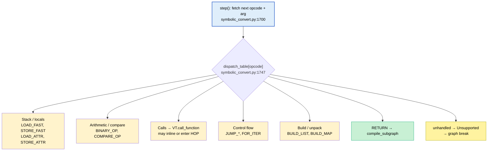

**2. VariableBuilder 3-stage type dispatch** (collapsed `VariableBuilder` node)

| Stage | What | Examples |
|---|---|---|
| 1 exact type table | `_type_dispatch()` O(1) | Tensor, list/tuple, int/bool/str/None |
| 2 exact id table | `_id_dispatch()` singletons | `None`, `True`, interned sentinels |
| 3 `isinstance` cascade | fallthrough | `nn.Module`, dict, arbitrary user objects |

**3. GuardBuilder `create_fn` dispatch** (collapsed into spine node 12; source subgraph GUARD_METHODS)

| `create_fn` | Checks |
|---|---|
| `TYPE_MATCH` | `id(type(value))` |
| `ID_MATCH` | `id(value)` + weakref invalidation |
| `EQUALS_MATCH` | Python `==` |
| `TENSOR_MATCH` | dtype / device / shape / stride / dispatch keys |
| `DICT_VERSION` | dict version tag |
| `GLOBAL_STATE` | grad mode, autocast, deterministic |
| `SHAPE_ENV` | delegates to ShapeEnv (own map node) |
| `CLOSURE_MATCH` | function closure identity |

**KEY MECHANISM:** adding a bytecode, a Python type, or a guard kind is writing one table entry — not patching the spine. Unhandled opcodes raise into graph break (S15), not a crash.

> **Speaker notes.** "S8 is the subway map. These three tables are the fare charts we kept in the appendix-shaped slide so the map stayed readable." One opcode trip: `LOAD_FAST x` / `LOAD_FAST y` / `BINARY_OP +` / `RETURN`. VariableBuilder is why a tensor vs an `nn.Module` vs `None` become different VTs in O(1) for the common case. `create_fn` is why the C++ tree is a translation of tracing, not a heuristic. 3.11 vs 3.12 opcode names change; the *shape* of table 1 does not.

---

## Slide 10 — Zoom: PEP523, lookup, and the grey doors  *(map nodes 1–5 + Setup / Grey / Precompile)*

No bytecode rewriting. Python lets you swap the *eval loop*. Around that hook sit the source-graph branches that never enter orange.

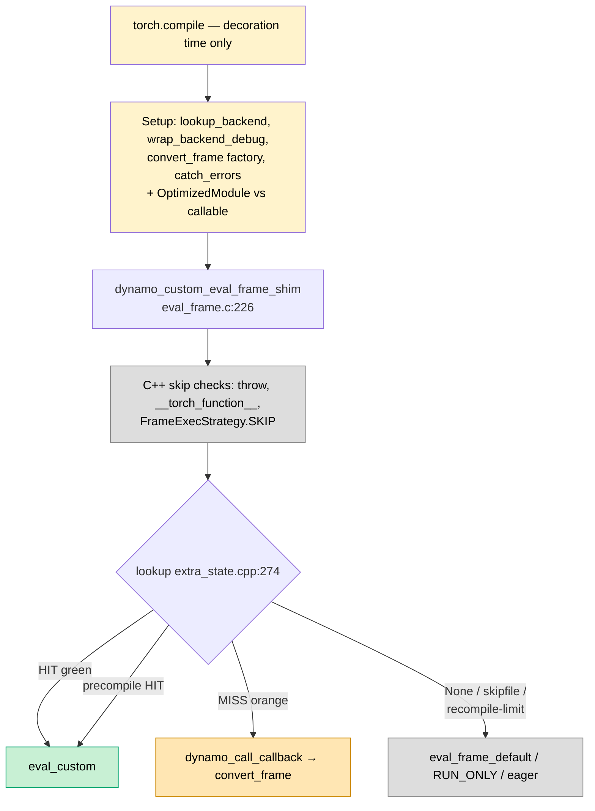

**KEY MECHANISM:** `torch.compile()` only installs a wrapper (**Setup**). Work starts on call #1. The shim usually does almost nothing: skip checks, then lookup. Grey doors are real control flow from the source graph — disabled callback, skipfile, recompile limit, SkipFrame — not "we forgot a path."

> **Speaker notes.** Decoration vs invocation: people conflate them. Setup is the parallel factory chain at `_optimize`. Module vs callable is `OptimizedModule` wrapping `forward`. Precompile is experimental (`TORCH_CACHING_PRECOMPILE`) but it is a third HIT edge on lookup — it belongs on the map. Recompile limit is how orange-forever becomes grey `RUN_ONLY`.

---

## Slide 11 — Zoom: the four stages inside orange  *(map nodes 7–13)*

Once lookup misses, compile is four phases. Later calls skip to phase 4's replay.

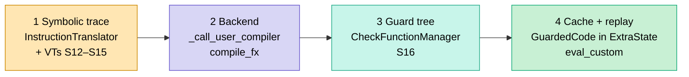

**KEY MECHANISM:** a CacheEntry is not "the Python function." It is **compiled bytecode + a C++ guard tree**. The shim swaps that in in place of the original frame. That is why the hit path can avoid the Python compiler entirely.

> **Speaker notes.** Stage 3 is what users never see and what every "why did it recompile?" debug session is about. Guards are live production checks, not log lines. After a successful orange pass, Dynamo is done for that *input class*; anything else is re-entry at lookup.

---

## Slide 12 — Zoom: VariableBuilder + VT  *(collapsed purple box)*

How Dynamo "understands" Python values without running them. One object per value, describing *how it was computed*.

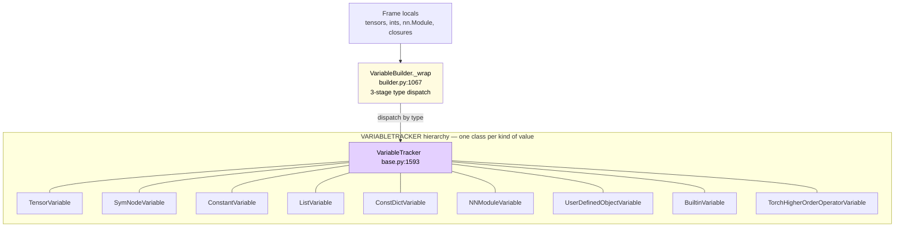

**Three-stage dispatch (the collapsed VariableBuilder graph):** (1) exact type table, (2) exact-id table for singletons (`None`, `True`), (3) `isinstance` cascade. Most values hit (1) in O(1).

**KEY MECHANISM:** `a + b` on two `TensorVariable`s records `aten.add` in the FX graph and installs dtype/shape guards. The 10 GB weight is not copied; tracing cost is O(ops), not O(bytes).

> **Speaker notes.** Walk `return x.add(self.weight).relu()`: three VTs, three FX nodes, a handful of guards. "Why not only FakeTensors?" FakeTensors propagate shapes; Dynamo also has to understand *Python* (if/for, user objects, HOPs). That is why the class hierarchy exists. Hardest slide in the Dynamo half — take questions here.

---

## Slide 13 — Zoom: the `step()` while-loop  *(map node 8 + S9 table)*

One while loop. Each iteration: fetch → **dispatch_table** (S9) → handler mutates the symbolic stack.

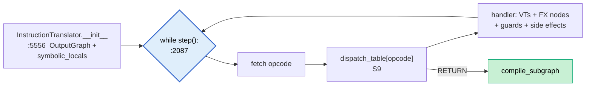

**KEY MECHANISM:** *no eager compute during tracing.* Expensive kernels are recorded as FX nodes. Real tensor sizes are not needed beyond what guards and FakeTensors need. Graph-break recovery can still be slow because a restart *re-walks* bytecode (S15).

> **Speaker notes.** Same loop runs nested when inlining (S17). Point back at S8: this loop is the orange box that the *during step()* collapsed row hangs off. The *entry / compile / reuse* row hangs off lookup, `compile_subgraph`, and codegen instead.

---

## Slide 14 — Zoom: three machines inside one `step()`  *(why the side boxes exist)*

VT ops are not alone. Every instruction can write three books at once. They only *meet* at `compile_subgraph`.

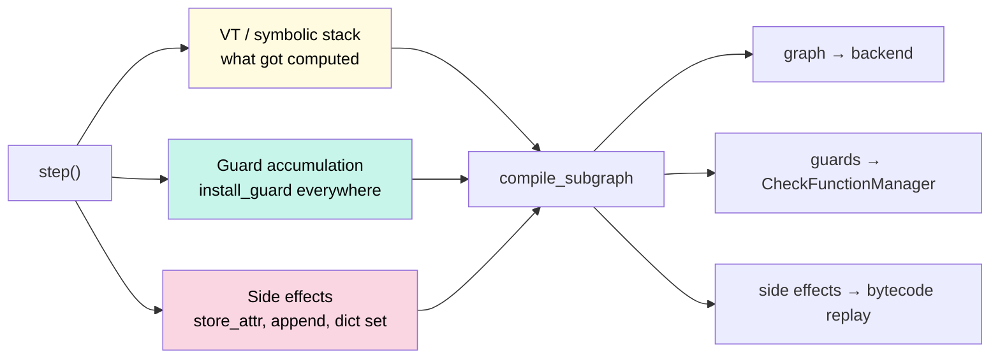

> **Speaker notes.** "Three bookkeeping engines, one loop, one OutputGraph." Tracking vs replay are two nodes on S8 (SIDEEFFECTS vs SEREPLAY in the source graph) — same split as guard accum vs eval. `TORCH_LOGS=recompile` is how mutation surprises show up later as a failed guard.

---

## Slide 15 — Zoom: graph breaks, two-pass recovery, resume  *(collapsed yellow box)*

Not a crash. A planned split: compile the prefix, resume the suffix.

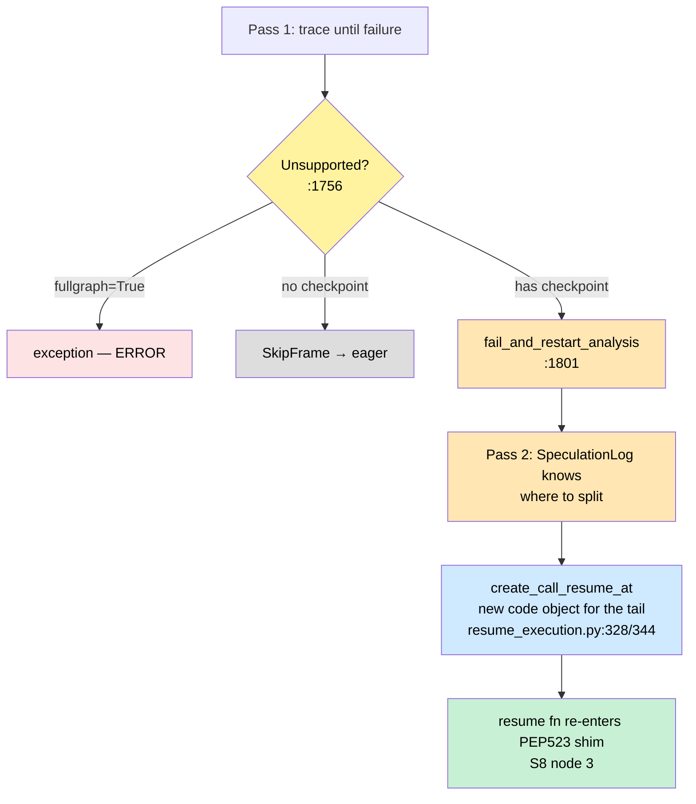

**KEY MECHANISM:** two CacheEntries, stitched by a generated resume function. Pass 1 *discovers* the break; pass 2 *uses* it so you do not re-trace the prefix blindly. Nested breaks compose; once every fragment is cached, later calls are a chain of compiled resume fns with no Python between fused kernels.

> **Speaker notes.** Example: one untraceable op in `forward` → two compiled fragments, first-call latency ≈ sum of two compiles. `TORCH_LOGS=graph_breaks` lists causes. Permanent cost: the broken *segment* stays eager until the op is supported. Graph break is partitioning, not failure — say that twice.

---

## Slide 16 — Zoom: guards, full lifecycle  *(cyan boxes on S8, including ShapeEnv + opts)*

Four stages from the source graph, plus the two collapsed nodes that are *not* "just more tree internals": **ShapeEnv** and **guard opts**.

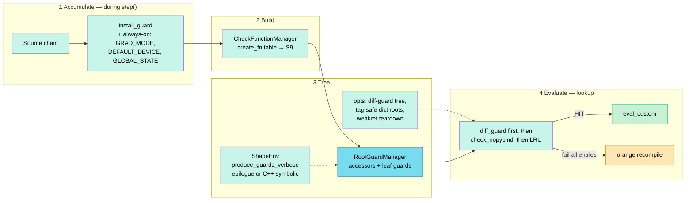

**Three details worth saying out loud**

1. **1:1 mirror:** `LocalSource("model") → AttrSource("weight")` becomes `FrameLocalsGuardAccessor → GetAttrGuardAccessor → TENSOR_MATCH`.
2. **diff_guard + tag-safe + weakref** are the GUARD_OPTS subgraph — not a footnote. Diff = likely-to-change leaves first. Tag-safe = dict version as proxy for a subtree. Weakref = ID_MATCH death tears down the CacheEntry.
3. **ShapeEnv** is the SHAPE_GUARDS subgraph: symbolic constraints from dynamic shapes, installed as epilogue lambdas or C++ symbolic guards (`enable_cpp_symbolic_shape_guards`). This is why `dynamic=True` is not "just skip shape checks."

> **Speaker notes.** If time is gone, keep the four-stage picture and name ShapeEnv + diff-guard. `check_verbose` / `TORCH_LOGS=recompile` is "guard X failed because Y." Always-on guards are seeded at OutputGraph init, not discovered per op.

---

## Slide 17 — Zoom: inlining and HOPs  *(collapsed purple / blue boxes)*

Two ways a CALL stays in the graph. Both rejoin `step()`.

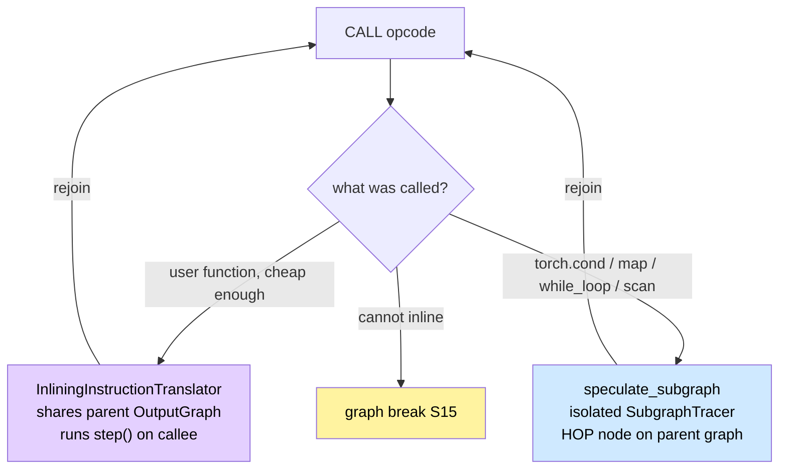

**KEY MECHANISM:** inlining *flattens* into one FX graph (optimizer sees a large region). A HOP *stays one op* with nested subgraphs (control flow stays structured, still lowerable). Mixing them accidentally (unbounded Python recursion in `forward`) fragments compilation — opposite of the goal.

> **Speaker notes.** Raw `def helper` → inline. Deliberate `torch.cond` → HOP. Warn: data-dependent Python `if x.item()` is the classic graph-break / recompile factory. `TORCH_LOGS=graph_breaks` again.

---

## Slide 18 — Handoff: Dynamo is done

| Dynamo produced | Consumed as |
|---|---|
| `GraphModule` + example inputs | input to every downstream pass |
| guards → C++ tree | `GuardedCode`; walked on every later call |
| `compiled_fn` wrapped in `disable()` (`output_graph.py:3042`) | Dynamo will not re-trace it |

**KEY MECHANISM:** handoff is data. Backend failure falls back to eager; the original module was never mutated. That is why custom backends work under `torch.compile`.

> **Speaker notes.** One line: "Dynamo's job ends here." Then drop into AOTAutograd — the box between *record* and *lower*. Remaining time favors Inductor; that is where the speedup lives.

---

# PART 3 — AOTAutograd bridge (~3 min)

**You are here:** purple box on S5 / node 10 on S8.

---

## Slide 19 — Split fwd and bwd *before* lowering

Two jobs neither Dynamo nor Inductor do alone. Training logs show two graphs because there *are* two.

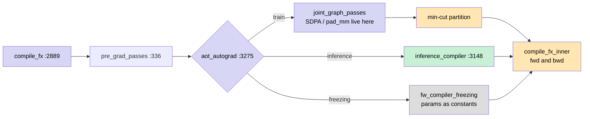

**KEY MECHANISM:** (1) split so each side optimizes independently; (2) `min_cut_rematerialization_partition` needs the *joint* fwd+bwd graph — Dynamo never produced that; (3) **joint passes run before the cut** — fused attention is a joint-graph rewrite, not an Inductor scheduler trick. Numerics stay the same; cut points trade memory vs FLOPs. Freezing inlines parameters and still rejoins `compile_fx_inner`.

> **Speaker notes.** Under 90 seconds. Name the three AOT exits: train (joint → cut), inference, freezing. SDPA is joint-graph, say it once so they do not look for it in `fuse_nodes`.

---

## Slide 20 — Joint / post-grad passes + Pattern Matcher DSL

Where high-level aten gets rewritten *before* per-op lowering. Same DSL at pre-grad, joint, and post-grad — one collapsed node on the Inductor map.

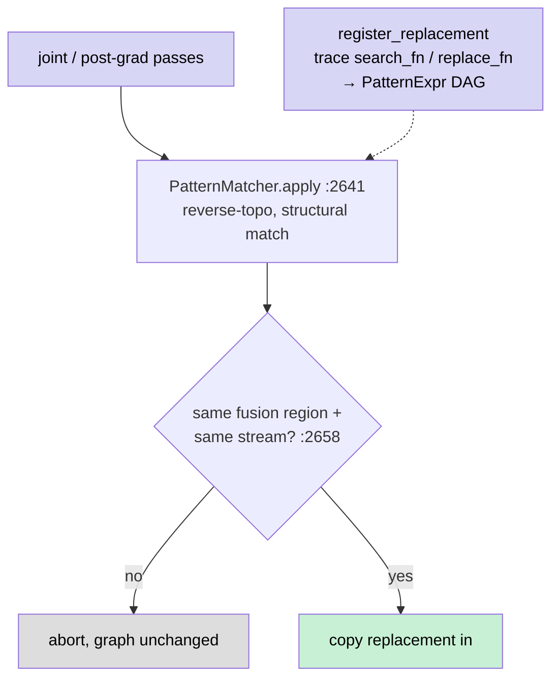

**KEY INSIGHT:** structural match, not string match — handwritten vs autodiff-spelled backward ops can still hit. Hot fusions (SDPA) ship as serialized patterns so they are not re-traced every graph.

> **Speaker notes.** ~60s. `register_replacement` is a DSL: you write search/replace as functions; they get traced into the pattern DAG. Then: "that is the last purple box. Inductor next — second hero map, then zooms."

---

# PART 4 — Inductor (~15 min)

**You are here:** blue box on S5. Same move as Dynamo: **complete condensed map first**, then open boxes.

---

## Slide 21 — Inductor, entire, condensed (hero map)

This is `inductor_control_flow_graph.md` with **every named subgraph** squashed. **Green = FxGraphCache hit. Orange = miss.** Joint passes are on the spine (that is where SDPA lives). Lookup tables are S21b.

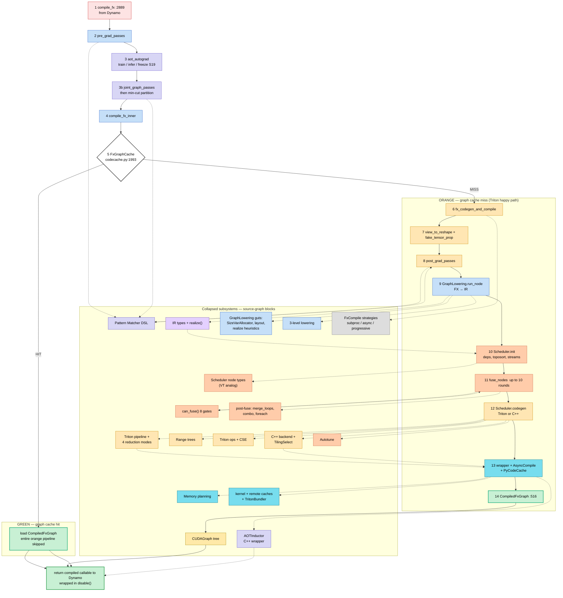

**Completeness inventory** — every named subgraph in `inductor_control_flow_graph.md`:

| Source subgraph | Condensed as |
|---|---|
| AOT_BRANCH (infer / freeze) | spine 3 + S19 |
| PREGRAD | spine 2 |
| JOINT | spine 3b (SDPA lives here) |
| POSTGRAD | spine 8 |
| PATMATCH | `Pattern Matcher DSL` |
| FXCOMPILE_BRANCH | `FxCompile strategies` |
| FxGraphCache / CACHING / TritonBundler | diamond 5 + `kernel + remote caches` |
| GRAPHLOW (SizeVarAllocator, layout, realize heuristics) | `GraphLowering guts` |
| LOWERING | `3-level lowering` (table S21b) |
| IR_TYPES | `IR types + realize()` |
| SCHED_INIT | spine 10 |
| SCHED_NODES | `Scheduler node types` |
| SCHED_FUSION | spine 11 |
| CAN_FUSE | `can_fuse() 8 gates` (table S21b) |
| merge_loops / combo / foreach | `post-fuse` |
| MEMORY | `Memory planning` |
| CODEGEN_DISPATCH | spine 12 (table S21b) |
| TRITON_PIPE / REDUCTION | `Triton pipeline` |
| RANGE_TREES | `Range trees` |
| TRITON_OPS | `Triton ops + CSE` (table S21b) |
| CPP_BACKEND | `C++ backend + TilingSelect` |
| AOTI | `AOTInductor` |
| WRAPPER / ASYNC | spine 13 |
| AUTOTUNE | `Autotune` |
| CUDAGRAPHS | `CUDAGraph tree` |
| OUTPUT | spine 14 |

> **Speaker notes.** Second wow slide. Trace green, then orange. Point at 3b: "joint is on the spine now — that is not scheduler fusion." Point at AOTInductor / range trees / scheduler node types: "same collapse idea as VT and HOP; they were on the source graph, they are on this map." Lookup tables → S21b. Never skip later zooms of lazy IR (S23) or fusion (S26).

---

## Slide 21b — Lookup tables pulled off the Inductor map

Same move as S9. Dense switches stay off S21.

**1. Lowering priority** (collapsed `3-level lowering`)

`user_lowerings` → built-in `@register_lowering` → `FallbackKernel` (eager ATen). Layout constraints apply *before* this switch.

**2. `can_fuse()` gates** (collapsed salmon box; full zoom S26)

G1 stream+mempool → G2 template/reduction → G3 extern epilogue → G4 not ancestor → G5 device+score → G6 vertical → G7 horizontal → G8 cycle DFS.

**3. Codegen node kind** (spine 12; full zoom S27)

template / extern / foreach-combo / pointwise-reduction (Triton) / CPU (`CppKernelProxy`).

**4. Triton internals** (collapsed `Range trees` + `Triton ops + CSE`)

| Piece | Role |
|---|---|
| `IterationRangesRoot` / `Entry` | tiled dims → `tl.program_id` + `ModularIndexing` |
| OpsHandler → TritonOverrides → CSEProxy | op names → `tl.*` / libdevice, then CSE |
| `_get_heuristic` | pointwise / looped reduction / persistent / cooperative |

**5. `TilingSelect`** (inside C++ backend node)

Always emit scalar `CppKernel`. Add `CppVecKernel` if dtype+strides allow. Add `CppTile2DKernel` if one axis is transposed. Keep one winner.

**6. FxCompile strategies** (collapsed grey)

in-process (happy path) / subprocess / `_AsyncFxCompile` / `_ProgressiveFxCompile` (fast now, better later). All rejoin `CompiledFxGraph`.

> **Speaker notes.** Flash this after S21 the way S9 follows S8. Do not teach range-tree algebra. One sentence: "Triton codegen is itself a tiny compiler with an indexing tree and an ops table — that is why it is a node on the map, not a black box named Triton."

---

## Slide 22 — Zoom: two cache layers inside Inductor  *(diamond 5 + teal boxes)*

Whether *any* codegen runs. Two tiers, keyed differently.

```mermaid
flowchart LR
    subgraph G["GRAPH-LEVEL"]
        CC1["FxGraphCache :1993\nkey = hash(gm + input meta +\nconfig + torch + system)"]:::cache
        CC1 -->|"HIT green"| L["load CompiledFxGraph"]:::hit
        CC1 -->|"MISS orange"| PIPE["orange pipeline S21"]:::miss
    end
    subgraph K["KERNEL-LEVEL"]
        CC4["CompiledTritonKernels :228\nkey = source + torch_key"]:::cache
        CC4 --> SUB["compile only new sources"]:::miss
    end
    R["RemoteCache\nshare artifacts across machines"]:::cache
    CC1 -.-> R

    classDef cache fill:#7de,stroke:#178,color:#000
    classDef hit fill:#c8f0d4,stroke:#1a7,color:#000
    classDef miss fill:#ffe6b3,stroke:#c80,color:#000
```

**KEY MECHANISM:** the graph hash includes structure *and* config *and* static input-class meta — wrong-kernel collisions would silently corrupt outputs. Kernel-level dedup: identical Triton source across nodes compiles once. A torch upgrade changes the key, so old caches die on purpose; RemoteCache is how a cluster does not all pay that rebuild.

> **Speaker notes.** Dynamo cache = "is this *Python frame* still the same world?" Inductor cache = "have we *lowered this graph* before?" TritonBundler is how a cache hit reconstitutes Triton artifacts. FxCompile strategies (S21b) are why first-call can feel less blocked.

---

## Slide 23 — Zoom: IR types and lazy `realize()`  *(collapsed purple IR box)*

The reason fusion is possible. Pointwise/Reduction are *descriptions*, not buffers, until `realize()`.

```mermaid
flowchart TD
    TB["TensorBox :10603\nlayout wrapper"] --> SB["StorageBox :10618\nrealize() lives here"]
    subgraph LAZY["lazy — fusion still possible"]
        PW["Pointwise :1220"] --> R["realize()"]
        RED["Reduction :1399"] --> R
        R --> CB["ComputedBuffer :5432"]:::hit
    end
    subgraph EAGER["eager — will not fuse into"]
        EX["ExternKernel :7021\ncuBLAS / oneDNN / cudnn"]:::miss
        FB["FallbackKernel :9373\neager ATen"]:::err
    end
    SB --> PW
    CB --> REG["graph.register_output"]

    classDef hit fill:#c8f0d4,color:#000
    classDef miss fill:#ffe6b3,color:#000
    classDef err fill:#fde3e3,color:#000
    style LAZY fill:#eef6ff,color:#000
    style EAGER fill:#fff6e6,color:#000
```

**KEY INSIGHT:** `x.add(1).mul(2)` stays two lazy Pointwise nodes until a heuristic (`realize_hint`: multi-user, large inner fn, stream/mempool boundary, outputs) materializes a ComputedBuffer. Fusion's job is to make that *one* buffer, with the other op inlined in registers.

**Also the GRAPHLOW subgraph** (collapsed `GraphLowering guts` on S21): `placeholder()` → InputBuffer; `realize_hint()` only if rematerializing would be expensive; multi-user / large-inner-fn / max-reads heuristics; `SizeVarAllocator` for symbolic sizes; `finalize()` / `decide_layout` so later fusion sees a chosen stride.

> **Speaker notes.** This is the conceptual heart of Inductor. Every later slide is "how we make sure that one kernel actually happens safely." Extern GEMMs stay boxes — you do not beat cuBLAS by fusing *into* it; you fuse the *epilogue* after it (S27). SizeVarAllocator is why dynamic shapes still lower.

---

## Slide 24 — Zoom: three-level lowering  *(collapsed blue LW box)*

How one aten op becomes some IR node. User always wins; unknown ops degrade, they do not crash.

```mermaid
flowchart TD
    RN["GraphLowering.run_node :1878"] --> P{"priority\ngraph.py:1520"}
    P -->|"1"| U["user_lowerings"]:::hit
    P -->|"2"| B["built-in lowerings\n@register_lowering"]:::ind
    P -->|"3"| F["fallback_handler\nFallbackKernel :2876"]:::err

    classDef hit fill:#c8f0d4,color:#000
    classDef ind fill:#c5dff8,color:#000
    classDef err fill:#ffaa66,color:#000
```

**KEY MECHANISM:** layout constraints (contiguous / channels_last) apply *before* dispatch, so fusion later sees honest strides. `config.implicit_fallbacks` can `make_fallback` on the fly.

> **Speaker notes.** Practical takeaway: partial coverage still runs. The eager patch is the price of an unregistered op — same *shape* of story as a Dynamo graph break, one layer down.

---

## Slide 25 — Zoom: Scheduler init  *(map node 10)*

A bag of lazy IR becomes an ordered DAG. Fusion is not allowed to start until this finishes — stream/mempool assignment is a *correctness* gate.

The collapsed **scheduler node types** node is the VT analog: `create_scheduler_node` picks a class, not a generic wrapper.

| Scheduler node | Wraps |
|---|---|
| `SchedulerNode` | one IR op |
| `ExternKernelSchedulerNode` | cuBLAS / oneDNN / etc. |
| `NopKernelSchedulerNode` | mark_run only |
| `ForeachKernelSchedulerNode` | grouped foreach |
| `FusedSchedulerNode` | result of `fuse_two_nodes` (S26) |
| `FusedMixOrderReductions` / `FusedNestedReductions` | reduction special cases |

```mermaid
flowchart LR
    A["create_scheduler_node"] --> B["compute_dependencies"]
    B --> C["topological_sort"]
    C --> D["dead_node_elim"]
    D --> E["create_foreach_nodes"]
    E --> F["stream + mempool\nassign"]:::fuse
    F --> G["fuse_nodes  S26"]:::fuse

    classDef fuse fill:#fca,stroke:#c64,color:#000
```

> **Speaker notes.** ~40s. Name the node-type family so "fused" is a type, not a metaphor. Toposort before fusion. Stream/mempool first is why G1 is a cheap reject.

---

## Slide 26 — Zoom: fusion + the 8-gate `can_fuse()`  *(map node 11 + salmon box)*

The performance payoff. Fixed-point loop, then eight independent gates plus cycle detection.

```mermaid
flowchart TB
    L{"fuse_nodes\nup to 10 rounds  :5304"} --> O["fuse_nodes_once\nprune, score, try pairs"]:::fuse
    O --> G["can_fuse() :7891"]:::fuse
    G --> G1["G1 stream + mempool"]
    G --> G2["G2 template / reduction epilogue"]
    G --> G3["G3 extern epilogue"]
    G --> G4["G4 not ancestor"]
    G --> G5["G5 device + memory score"]
    G --> G6["G6 vertical: reads match writes"]
    G --> G7["G7 horizontal allowed"]
    G --> G8["G8 cycle DFS :6922"]:::err
    G -->|"all pass"| F["fuse_two_nodes\nFusedSchedulerNode"]:::hit
    F --> L
    L -->|"fixed point"| P["merge_loops + combo kernels"]:::hit

    classDef fuse fill:#fca,color:#000
    classDef err fill:#fde3e3,color:#000
    classDef hit fill:#c8f0d4,color:#000
```

**KEY MECHANISM:** G1 is first because it is cheap and kills most illegal pairs. One successful fuse can expose new pairs next round — that is why it is a loop, not a single pass. G8 is why *apparently adjacent* ops sometimes never merge.

> **Speaker notes.** This is the #1 reason "I expected N kernels and got more." Name G1, G5, G8. After the loop, the collapsed **post-fuse** node is `merge_loops`, `finalize_multi_template_buffers`, `create_combo_kernel_nodes` — still on the map, not swallowed by `fuse_nodes`.

---

## Slide 27 — Zoom: codegen dispatch  *(map node 12 + Triton / C++ boxes)*

After fusion, dispatch is a *type switch*, not an op-name lookup.

```mermaid
flowchart LR
    C["Scheduler.codegen"] --> T{"node kind?"}
    T -->|"template"| T1["codegen_template\nGEMM + epilogue"]:::miss
    T -->|"extern"| T2["codegen_extern_call\ncuBLAS etc."]:::aot
    T -->|"foreach / combo"| T3["codegen_combo_kernel"]:::ind
    T -->|"pointwise / reduction"| T4["SIMDScheduling\nTriton path"]:::miss
    T -->|"CPU"| T5["CppKernelProxy\nscalar / vec / 2D-tile"]:::miss

    classDef miss fill:#ffe6b3,color:#000
    classDef aot fill:#d8d6f5,color:#000
    classDef ind fill:#c5dff8,color:#000
```

**Concrete picture:** `nn.Linear` → ExternKernel (cuBLAS GEMM) + a small fused Triton epilogue (bias + activation). That is Slide 2's 3→1 reduction, arrived at honestly.

The Triton path is not a single function — it is the collapsed nodes **Triton pipeline**, **Range trees**, **Triton ops + CSE** (tables on S21b). `_get_heuristic` picks pointwise / looped reduction / persistent / cooperative. CPU path is `TilingSelect` inside the C++ backend node.

> **Speaker notes.** Point at S21: those three Triton boxes are why "it emits Triton" is not one step. Wrapper is next. Do not derive ModularIndexing on stage.

---

## Slide 28 — Zoom: wrapper, memory plan, async compile  *(map nodes 13–14)*

Triton and C++ converge here. First call should not wait for every kernel to finish compiling.

```mermaid
flowchart LR
    W["PythonWrapperCodegen._generate"]:::ind --> MP["MemoryPlanningState"]:::cache
    W --> A["async_compile.wait"]:::cache
    A --> P["PyCodeCache.load"]:::cache
    P --> O["CompiledFxGraph"]:::hit
    W -->|"AOTInductor path"| AOTI["CppWrapperCpu / CppWrapperGpu\n→ AotCodeCompiler .so"]:::aot
    AOTI --> O

    classDef ind fill:#c5dff8,color:#000
    classDef cache fill:#7de,stroke:#178,color:#000
    classDef hit fill:#c8f0d4,stroke:#1a7,color:#000
    classDef aot fill:#d8d6f5,color:#000
```

**KEY MECHANISM:** memory planning is peak-memory optimization, not "malloc each node." AsyncCompile: process pool for Triton, thread pool for C++. **AOTInductor is the other wrapper** — same scheduled units, C++ orchestration for export / AOT, rejoins `CompiledFxGraph`. That is a source-graph subgraph, not a footnote.

> **Speaker notes.** Python wrapper = eager-compile envelope. AOTI = C++ envelope for a `.so`. Both sit on S21. `wait` is the join before `call()` runs.

---

## Slide 29 — Zoom: CUDA Graph *tree*  *(collapsed gold box)*

Fused kernels still pay 5–20µs launch each. CUDA Graphs record once, replay with near-zero host work. The manager is a **tree**, not a list.

```mermaid
flowchart TD
    Q{"triton.cudagraphs?"} -->|no| RET["callable as-is"]:::skip
    Q -->|yes| T["CUDAGraphTreeManager :2261"]:::cg
    T --> W["run_eager warmup :2689"]:::cg
    W --> R["record_function :2641"]:::cg
    R --> I{"check_invariants :1950\nptrs, dead tensors, statics"}:::dec
    I -->|"pass HIT"| P["execute_node replay :2681"]:::hit
    I -->|"fail"| F["fork child branch :2618"]:::miss
    F --> R

    classDef skip fill:#ddd,color:#000
    classDef cg fill:#ffe9a8,stroke:#a80,color:#000
    classDef dec fill:#fff,stroke:#333,color:#000
    classDef hit fill:#c8f0d4,stroke:#1a7,color:#000
    classDef miss fill:#ffe6b3,stroke:#c80,color:#000
```

**KEY MECHANISM:** after replaying A, different output-liveness can make a *different* next recording valid — so the runtime branches instead of aborting. Same green/orange idea, one layer below Inductor's cache: **replay if invariants hold, record a new child if not.**

> **Speaker notes.** Do not teach every invariant. Warmup → record → replay, fork on mismatch. That is enough. Checkpoint of the CUDA allocator's CPU-side state exists because replay does not update it — mention only if a CUDA-memory person is in the room.

---

## Slide 30 — Zoom: autotune  *(collapsed salmon AT box)*

Template ops (GEMM/conv) have many launch configs. Paid once, cached, off the per-call path.

```mermaid
flowchart LR
    C["candidate configs"] --> RS["random search"]:::ind
    RS --> CA["CachingAutotuner\nCoordescTuner :377\none field at a time"]:::fuse
    CA --> W["winner in AlgorithmSelectorCache"]:::hit

    classDef ind fill:#c5dff8,color:#000
    classDef fuse fill:#fca,color:#000
    classDef hit fill:#c8f0d4,color:#000
```

**KEY MECHANISM:** coordinate descent, not full grid. `max_autotune` buys first-call latency for better later calls.

> **Speaker notes.** 30 seconds. Then zoom back out — we have opened every collapsed box on S21 that belongs in a 45-minute talk.

---

# PART 5 — Recap + Q&A (~4 min)

---

## Slide 31 — Zoom back out: the same three maps, now readable

Put **S5** back on screen. Optionally flash S8 and S21. The audience can now *read* them.

```mermaid
flowchart LR
    subgraph DY["Dynamo — record"]
        D1["PEP523"] --> D2{"lookup"}
        D2 -->|"HIT green"| D3["guard tree → run"]
        D2 -->|"MISS orange"| D4["step loop → FX + guards"]
    end
    subgraph AO["AOT — split"]
        A["fwd / bwd or inference\n+ pattern matcher"]
    end
    subgraph IN["Inductor — fuse + emit"]
        I1{"FxGraphCache"}
        I1 -->|"HIT green"| I3["CompiledFxGraph"]
        I1 -->|"MISS orange"| I2["lower · fuse · codegen"]
        I2 --> I3
        I3 --> I4["optional CUDAGraph tree"]
    end
    D4 --> A --> I1
    D3 -.-> D2

    style DY fill:#fff8e6,color:#000
    style AO fill:#f3f0ff,color:#000
    style IN fill:#eef6ff,color:#000
```

**One breath:** record (Dynamo) → split (AOTAutograd) → schedule, fuse, emit (Inductor). Two green shortcuts (Dynamo guards, Inductor graph hash). CUDA Graphs erase launch cost after that.

**Where the speedup actually comes from (stacked, not magic)**

1. Larger regions from Dynamo (less Python)
2. Graph rewrites / decomps (pattern matcher)
3. Fusion + memory planning (fewer HBM trips)
4. Better kernels (Triton / cuBLAS / autotune)
5. Caching + CUDA Graph replay (less host time)

**Debug by artifact, not by vibe**

| Symptom | Artifact to inspect |
|---|---|
| recompile storm / graph breaks | Dynamo graph + guards (`TORCH_LOGS=recompile,graph_breaks`) |
| more kernels than expected | Inductor fusion / `can_fuse` |
| wrong numerics scare | usually fp order; AOT cuts do not change math |
| launch-overhead only | toggle cudagraphs |

> **Speaker notes.** Closing line, same spirit as the vLLM talk: `torch.compile` is an **artifact pipeline**. Python becomes a graph, the graph becomes specialized code, later calls try very hard to stay on green. If they remember green vs orange and the three layers, the talk worked.

---

## Slide 32 — Likely questions (leave up during Q&A)

- **"Does `torch.compile` change numerics?"** — Not for correctness. Fwd/bwd cuts trade memory vs FLOPs. fp association can differ, like any fused kernel.
- **"Why does it recompile forever?"** — `TORCH_LOGS=recompile`. Usual cause: Python control flow on `.item()` / changing shapes, so every call is a new orange path. Hit the recompile limit → `RUN_ONLY` or error.
- **"Can I disable caching?"** — `torch._dynamo.reset()` for debugging. Production caching *is* the green path; dropping it is a throughput cliff.
- **"What actually runs on the GPU?"** — A handful of fused Triton (and/or cuBLAS) kernels, often inside one CUDA Graph replay. Python is out of the way on green.
- **"Which layer do I debug?"** — Dynamo for guard churn / breaks. Inductor scheduler for kernel-count / fusion. Cudagraphs off isolates launch-overhead regressions.
- **"Why is the first call slow?"** — You just walked every orange node on S5. That is the point. Amortize it.

---

## Appendix (if they want to keep zooming)

The maps now carry these as **one node**. Only explode if asked.

**A. Guard accessors / leaves** — already a node (`C++ tree`). Full class list is the source graph's GUARD_ACCESSORS / GUARD_LEAVES subgraphs.

**B. Triton four reduction modes + range trees + ops/CSE** — nodes on S21, tables on S21b.

**C. C++ `TilingSelect` + OpenMP + CppMicroGemm** — inside `C++ backend` node.

**D. FxCompile strategies** — grey node on S21, table on S21b.

**E. compile_subgraph guts** — prune_dead_object_new, cleanup_graph, `_make_graph_module`, backend FakeTensorMode. Own node on S8.

**F. Always-on guards** — SHAPE_ENV, GRAD_MODE, DEFAULT_DEVICE, GLOBAL_STATE seeded at OutputGraph init (S16).

---

## Presenter cheat sheet

1. S1–S4: promise and nouns. Do not show internals.
2. **S5 for 90 seconds.** Green vs orange. Two caches.
3. **S8 Dynamo hero map.** Completeness inventory is the "nothing left out" card. **S9** is the three lookup tables.
4. Zooms S10–S18; skip 12/17 if junior. Do not skip S10 grey doors or S16 ShapeEnv if this audience hits recompiles.
5. S19–S20: name joint passes (SDPA) and freezing.
6. **S21 Inductor hero map** + **S21b** lookup tables.
7. Zooms S22–S30; skip 24/30 if time-crunched. Never skip 23 (lazy IR) or 26 (fusion). Mention AOTI on S28 if anyone says "export."
8. S31: S5 again. Stop talking.

If you only had five slides: **S2, S5, S8, S21, S31.** That is the whole compiler.
